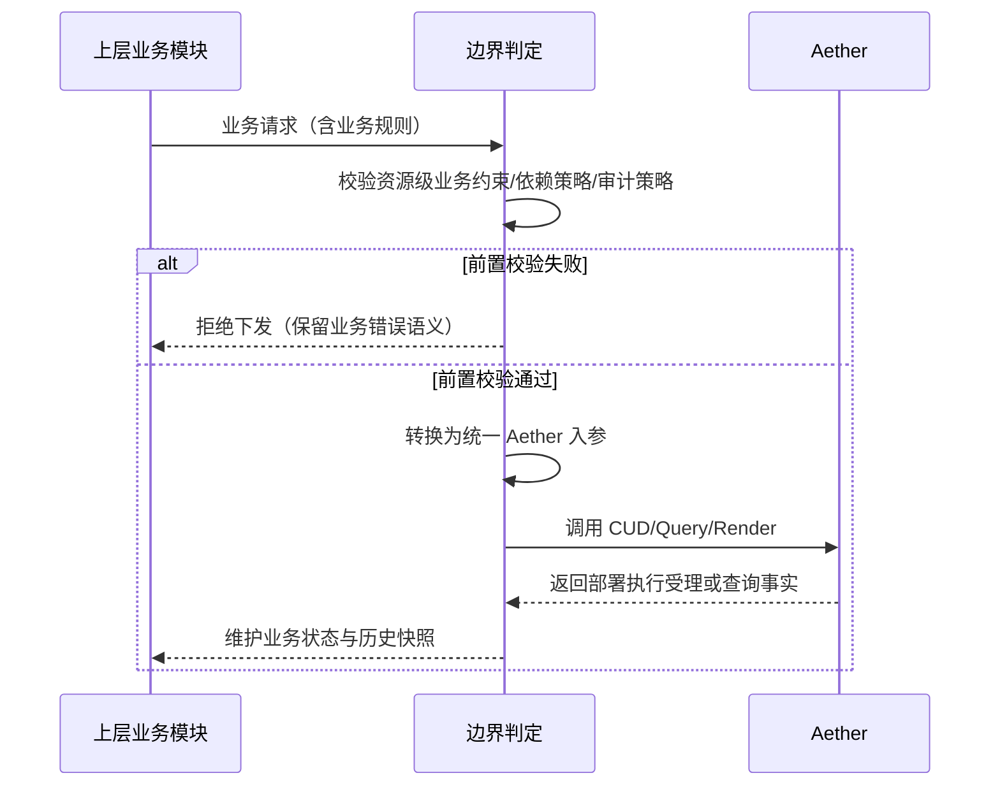
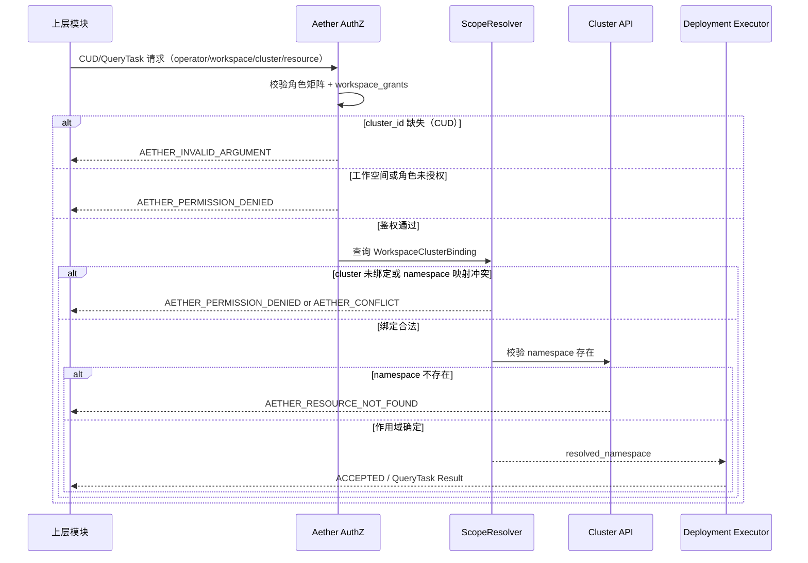
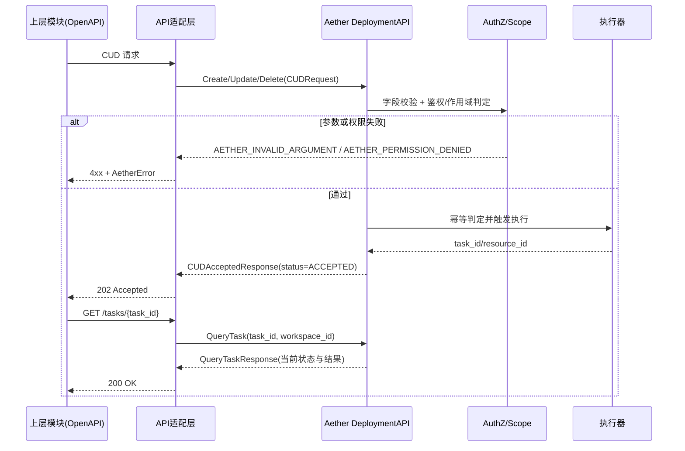
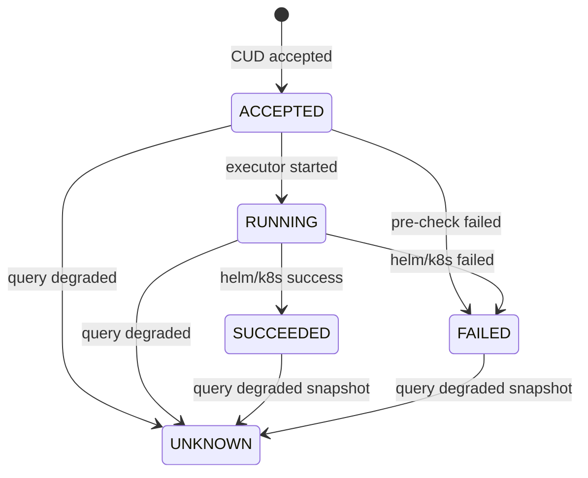
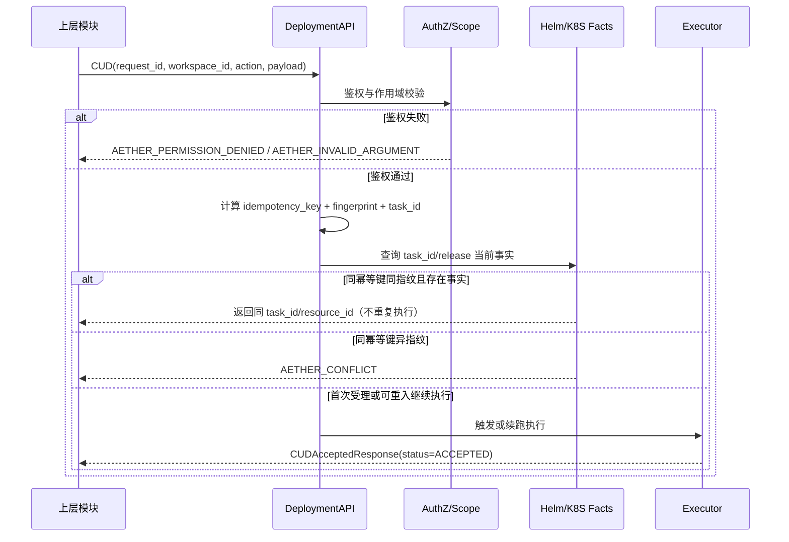
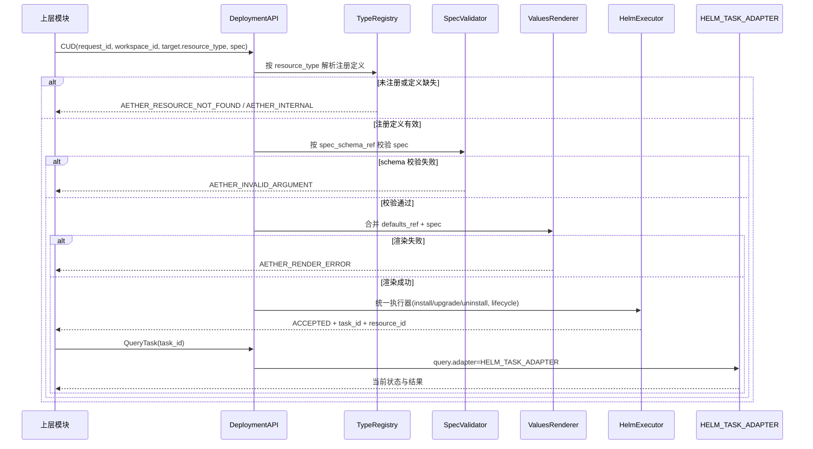

# Aether 设计文档

## §1 设计目标、范围、术语与决策基线（T01）

### 1.1 目标与需求追踪

本章节作为后续设计任务（§2~§10）的输入冻结层，仅定义“可设计/不可设计”边界与术语、决策基线，不提前下沉接口实现细节。

| 追踪ID | 来源 | 约束落点 |
| --- | --- | --- |
| RG-01 | requirements §1 文档目标 | 本文档仅覆盖 Aether 部署域能力，不扩展到上游制品构建流程。 |
| RG-02 | requirements §2 背景与范围 | 固化 In Scope / Out of Scope / 上层职责三段式边界。 |
| RG-03 | requirements §3 术语与对象 | 统一术语字典，禁止同义词混用。 |
| RG-04 | requirements §13.1 + 生效决策清单 | 仅使用 D-001/D-003/D-005/D-007/D-010/D-011/D-012/D-013/D-015/D-016/D-017/D-018/D-019 作为设计输入。 |
| RG-05 | requirements §13.2 | 后续章节必须满足 GC-01~GC-10 的交付约束。 |

### 1.2 设计输入边界（In Scope / Out of Scope / 上层职责）

| 边界分类 | 内容 |
| --- | --- |
| In Scope（Aether） | 统一 CUD/Query 执行能力；无状态部署执行；按工作空间/集群/命名空间落地；参数渲染 `values.yaml`；输出任务当前状态与结果。 |
| Out of Scope（Aether 不负责） | 低代码平台内部业务功能；登录认证流程；资源级业务约束前置校验；资源/任务状态与历史快照持久化；依赖展示语义模型。 |
| 上层职责（调用方必须完成） | 接收业务 OpenAPI；业务约束前置校验；Aether 入参转换；维护状态表与历史快照；决定依赖删除策略并显式传参。 |

不得下沉到 Aether 的职责（T01 DoD 强约束）：

1. 资源级业务约束校验（如单实例限制、来源组合限制）。
2. 依赖展示语义及其状态模型。
3. 资源/任务状态持久化维护。

### 1.3 术语与对象字典（与 requirements §3 对齐）

| 术语 | 规范定义 | 设计使用约束 |
| --- | --- | --- |
| Workspace | 资源管理与权限作用域的核心边界。 | 所有授权、幂等、隔离讨论默认以 `workspace_id` 为第一边界。 |
| Managed Cluster | 被平台接入的 Kubernetes 集群。 | 资源创建必须显式携带 `cluster_id`。 |
| Namespace | 工作空间在关联集群中的同名命名空间。 | 命名空间命名由工作空间映射决定，不在 Aether 内二次派生。 |
| Managed Registry | 被平台接入的 Harbor 仓库。 | 作为上层已纳管资产输入，Aether 不承担仓库纳管生命周期。 |
| Resource Type | Aether 管理的部署对象类型。 | 仅通过“类型注册 + 通用执行器”扩展，不复制流程。 |
| Resource Instance | 某资源类型的一次实例化部署。 | 作为执行目标实体，不承载业务域附加状态。 |
| Deployment Execution | CUD 触发的一次 Helm/K8S 执行过程。 | 仅表达当前执行事实，不承诺历史时间线。 |

### 1.4 决策基线映射（生效/废止隔离）

#### 1.4.1 生效决策与设计落点

| 决策ID | 状态 | 设计落点 | 约束摘要 |
| --- | --- | --- | --- |
| D-001 | 生效 | §1.1, §1.2 | Aether 聚焦部署消费，不承载制品构建流程。 |
| D-003 | 生效 | §1.3, §5（T05） | 资源扩展通过类型注册，执行链路复用通用执行器。 |
| D-005 | 生效 | §1.3, §2（T02） | 授权边界按工作空间统一，同空间不按创建者隔离。 |
| D-007 | 生效 | §1.3, §2（T02）, §3（T03） | 创建请求 `cluster_id` 必填。 |
| D-010 | 生效 | §1.2, §9（T09） | 资源级业务约束由上层前置校验。 |
| D-011 | 生效 | §1.2, §8（T08） | Aether 无状态执行，不维护资源/任务持久化。 |
| D-012 | 生效 | §1.1, §3（T03）, §4（T04） | Query 收敛为 `task_id` 单任务查询。 |
| D-013 | 生效 | §1.3, §4（T04） | 幂等键固定为 `request_id + workspace_id + action`。 |
| D-015 | 生效 | §1.2, §6（T06） | 依赖删除策略由上层显式传参，Aether 不内建隐式级联。 |
| D-016 | 生效 | §1.1, §4（T04）, §8（T08） | 幂等/重入采用“无存储 + 可观测事实判定”。 |
| D-017 | 生效 | §1.1, §3（T03）, §9（T09） | 接口定义与 OpenAPI 映射归属 `docs/design.md`。 |
| D-018 | 生效 | §1.1, §10（T10） | 图示仅 Mermaid；设计交付粒度需可直接指导编码。 |
| D-019 | 生效 | §1.1, §7（T07） | 必须支持 values 渲染并保证 Helm 执行语义等效。 |

#### 1.4.2 废止决策隔离规则

| 决策ID | 状态 | 替代关系 | 处理规则 |
| --- | --- | --- | --- |
| D-002 | 废止 | 被 D-011 取代 | 不得再用于定义任务持久化与列表查询能力。 |
| D-004 | 废止 | 被 D-015 取代 | 不得再引入依赖展示分类与强制级联删除语义。 |
| D-006 | 废止 | 被 D-011 取代 | 不得再将 PostgreSQL/Redis 作为 Aether 强依赖。 |
| D-008 | 废止 | 被 D-010 取代 | 不得再在 Aether 内固化“单实例”业务约束。 |
| D-009 | 废止 | 被 D-012 取代 | 不得再扩展分页/过滤/排序型 Query 能力。 |
| D-014 | 废止 | 被 D-017 取代 | 不得再将接口 DTO/OpenAPI 设计内容回填到 requirements。 |

基线判定规则：

1. 设计评审仅接受 requirements §13.1 生效清单中的决策条目。
2. 任何引用废止决策的设计内容都应判定为越界并回退。
3. 生效决策若存在历史表述冲突，以“最新替代链终点决策”解释为准。

### 1.5 边界判定关键时序（Mermaid）



### 1.6 数据结构与边界规则（设计输入层）

| 结构 | 字段 | 规则 |
| --- | --- | --- |
| `DesignBoundaryRow` | `category`, `responsibility`, `owner`, `forbidden_in_aether` | 用于标记职责归属；`owner` 只能是 `AETHER` 或 `UPSTREAM`。 |
| `GlossaryEntry` | `term`, `definition`, `source_section`, `aliases` | `aliases` 必须为空或仅含同义词映射，禁止改变术语边界。 |
| `DecisionBaselineEntry` | `decision_id`, `status`, `superseded_by`, `design_sections`, `enforced_rules` | `status=DEPRECATED` 的条目不得进入 `design_sections` 的实现约束集合。 |

边界条件与禁止操作：

1. 若需求变更引入新能力但未写入 requirements §13.1 生效决策，设计不得先行扩展。
2. 不允许将“上层已校验”替换为 “Aether 内部兜底业务校验”。
3. 不允许在无状态边界下声明“任务历史可追溯存储”能力。

## §2 授权模型与工作空间/多集群作用域（T02）

### 2.1 需求追踪与约束

| 追踪ID | 来源 | 设计落点 |
| --- | --- | --- |
| ACL-01 | FR-ACL-001 | 定义超级管理员对全部资源类型 CUD/QueryTask 的授权能力，并声明纳管资产管理动作由上层模块承载。 |
| ACL-02 | FR-ACL-002 | 定义空间管理员在授权工作空间内的全量工作空间级操作能力。 |
| ACL-03 | FR-ACL-003 | 定义普通用户可操作资源类型集合（数据服务、DevBox、高代码应用、记忆体）。 |
| ACL-04 | FR-ACL-004 | 明确同工作空间内不按创建者做二级隔离。 |
| WS-01 | FR-WS-001 | 固化 `workspace -> cluster -> namespace` 映射规则与校验点。 |
| WS-02 | FR-WS-002 | 定义工作空间仓库关联为“上层维护、Aether 消费引用”的边界。 |
| WS-03 | FR-WS-003 | 固化 `cluster_id` 必填规则及错误码/错误消息模板。 |

基线约束：本章节仅定义授权与作用域判定，不下沉登录认证与业务规则前置校验（D-005、D-010、D-017）。

### 2.2 授权输入模型与领域结构

| 结构 | 字段 | 规则 |
| --- | --- | --- |
| `OperatorContext` | `operator_id`, `roles[]`, `workspace_grants[]` | `roles` 取值：`SUPER_ADMIN`、`WORKSPACE_ADMIN`、`USER`。`workspace_grants` 由上层鉴权系统下发，Aether 不反查 IAM。 |
| `WorkspaceGrant` | `workspace_id`, `role`, `granted_at`, `expires_at` | 同一 `workspace_id` 可出现多角色并集；过期授权不得用于 CUD/Query。 |
| `AuthorizationRequest` | `action`, `workspace_id`, `cluster_id`, `resource_type`, `resource_id?`, `task_id?` | `action` 取值：`DEPLOY_CREATE`、`DEPLOY_UPDATE`、`DEPLOY_DELETE`、`QUERY_TASK`。 |
| `WorkspaceClusterBinding` | `workspace_id`, `cluster_id`, `namespace`, `registry_refs[]` | `namespace` 必须与该工作空间的命名空间键一致；`registry_refs` 只用于镜像引用合法性消费。 |
| `AuthorizationDecision` | `allowed`, `deny_code?`, `deny_message?`, `resolved_namespace?` | 拒绝时必须返回统一错误码；允许时输出 `resolved_namespace` 供执行链路复用。 |

字段约束：

1. CUD 请求的 `cluster_id` 必填（Create/Update/Delete 一致）。
2. `workspace_id` 必须来自上层请求路径或业务上下文，不允许由 Aether 推断。
3. `namespace` 不接受调用方自由传入，必须由 `WorkspaceClusterBinding` 解析得到。

### 2.3 角色-动作-资源矩阵

#### 2.3.1 Aether 资源操作矩阵

| 资源类型 | CUD 允许角色 | QueryTask 允许角色 | 说明 |
| --- | --- | --- | --- |
| `DATA_SERVICE` | `SUPER_ADMIN`、`WORKSPACE_ADMIN`、`USER` | 同 CUD | 对应 FR-ACL-003“创建数据服务组件实例”。 |
| `LOW_CODE_PLATFORM` | `SUPER_ADMIN`、`WORKSPACE_ADMIN` | 同 CUD | 普通用户在低代码平台内的业务操作不经 Aether CUD。 |
| `DEVBOX` | `SUPER_ADMIN`、`WORKSPACE_ADMIN`、`USER` | 同 CUD | 对应 FR-ACL-003“DevBox CRUD”。 |
| `GATEWAY` | `SUPER_ADMIN` | `SUPER_ADMIN` | 网关实例管理保留超级管理员权限。 |
| `HIGH_CODE_APP` | `SUPER_ADMIN`、`WORKSPACE_ADMIN`、`USER` | 同 CUD | 对应 FR-ACL-003“创建高代码应用”。 |
| `MEMORY` | `SUPER_ADMIN`、`WORKSPACE_ADMIN`、`USER` | 同 CUD | 对应 FR-ACL-003“创建记忆体实例”。 |

同工作空间内授权规则：

1. 不按资源创建者做隔离，判定维度仅为 `workspace_id + role + resource_type`（FR-ACL-004）。
2. QueryTask 与 CUD 使用同一资源权限矩阵（覆盖 TC-017）。

#### 2.3.2 超出 Aether 范围的管理动作

FR-ACL-001 中“纳管集群/仓库/工作空间 CRUD、空间管理员配置”等平台管理动作由上层模块实现；Aether 仅消费其产出（如 `WorkspaceClusterBinding`、`workspace_grants`），不提供对应 CUD 接口。

### 2.4 工作空间/多集群作用域规则

| 规则ID | 规则 | 失败处理 |
| --- | --- | --- |
| SCOPE-01 | `workspace_id` 必须存在于 `workspace_grants`（或 `SUPER_ADMIN` 全局放行）。 | `AETHER_PERMISSION_DENIED` |
| SCOPE-02 | CUD 的 `cluster_id` 必填。 | `AETHER_INVALID_ARGUMENT` |
| SCOPE-03 | `cluster_id` 必须在 `WorkspaceClusterBinding` 中与 `workspace_id` 成对存在。 | `AETHER_PERMISSION_DENIED`（避免泄露绑定拓扑） |
| SCOPE-04 | `resolved_namespace` 必须等于该工作空间的规范命名空间键（默认同 `workspace_id`）。 | `AETHER_CONFLICT` |
| SCOPE-05 | 目标集群中必须已存在 `resolved_namespace`。 | `AETHER_RESOURCE_NOT_FOUND` |
| SCOPE-06 | `registry_refs` 仅作引用消费，不在 Aether 内落库。 | 非法引用由上层拒绝；Aether 不新增持久化实体 |

多集群同名 namespace 约束（FR-WS-001）：

1. 同一 `workspace_id` 绑定多个集群时，所有绑定记录的 `namespace` 必须一致。
2. 若任一集群缺失该 namespace，Aether 不自动创建，直接拒绝执行。
3. 绑定关系变更后，后续请求按最新绑定快照判定；Aether 不缓存长期拓扑状态。

### 2.5 接口边界映射（OpenAPI 3.0 RESTful -> Aether 代码接口）

Aether 本身不对外暴露 OpenAPI；本表用于固定上层 REST 接口与 Aether 鉴权输入的映射关系（GC-03）。

| 上层 OpenAPI 3.0 路径（RESTful） | Aether 动作 | 必要鉴权字段 | 备注 |
| --- | --- | --- | --- |
| `POST /api/v1/workspaces/{workspace_id}/resources/{resource_type}` | `DEPLOY_CREATE` | `operator`, `workspace_id`, `cluster_id`, `resource_type` | 缺失 `cluster_id` 按参数错误拒绝。 |
| `PUT /api/v1/workspaces/{workspace_id}/resources/{resource_type}/{resource_id}` | `DEPLOY_UPDATE` | 同上 + `resource_id` | 更新沿用创建同一作用域规则。 |
| `DELETE /api/v1/workspaces/{workspace_id}/resources/{resource_type}/{resource_id}` | `DEPLOY_DELETE` | 同上 + `resource_id` | 删除同样要求显式 `cluster_id`。 |
| `GET /api/v1/workspaces/{workspace_id}/tasks/{task_id}` | `QUERY_TASK` | `operator`, `workspace_id`, `task_id` | QueryTask 在工作空间维度校验权限。 |

错误码与错误消息模板（T02 DoD）：

| 场景 | 错误码 | 错误消息模板 |
| --- | --- | --- |
| CUD 缺失 `cluster_id` | `AETHER_INVALID_ARGUMENT` | `cluster_id is required (action={action}, workspace_id={workspace_id})` |
| 操作者不具备工作空间授权 | `AETHER_PERMISSION_DENIED` | `operator has no permission in workspace {workspace_id}` |
| 角色不允许操作目标资源类型 | `AETHER_PERMISSION_DENIED` | `role {role} cannot {action} on {resource_type} in workspace {workspace_id}` |
| 目标集群未绑定到工作空间 | `AETHER_PERMISSION_DENIED` | `cluster scope is not allowed for workspace {workspace_id}` |
| 工作空间 namespace 配置冲突 | `AETHER_CONFLICT` | `workspace namespace mapping conflict for workspace {workspace_id}` |
| 集群缺失目标 namespace | `AETHER_RESOURCE_NOT_FOUND` | `namespace {namespace} not found in cluster {cluster_id}` |

### 2.6 授权与作用域判定关键时序（Mermaid）



### 2.7 并发、幂等与边界条件

并发与幂等协同规则（与 §4 对齐）：

1. 授权/作用域判定必须发生在幂等键计算与 `task_id` 生成之前；鉴权失败不得占用幂等键。
2. 同一 `request_id + workspace_id + action` 的重试请求，若当前操作者在该工作空间仍有权限，则允许命中同一幂等结果（不要求“原操作者本人”）。
3. 任务执行中若角色被撤销，不影响已受理执行；后续 CUD/QueryTask 重新按最新授权快照判定。

边界条件与禁止操作：

1. 禁止通过伪造 `workspace_id` 访问其他工作空间任务或资源。
2. 禁止调用方显式覆盖 `resolved_namespace`（仅允许由绑定关系解析）。
3. 普通用户禁止对 `LOW_CODE_PLATFORM`、`GATEWAY` 发起 CUD/QueryTask。
4. 多集群绑定中出现 namespace 不一致时，所有涉及该工作空间的 CUD 必须失败，直至绑定修复。

## §3 统一接口契约、DTO、错误码（T03）

### 3.1 需求追踪与章节边界

| 追踪ID | 来源 | 设计落点 |
| --- | --- | --- |
| API-01 | FR-API-001 | Aether 仅定义代码级 Go 接口，不直接暴露对外 OpenAPI。 |
| API-02 | FR-API-002 | 统一 CUD 请求 DTO，固定最小字段与校验规则。 |
| API-03 | FR-API-003 | CUD 同步返回固定受理模型，`status=ACCEPTED`。 |
| API-04 | FR-API-004 | Query 仅支持 `task_id` 单任务查询，不提供列表检索。 |
| API-05 | FR-API-005 | 错误码类别一一映射，无“兜底模糊错误”。 |
| API-06 | FR-API-006 | RenderValues 复用 CUD 语义并提供数据/文件两种输出。 |
| CORE-03 | FR-CORE-003 | 资源标识在接口模型中统一携带 `resource_id/workspace_id/cluster_id/namespace/resource_type`。 |
| GC-02 | requirements §13.2 | 章节必须给出 Go 接口签名、DTO、枚举、字段校验、错误码。 |
| GC-03 | requirements §13.2 | 明确上层 OpenAPI 3.0 RESTful 到 Aether 代码接口映射。 |

章节边界：

1. 本节定义接口契约、DTO 与错误码，不定义执行状态机细节（状态机与重入细节见 §4）。
2. 本节定义“接口级并发/幂等约束”，不引入资源级并发锁实现（由上层治理，见 requirements NFR-003）。
3. 本节中 OpenAPI 仅作边界映射示意，Aether 仍保持“非对外 OpenAPI”定位。

### 3.2 代码级接口签名（Go）

```go
type DeploymentAPI interface {
    Create(ctx context.Context, req CUDRequest) (CUDAcceptedResponse, *AetherError)
    Update(ctx context.Context, req CUDRequest) (CUDAcceptedResponse, *AetherError)
    Delete(ctx context.Context, req CUDRequest) (CUDAcceptedResponse, *AetherError)
    QueryTask(ctx context.Context, req QueryTaskRequest) (QueryTaskResponse, *AetherError)
    RenderValues(ctx context.Context, req RenderValuesRequest) (RenderValuesResponse, *AetherError)
}
```

接口语义约束：

1. `Create/Update/Delete` 必须复用同一 `CUDRequest` 结构，动作语义由调用方法名确定。
2. `QueryTask` 的业务检索键仅允许 `task_id`；`workspace_id` 仅用于授权与作用域判定，不属于任务检索过滤条件。
3. `RenderValues` 仅支持 `DEPLOY_CREATE`、`DEPLOY_UPDATE` 两类渲染意图；不提供 `DEPLOY_DELETE` 渲染。

### 3.3 DTO、枚举与字段约束

#### 3.3.1 枚举定义

| 枚举 | 取值 | 说明 |
| --- | --- | --- |
| `CUDAction` | `DEPLOY_CREATE`、`DEPLOY_UPDATE`、`DEPLOY_DELETE` | 用于幂等键中的 `action` 维度。 |
| `RenderIntent` | `DEPLOY_CREATE`、`DEPLOY_UPDATE` | Render 仅覆盖需要 values 输入的动作。 |
| `AcceptedStatus` | `ACCEPTED` | CUD 受理态固定枚举，不允许扩展。 |
| `TaskStatus` | `ACCEPTED`、`RUNNING`、`SUCCEEDED`、`FAILED`、`UNKNOWN` | Query 返回状态枚举（详细流转见 §4）。 |
| `RenderOutputFormat` | `YAML_DATA`、`EXECUTABLE_FILE` | 对应 FR-API-006 输出形态。 |

#### 3.3.2 请求 DTO

| DTO | 字段 | 类型 | 必填 | 约束 |
| --- | --- | --- | --- | --- |
| `CUDRequest` | `request_id` | `string` | 是 | 非空；用于幂等键组成。 |
| `CUDRequest` | `operator` | `OperatorContext` | 是 | 与 §2 授权模型一致；不可为空对象。 |
| `CUDRequest` | `workspace_id` | `string` | 是 | 非空；由上层传入，不允许 Aether 推断。 |
| `CUDRequest` | `target.resource_type` | `ResourceType` | 是 | 必须是已注册资源类型。 |
| `CUDRequest` | `target.resource_id` | `string` | 条件必填 | `Update/Delete` 必填；`Create` 可选。 |
| `CUDRequest` | `cluster_id` | `string` | 是 | 所有 CUD 必填；缺失返回 `AETHER_INVALID_ARGUMENT`。 |
| `CUDRequest` | `spec` | `map[string]any` | 是 | 非空；结构校验由类型注册 schema 执行。 |
| `CUDRequest` | `labels` | `map[string]string` | 否 | 键值需满足 K8S label 约束。 |
| `CUDRequest` | `annotations` | `map[string]string` | 否 | 键值需满足 K8S annotation 约束。 |
| `QueryTaskRequest` | `task_id` | `string` | 是 | 任务唯一查询键；禁止列表参数。 |
| `QueryTaskRequest` | `workspace_id` | `string` | 是 | 仅用于权限与作用域校验，不参与查询过滤。 |
| `QueryTaskRequest` | `operator` | `OperatorContext` | 是 | 与 CUD 相同授权输入。 |
| `RenderValuesRequest` | `intent` | `RenderIntent` | 是 | 仅允许 `DEPLOY_CREATE/DEPLOY_UPDATE`。 |
| `RenderValuesRequest` | `cud_request` | `CUDRequest` | 是 | 与目标 CUD 的语义字段完全一致。 |
| `RenderValuesRequest` | `output_format` | `RenderOutputFormat` | 是 | 决定返回 YAML 数据或文件内容。 |

#### 3.3.3 响应 DTO

| DTO | 字段 | 类型 | 必填 | 约束 |
| --- | --- | --- | --- | --- |
| `CUDAcceptedResponse` | `request_id` | `string` | 是 | 回显请求值。 |
| `CUDAcceptedResponse` | `task_id` | `string` | 是 | 后续 Query 唯一查询键。 |
| `CUDAcceptedResponse` | `resource_id` | `string` | 是 | `Create` 可新分配；`Update/Delete` 与目标一致。 |
| `CUDAcceptedResponse` | `accepted_at` | `string(date-time)` | 是 | RFC3339 UTC 时间戳。 |
| `CUDAcceptedResponse` | `status` | `AcceptedStatus` | 是 | 固定为 `ACCEPTED`。 |
| `CUDAcceptedResponse` | `resource_ref` | `ResourceRef` | 是 | 包含 `workspace_id/cluster_id/namespace/resource_type/resource_id`。 |
| `QueryTaskResponse` | `task_id` | `string` | 是 | 与请求一致。 |
| `QueryTaskResponse` | `resource_ref` | `ResourceRef` | 是 | 统一资源标识（FR-CORE-003）。 |
| `QueryTaskResponse` | `status` | `TaskStatus` | 是 | 当前任务状态。 |
| `QueryTaskResponse` | `result` | `TaskResult` | 是 | 当前任务结果快照。 |
| `QueryTaskResponse` | `observed_at` | `string(date-time)` | 是 | 状态观测时间。 |
| `RenderValuesResponse` | `request_id` | `string` | 是 | 回显渲染输入中的 `request_id`。 |
| `RenderValuesResponse` | `output_format` | `RenderOutputFormat` | 是 | 返回形态标记。 |
| `RenderValuesResponse` | `yaml_data` | `string` | 条件必填 | `output_format=YAML_DATA` 时必填。 |
| `RenderValuesResponse` | `file_content` | `[]byte` | 条件必填 | `output_format=EXECUTABLE_FILE` 时必填。 |
| `RenderValuesResponse` | `values_digest` | `string` | 是 | 渲染内容摘要，用于与 CUD 执行输入对账。 |
| `RenderValuesResponse` | `template_version` | `string` | 是 | 标识渲染使用的模板版本。 |

### 3.4 字段校验、失败分支与状态约束

| 校验规则ID | 规则 | 失败错误码 |
| --- | --- | --- |
| VAL-01 | CUD 缺失 `request_id/workspace_id/cluster_id/spec/target.resource_type` 任一必填字段 | `AETHER_INVALID_ARGUMENT` |
| VAL-02 | `Update/Delete` 缺失 `target.resource_id` | `AETHER_INVALID_ARGUMENT` |
| VAL-03 | `QueryTaskRequest` 含分页、过滤、排序类参数 | `AETHER_INVALID_ARGUMENT` |
| VAL-04 | `QueryTaskRequest.task_id` 为空 | `AETHER_INVALID_ARGUMENT` |
| VAL-05 | `RenderValuesRequest.intent=DEPLOY_DELETE` | `AETHER_INVALID_ARGUMENT` |
| VAL-06 | `target.resource_type` 未注册 | `AETHER_RESOURCE_NOT_FOUND` |
| VAL-07 | 请求通过语法校验但权限不足/作用域不合法 | `AETHER_PERMISSION_DENIED` |

接口状态约束：

1. CUD 成功受理时 `status` 必须且仅能为 `ACCEPTED`。
2. Query 返回状态必须属于 `TaskStatus` 枚举集合；`UNKNOWN` 仅表示查询降级态。
3. Render 不产生 `task_id`，其结果仅作为 CUD 输入等价视图。

### 3.5 统一错误响应与错误码体系

统一错误 DTO：

| 字段 | 类型 | 说明 |
| --- | --- | --- |
| `code` | `string` | Aether 统一错误码。 |
| `message` | `string` | 面向调用方的稳定错误消息模板。 |
| `details` | `map[string]any` | 字段级错误详情（可选）。 |
| `retriable` | `bool` | 是否建议上层重试。 |
| `trace_id` | `string` | 调用链跟踪标识。 |

错误码映射（与 FR-API-005 一一对应）：

| 错误码 | 类别 | 典型触发场景 | `retriable` | 上层 OpenAPI 建议 HTTP 状态 |
| --- | --- | --- | --- | --- |
| `AETHER_INVALID_ARGUMENT` | 参数错误 | 缺失必填字段、枚举非法、Query 出现列表参数 | `false` | `400` |
| `AETHER_PERMISSION_DENIED` | 权限错误 | workspace/角色/集群作用域不满足 | `false` | `403` |
| `AETHER_RESOURCE_NOT_FOUND` | 资源不存在 | `task_id` 不存在、类型未注册、namespace 不存在 | `false` | `404` |
| `AETHER_CONFLICT` | 资源冲突 | 幂等键命中但请求指纹冲突、namespace 映射冲突 | `false` | `409` |
| `AETHER_DEPENDENCY_MISSING` | 依赖缺失 | `spec.dependencies` 中 required 依赖未找到 | `false` | `422` |
| `AETHER_RENDER_ERROR` | 渲染错误 | values 渲染失败、渲染结果不满足模板/schema | `false` | `422` |
| `AETHER_QUERY_CONTEXT_UNAVAILABLE` | 查询上下文不可用 | Query 时 Helm/K8S 暂不可达 | `true` | `503` |
| `AETHER_INTERNAL` | 内部错误 | 非预期运行时异常 | `true` | `500` |

禁止规则：

1. 禁止定义“`UNKNOWN_ERROR`/`AETHER_ERROR`”等模糊兜底业务错误码。
2. 所有失败分支必须映射到上表 8 类之一；无法归类时只能落 `AETHER_INTERNAL`。

### 3.6 OpenAPI 3.0 RESTful 到代码接口映射

说明：以下路径由上层模块对外提供，Aether 仅提供代码接口实现（FR-API-001，GC-03）。

| 上层 REST 路径 | 方法 | Aether 接口 | 关键 DTO | 关键返回 |
| --- | --- | --- | --- | --- |
| `/api/v1/workspaces/{workspace_id}/resources/{resource_type}` | `POST` | `Create` | `CUDRequest` | `CUDAcceptedResponse` |
| `/api/v1/workspaces/{workspace_id}/resources/{resource_type}/{resource_id}` | `PUT` | `Update` | `CUDRequest` | `CUDAcceptedResponse` |
| `/api/v1/workspaces/{workspace_id}/resources/{resource_type}/{resource_id}` | `DELETE` | `Delete` | `CUDRequest` | `CUDAcceptedResponse` |
| `/api/v1/workspaces/{workspace_id}/tasks/{task_id}` | `GET` | `QueryTask` | `QueryTaskRequest` | `QueryTaskResponse` |
| `/api/v1/workspaces/{workspace_id}/resources/{resource_type}/render-values` | `POST` | `RenderValues` (`intent=DEPLOY_CREATE`) | `RenderValuesRequest` | `RenderValuesResponse` |
| `/api/v1/workspaces/{workspace_id}/resources/{resource_type}/{resource_id}/render-values` | `POST` | `RenderValues` (`intent=DEPLOY_UPDATE`) | `RenderValuesRequest` | `RenderValuesResponse` |

### 3.7 并发、幂等与一致性约束（接口层）

1. 幂等键固定为 `request_id + workspace_id + action`，`action` 由 `Create/Update/Delete` 方法确定（与 §4 保持一致）。
2. 同幂等键且请求指纹一致时，CUD 必须返回同一 `task_id/resource_id`（不重复触发执行）；指纹冲突返回 `AETHER_CONFLICT`。
3. Query 不提供批量、列表、分页、过滤、排序参数；任何此类扩展均判定为越界。
4. 同一资源的并发治理策略由上层负责，Aether 不在接口层声明强制互斥锁。
5. `RenderValuesResponse.values_digest` 必须可用于与后续 CUD 实际执行输入进行等价对账（渲染一致性细节见 §7）。

### 3.8 关键时序（Mermaid）



### 3.9 边界条件与禁止操作

1. 禁止在 Aether 侧新增“任务列表检索接口”或“资源运行态聚合视图接口”。
2. 禁止在 CUD 受理响应中返回除 `ACCEPTED` 以外的状态值。
3. 禁止 Render 接口接受与 CUD 语义不一致的独立参数模型（避免两套输入语义分叉）。
4. `resource_id` 全局唯一性冲突治理由上层负责；Aether 不承担跨业务域唯一性仲裁。
5. `workspace_id` 必须贯穿 CUD/Query/Render 请求，禁止由 `task_id` 反推并隐式覆盖调用方作用域。

## §4 执行状态机、幂等与重入（T04）

### 4.1 需求追踪与章节边界

| 追踪ID | 来源 | 设计落点 |
| --- | --- | --- |
| EXEC-01 | FR-EXEC-001 | CUD 受理后立即进入执行链路，接口返回不阻塞部署完成。 |
| EXEC-03 | FR-EXEC-003 | 幂等键固定为 `request_id + workspace_id + action`，定义命中/冲突/重入规则。 |
| Q-01 | FR-Q-001 | Query 仅返回当前可观测任务状态与任务结果，不承诺持久化时间线。 |
| Q-02 | FR-Q-002 | Query 仅按 `task_id` 单任务查询，并与工作空间授权规则联动。 |
| SM-01 | requirements §13.3.1 | 状态集固定为 `ACCEPTED/RUNNING/SUCCEEDED/FAILED/UNKNOWN`。 |
| IDEMP-01 | requirements §13.3.2 | 定义请求指纹规范化算法、幂等冲突分支与重入行为。 |
| GC-04 | requirements §13.2 | 章节必须覆盖状态流转、冲突判定、重试语义且可直接指导编码。 |

章节边界：

1. 本节只定义“状态与幂等判定语义”，不引入资源级并发锁或任务持久化模型（由上层治理）。
2. 本节复用 §2 授权/作用域与 §3 DTO/错误码，不重复定义接口字段。
3. `UNKNOWN` 仅是 Query 投影态，不参与持久状态机终态集合。

### 4.2 任务事实模型与派生字段

| 结构 | 字段 | 规则 |
| --- | --- | --- |
| `IdempotencyTuple` | `request_id`, `workspace_id`, `action` | 三元组必须来自 `CUDRequest` 已定义字段；禁止添加 `cluster_id/resource_id/operator_id` 等额外键字段。 |
| `RequestFingerprint` | `operator_scope_hash`, `cluster_id`, `target`, `spec`, `labels`, `annotations`, `digest` | 对字段做“键排序 + 空值归一 + 稳定序列化”后计算 `SHA-256`。 |
| `ObservedTaskFact` | `task_id`, `resource_ref`, `status`, `result`, `observed_at`, `source` | `source` 仅允许 `HELM_RELEASE`、`K8S_API`、`EXECUTOR_FEEDBACK`。 |
| `ReentryDecision` | `mode`, `reason`, `next_action` | `mode` 取值：`RETURN_EXISTING`、`RESUME_EXECUTION`、`RETURN_CONFLICT`。 |

字段与算法约束：

1. `task_id = base32(sha256("task:" + request_id + "|" + workspace_id + "|" + action))`，同幂等键必须稳定产出同一 `task_id`。
2. `action` 由调用接口方法决定：`Create -> DEPLOY_CREATE`、`Update -> DEPLOY_UPDATE`、`Delete -> DEPLOY_DELETE`。
3. `RequestFingerprint.operator_scope_hash` 使用 `operator.roles + workspace_grants[workspace_id]` 的规范化视图，不包含 `operator_id`，以满足“同工作空间已授权操作者重试可命中同幂等结果”。
4. 当 `Create` 未传 `target.resource_id` 时，`resource_id` 必须由 `workspace_id + resource_type + task_id + fingerprint.digest` 稳定派生，保证同幂等键同指纹返回同一 `resource_id`。

### 4.3 状态机定义与流转规则

状态语义：

| 状态 | 类别 | 定义 | 可见接口 |
| --- | --- | --- | --- |
| `ACCEPTED` | 受理态 | CUD 请求通过校验并产出稳定 `task_id`，执行已触发。 | CUD 响应、Query |
| `RUNNING` | 执行中态 | Helm/K8S 执行链路已开始，尚未得到稳定结果。 | Query |
| `SUCCEEDED` | 终态 | Helm 执行成功且目标 release 达到期望 revision/状态。 | Query |
| `FAILED` | 终态 | 受理后预检查失败或 Helm/K8S 执行失败。 | Query |
| `UNKNOWN` | 查询降级态 | 查询时事实源暂不可达，无法可靠判定当前稳定状态。 | Query |

允许流转（符合 requirements §13.3.1）：

1. `ACCEPTED -> RUNNING`
2. `RUNNING -> SUCCEEDED`
3. `RUNNING -> FAILED`
4. `ACCEPTED -> FAILED`（受理后预检查失败）
5. `* -> UNKNOWN`（仅 Query 投影，不写入持久终态）

禁止流转：

1. `SUCCEEDED/FAILED -> RUNNING`（不得回退终态；重试仅产生新的“当前观测结果”，不改写历史终态语义）。
2. `UNKNOWN -> SUCCEEDED/FAILED` 作为“状态迁移事件”写入存储（`UNKNOWN` 不是持久节点）。
3. 跳过 `ACCEPTED` 直接返回 `RUNNING/SUCCEEDED/FAILED` 作为 CUD 同步响应。

### 4.4 幂等命中、冲突与重入规则

幂等判定优先级：

1. 先执行 §2 授权/作用域校验；失败直接返回错误，不占用幂等计算结果。
2. 通过后计算 `IdempotencyTuple` 与 `RequestFingerprint`。
3. 基于 `task_id` + 当前可观测事实（Helm release 元数据、revision、资源注解）进行命中判定。

命中/冲突规则（对应 FR-EXEC-003、TC-006、TC-007）：

| 场景 | 判定 | 返回 |
| --- | --- | --- |
| 同幂等键 + 同指纹，存在在途或已完成事实 | 命中 | 返回同一 `task_id/resource_id`，不重复触发执行 |
| 同幂等键 + 异指纹 | 冲突 | 返回 `AETHER_CONFLICT` |
| 同幂等键 + 同指纹，但无稳定事实（首次触发） | 新受理 | 返回 `ACCEPTED` 并触发执行 |

重入规则（对应 requirements §13.3.2）：

1. 调用方可复用同一 `request_id + workspace_id + action` 进行重试。
2. Aether 必须先读取目标 release 当前事实：若事实已稳定为成功，直接返回同一 `task_id/resource_id` 且 Query 可见 `SUCCEEDED`。
3. 若事实为失败或不可达且不构成冲突，执行器继续推进到下一稳定状态（`SUCCEEDED` 或 `FAILED`）。
4. 不得因“重入重试”重新分配 `task_id` 或重新生成不同 `resource_id`。

### 4.5 Query 降级与错误分支

Query 返回策略（对应 FR-Q-001、FR-Q-002、TC-003、TC-011）：

| 场景 | Query 行为 | 错误码 |
| --- | --- | --- |
| 可读取到任务事实 | 返回 `QueryTaskResponse`，`status` 为当前观测态 | 无 |
| 事实源暂不可达但可确认 `task_id` 属于当前作用域 | 返回 `QueryTaskResponse(status=UNKNOWN)`，`result.reason=QUERY_CONTEXT_UNAVAILABLE` | 无 |
| 事实源不可达且无法构造最小可信响应 | 返回错误 | `AETHER_QUERY_CONTEXT_UNAVAILABLE` |
| `task_id` 不存在或不在当前作用域 | 返回错误 | `AETHER_RESOURCE_NOT_FOUND` 或 `AETHER_PERMISSION_DENIED` |

一致性要求：

1. `observed_at` 必须记录本次观测时间，不可伪造成“最后成功时间线”。
2. `result` 仅表达当前任务执行结果快照，不输出历史事件列表。
3. Query 不得扩展分页、过滤、排序等列表语义。

### 4.6 接口契约映射（状态机视角）

| 上层 REST 路径 | Aether 接口 | 状态机约束 |
| --- | --- | --- |
| `POST /api/v1/workspaces/{workspace_id}/resources/{resource_type}` | `Create` | 同步仅返回 `ACCEPTED`，并生成稳定 `task_id`。 |
| `PUT /api/v1/workspaces/{workspace_id}/resources/{resource_type}/{resource_id}` | `Update` | 与 `Create` 同幂等规则；不可返回终态。 |
| `DELETE /api/v1/workspaces/{workspace_id}/resources/{resource_type}/{resource_id}` | `Delete` | 受理即触发执行，状态推进由 Query 观察。 |
| `GET /api/v1/workspaces/{workspace_id}/tasks/{task_id}` | `QueryTask` | 仅返回单任务当前状态；允许 `UNKNOWN` 降级态。 |

### 4.7 关键流程（Mermaid）

任务状态机图：



幂等/冲突/重入判定时序：



### 4.8 并发约束与禁止操作

并发约束：

1. Aether 不对“不同幂等键指向同一资源”的并发写入提供强制互斥锁（符合 FR-EXEC-003、NFR-003）。
2. 同一幂等键的并发请求必须收敛到单一 `task_id` 与单一路径判定结果。
3. Query 与执行并发发生时，Query 返回的是观测瞬时值；上层需容忍 `RUNNING/UNKNOWN` 短时抖动。

禁止操作：

1. 禁止在幂等键中引入任何未在接口契约定义的字段。
2. 禁止将 `UNKNOWN` 当作任务终态写入业务持久化语义。
3. 禁止同幂等键同指纹请求返回新的 `task_id` 或新的 `resource_id`。
4. 禁止将 Query 扩展为任务列表或历史聚合接口。

### 4.9 DoD 对照

| T04 DoD | 设计落点 |
| --- | --- |
| `UNKNOWN` 为查询降级态而非持久终态 | §4.3 状态语义与禁止流转、§4.5 Query 降级策略 |
| 幂等键严格使用 `request_id + workspace_id + action` | §4.2 `IdempotencyTuple` 与字段约束、§4.8 禁止操作 |
| 同幂等键同指纹返回同 `task_id/resource_id`，异指纹冲突 | §4.4 命中/冲突规则、§4.7 判定时序 |

## §5 资源类型注册与扩展机制（T05）

### 5.1 需求追踪与章节边界

| 追踪ID | 来源 | 设计落点 |
| --- | --- | --- |
| RT-01 | FR-RT-001 | 固化六类资源的注册标识与分类，统一进入同一执行链路。 |
| RT-02 | FR-RT-002 | 数据服务组件仅允许平台内置 Chart 模板，依赖绑定按请求显式声明。 |
| RT-03 | FR-RT-003 | 低代码平台支持“内置 Chart + 超级管理员导入外部 Chart”双来源。 |
| RT-04 | FR-RT-004 | DevBox 复用平台内置高代码模板，不新增独立执行器。 |
| RT-05 | FR-RT-005 | 网关（Higress）固定平台内置 Chart 模板。 |
| RT-06 | FR-RT-006 | 高代码应用支持镜像与外部 Chart 两种模板来源，依赖仅解析显式声明。 |
| RT-07 | FR-RT-007 | 记忆体使用平台内置 Chart，依赖输入由上层显式提供。 |
| CORE-01 | FR-CORE-001 | 注册模型覆盖 `type/category/template/schema/defaults/lifecycle/capabilities/query-adapter` 全字段。 |
| CORE-02 | FR-CORE-002 | 新增资源类型通过注册与配置接入，不复制业务流程。 |
| EXT-01 | NFR-002 | 扩展时不改动通用编排核心，仅新增类型定义与规则。 |
| AC-01 | AC-001 | 六类资源均可通过同一套 CUD/Query 流程完成生命周期操作。 |
| REG-01 | requirements §13.4.1 | 注册 schema 字段与约束对齐需求附录示例。 |
| REG-02 | requirements §13.4.2 | 新增资源类型接入步骤与回归检查清单可独立执行。 |

章节边界：

1. 本节仅定义资源类型注册与扩展规则，不重复定义 §3 接口 DTO 与 §4 状态机细节。
2. 本节定义“资源模板来源与依赖表达边界”，不引入依赖展示模型（详见 §6）。
3. Query 仍沿用 `task_id` 单任务查询模型；本节只定义各类型 `query.adapter` 绑定规则。

### 5.2 注册目录模型与字段契约

| 结构 | 字段 | 规则 |
| --- | --- | --- |
| `ResourceTypeRegistry` | `revision`, `definitions[]`, `loaded_at` | `definitions` 至少包含六类内置资源；`revision` 用于标识注册快照版本。 |
| `ResourceTypeDefinition` | `resource_type`, `category`, `template_profiles[]`, `spec_schema_ref`, `defaults_ref`, `lifecycle`, `capabilities`, `query` | 对齐 requirements §13.4.1；缺任一必填字段视为无效注册定义。 |
| `TemplateProfile` | `profile_id`, `source_kind`, `ref`, `version_constraint`, `selector_rules` | `source_kind` 仅允许 `BUILTIN_CHART`、`IMAGE`、`EXTERNAL_CHART`。 |
| `LifecyclePolicy` | `install_timeout_seconds`, `upgrade_timeout_seconds`, `uninstall_timeout_seconds`, `atomic`, `cleanup_on_fail` | 所有 CUD 动作均映射到统一 Helm 生命周期执行器。 |
| `CapabilityPolicy` | `supports_create`, `supports_update`, `supports_delete`, `dependency_mode` | 当前六类资源均要求 `supports_* = true`；`dependency_mode=EXPLICIT_ONLY`。 |
| `QueryAdapterBinding` | `adapter`, `result_projection` | 当前统一为 `HELM_TASK_ADAPTER`，返回结构与 §3/§4 保持一致。 |

字段契约约束（与 requirements §13.4.1 对齐）：

1. `resource_type` 必须是稳定枚举值，不允许以模板来源动态派生新类型。
2. `template_profiles` 用于表达同一资源类型下的来源分支，不允许通过新增执行器代码分支表达来源差异。
3. `spec_schema_ref` 负责结构校验，`defaults_ref` 负责默认值补齐；两者缺失均不得进入执行阶段。
4. `lifecycle` 仅声明参数，不改变统一执行器的动作集合（`install/upgrade/uninstall`）。
5. `query.adapter` 必须能够产出 `task_id` 维度的当前状态与结果快照。

### 5.3 六类资源注册配置表

| `resource_type` | `category` | `template_profiles`（`source_kind -> ref`） | `spec_schema_ref` / `defaults_ref` | `lifecycle`（秒） | `capabilities` / `query.adapter` |
| --- | --- | --- | --- | --- | --- |
| `DATA_SERVICE` | `DATA` | `builtin-datasvc -> BUILTIN_CHART:data-services/{engine}` | `data_service.schema.json` / `data_service.defaults.yaml` | `i=900,u=900,d=600,atomic` | `shared-capability` |
| `LOW_CODE_PLATFORM` | `LOW_CODE` | `builtin/imported -> CHART:lowcode/{slug}` | `low_code_platform.schema.json` / `low_code_platform.defaults.yaml` | `i=1200,u=1200,d=900,atomic` | `shared-capability` |
| `DEVBOX` | `DEV_ENV` | `builtin-devbox -> BUILTIN_CHART:devbox/base` | `devbox.schema.json` / `devbox.defaults.yaml` | `i=900,u=900,d=600,atomic` | `shared-capability` |
| `GATEWAY` | `GATEWAY` | `builtin-higress -> BUILTIN_CHART:gateway/higress` | `gateway.schema.json` / `gateway.defaults.yaml` | `i=900,u=900,d=600,atomic` | `shared-capability` |
| `HIGH_CODE_APP` | `HIGH_CODE` | `image -> IMAGE:{registry}/{repo}:{tag}`; `chart -> EXTERNAL_CHART:charts/{artifact_id}` | `high_code_app.schema.json` / `high_code_app.defaults.yaml` | `i=900,u=900,d=600,atomic` | `shared-capability` |
| `MEMORY` | `MEMORY` | `builtin-memory -> BUILTIN_CHART:memory/mem0` | `memory.schema.json` / `memory.defaults.yaml` | `i=1200,u=1200,d=900,atomic` | `shared-capability` |

补充说明：

1. `DATA_SERVICE` 的 `{engine}` 覆盖 PostgreSQL、Redis、Milvus、Weaviate、pgvector、NebulaGraph、MongoDB。
2. `LOW_CODE_PLATFORM` 的 `builtin` 覆盖 `Dify/FastGPT`，`imported` 仅允许超级管理员导入（与 §2 角色矩阵一致）。
3. `HIGH_CODE_APP` 的 `image-runtime` 覆盖 DevBox 发布镜像与用户上传镜像两类来源。
4. 表中 `shared-capability` 固定为 `create/update/delete=true`、`dependency_mode=EXPLICIT_ONLY`、`query.adapter=HELM_TASK_ADAPTER`。

一致性约束：

1. 六类资源必须全部在注册表中显式出现，不允许通过“默认兜底类型”隐式映射。
2. 任一类型若未配置 `query.adapter`，该类型视为未完成注册，不可受理 CUD。
3. `HIGH_CODE_APP` 来源分支由 `template_profiles` 表达，不拆分为额外资源类型，保证 AC-001 与 NFR-002。

### 5.4 模板来源与依赖表达边界

| 资源类型 | 模板来源边界 | 依赖表达边界（与 FR-DM-002/003 对齐） |
| --- | --- | --- |
| `DATA_SERVICE` | 仅平台内置 Helm Chart。 | 可作为他类资源依赖目标；Aether 仅解析请求内显式依赖引用。 |
| `LOW_CODE_PLATFORM` | 内置 `Dify/FastGPT`；`Coze Studio/n8n/外部 Dify/FastGPT` 通过超级管理员导入外部 Chart。 | 依赖项必须由上层在请求中显式声明；Aether 不推断低代码内部依赖。 |
| `DEVBOX` | 仅平台内置高代码模板派生的 DevBox Chart。 | 不内建依赖展示模型；若请求声明依赖，按显式规则展开。 |
| `GATEWAY` | 仅平台内置 Higress Chart。 | 默认无强制依赖；请求显式声明时仍按统一依赖 schema 处理。 |
| `HIGH_CODE_APP` | 支持 DevBox 发布镜像、用户上传镜像、用户上传 Chart 三类来源。 | 镜像/Chart 场景下的数据服务绑定由上层显式传入；Aether 不解释 Chart 内部隐式依赖。 |
| `MEMORY` | 仅平台内置 mem0 Chart。 | 记忆体业务实例与数据服务绑定由上层显式声明，Aether 仅做显式依赖解析与执行。 |

边界规则：

1. 资源来源合法性由“类型注册 + 来源枚举”判定，不由业务流程分支硬编码。
2. Aether 不承担“依赖展示语义”与“依赖分类可视化”职责，仅消费请求中的依赖引用。
3. 资源级业务约束（如实例数量上限、来源组合策略）保持上层前置校验边界，不在注册层新增业务规则。

### 5.5 生命周期参数与统一执行器映射

动作映射：

| CUD 动作 | 执行器动作 | 生命周期参数来源 | 返回契约 |
| --- | --- | --- | --- |
| `DEPLOY_CREATE` | `helm install` | `ResourceTypeDefinition.lifecycle.install_*` | 同步返回 `ACCEPTED + task_id + resource_id`（§3、§4）。 |
| `DEPLOY_UPDATE` | `helm upgrade` | `ResourceTypeDefinition.lifecycle.upgrade_*` | 同上。 |
| `DEPLOY_DELETE` | `helm uninstall` | `ResourceTypeDefinition.lifecycle.uninstall_*` | 同上。 |
| `QUERY_TASK` | `query.adapter` 投影 | `ResourceTypeDefinition.query.adapter` | 返回当前任务状态与结果快照。 |

生命周期规则：

1. 六类资源共享同一 Helm 生命周期执行器，禁止为任一类型新增独立 CUD 编排引擎。
2. `atomic/cleanup_on_fail` 只作为执行参数，不改变状态机定义（状态机见 §4）。
3. 执行参数读取顺序固定为：`类型 defaults -> 请求 spec 覆盖 -> 生命周期参数绑定`。
4. 生命周期参数缺失或无效时，受理前失败并返回 `AETHER_INTERNAL`（注册定义缺陷）。

### 5.6 新资源类型接入模板与回归检查

#### 5.6.1 接入步骤（requirements §13.4.2 落地）

1. 新增注册定义：补齐 `resource_type/category/template_profiles/spec_schema_ref/defaults_ref`。
2. 新增参数 schema：确保 `spec` 可做结构校验，明确必填字段与枚举边界。
3. 新增默认值模板：保证渲染与执行可得到完整输入，不依赖代码默认分支。
4. 配置生命周期参数：定义 install/upgrade/uninstall 超时与原子性策略。
5. 配置能力与依赖模式：当前必须声明 `dependency_mode=EXPLICIT_ONLY`。
6. 绑定查询适配器：声明 `query.adapter` 并保证可返回 §3 `QueryTaskResponse` 结构。
7. 编写契约测试：覆盖 Create/Update/Delete/QueryTask 成功与错误分支。
8. 编写扩展性回归：验证新增类型不改动通用编排核心逻辑。

#### 5.6.2 回归检查清单

| 检查ID | 检查项 | 通过标准 |
| --- | --- | --- |
| REG-CHECK-01 | 六类内置类型仍全部可加载 | 注册加载后 `definitions` 至少包含六类基础类型。 |
| REG-CHECK-02 | 新类型接入仅走注册扩展点 | 变更集中在注册/Schema/defaults/测试文件，不引入新的执行主流程。 |
| REG-CHECK-03 | CUD/Query 契约不变 | 不修改 §3 `DeploymentAPI` 签名与标准响应模型。 |
| REG-CHECK-04 | 错误码映射不漂移 | 失败分支仍映射 §3.5 定义的 8 类错误码。 |
| REG-CHECK-05 | AC-001 回归 | 六类资源 + 新增类型均通过同一 CUD/Query 路径。 |
| REG-CHECK-06 | NFR-002 回归 | 未修改通用编排核心逻辑，仅新增类型定义和规则。 |

### 5.7 关键流程（Mermaid）



### 5.8 并发、幂等与扩展性约束

1. 注册解析发生在鉴权之后、幂等冲突判定之前；注册失败不得占用幂等命中结果。
2. 同幂等键请求若 `target.resource_type` 或 `template_profile/source_kind` 不一致，应由指纹差异分支返回 `AETHER_CONFLICT`（规则继承 §4.4）。
3. 单次请求内使用不可变注册快照；请求处理中不切换 `template_profiles`，避免并发热更新导致语义漂移。
4. 新增资源类型只能通过“注册定义 + schema/defaults + 测试”扩展点接入，禁止修改通用执行编排主干。
5. Query 适配器输出必须与 §4 状态机一致，禁止按资源类型定义私有状态枚举。

### 5.9 错误分支与禁止操作

| 场景 | 错误码 | 说明 |
| --- | --- | --- |
| `resource_type` 未注册 | `AETHER_RESOURCE_NOT_FOUND` | 命中 §3 `VAL-06` 分支。 |
| 注册类型存在但 `source_kind` 不在允许集合 | `AETHER_INVALID_ARGUMENT` | 请求模板来源与注册定义不一致。 |
| `spec` 不满足 `spec_schema_ref` | `AETHER_INVALID_ARGUMENT` | 结构校验失败，受理前拒绝。 |
| defaults 合并/渲染失败 | `AETHER_RENDER_ERROR` | values 生成失败。 |
| 注册定义缺失生命周期或查询适配器关键字段 | `AETHER_INTERNAL` | 配置缺陷，需修复注册定义。 |
| Query 适配器暂不可达 | `AETHER_QUERY_CONTEXT_UNAVAILABLE` 或 `UNKNOWN` | 与 §4.5 降级规则一致。 |

禁止操作：

1. 禁止为某一资源类型复制或派生独立 CUD 编排流程。
2. 禁止通过新增“来源专用资源类型”绕开统一 `resource_type` 枚举边界。
3. 禁止在注册层引入依赖展示分类、依赖可视化状态或隐式依赖推断。
4. 禁止跳过 `spec_schema_ref/defaults_ref` 直接执行 Helm。
5. 禁止定义与 §4 不一致的资源类型私有任务状态机。

### 5.10 DoD 对照

| T05 DoD | 设计落点 |
| --- | --- |
| 六类资源均可通过统一执行器进入 CUD/Query 流程 | §5.3 注册配置表、§5.5 动作映射、§5.7 时序图 |
| 新资源接入步骤可独立执行且不改通用编排核心 | §5.6 接入步骤与回归检查、§5.8 扩展性约束 |
| 模板来源和依赖表达边界与需求一致 | §5.4 资源边界表、§5.9 禁止操作 |

## §6 依赖表达与删除策略（T06）

待 T06 补充。

## §7 values 渲染与 Helm 等效执行（T07）

待 T07 补充。

## §8 无状态执行与任务查询架构（T08）

待 T08 补充。

## §9 上层集成边界与审计日志（T09）

待 T09 补充。

## §10 验收追踪矩阵与设计完成性检查（T10）

待 T10 补充。
