# Aether 部署模块设计文档

## 1. 文档信息

### 1.1 版本记录

| 版本 | 日期 | 变更摘要 | 关联任务/决策 |
| --- | --- | --- | --- |
| `v0.1.0` | `2026-01-28` | 建立文档骨架与追踪/变更基线。 | `T1`、`ADR-001~ADR-015` |
| `v0.2.0` | `2026-02-11` | 补齐架构、模型、状态机与接口主链路。 | `T2~T4`、`ADR-016~ADR-031` |
| `v0.3.0` | `2026-02-19` | 补齐安全、观测、NFR 与回滚方案。 | `T5~T6`、`ADR-032~ADR-038` |
| `v1.0.0` | `2026-02-23` | 完成第 1 章文档元信息收口（版本、术语、参考），形成可评审基线版本。 | 文档收口 |
| `v1.1.0` | `2026-02-23` | 完成 T7：补齐端点、统一路径并更新覆盖回标。 | `T7`、`ADR-084` |
| `v1.2.0` | `2026-02-23` | 完成 T8：修复命名/更新方法/幂等口径冲突并回标。 | `T8`、`ADR-085` |
| `v1.3.0` | `2026-02-23` | 完成 T9：补齐语义缺口（配额/报表、外部导入闭环、embedded 权限、LCP 多实例默认值）并更新覆盖回标。 | `T9`、`ADR-086` |
| `v1.4.0` | `2026-02-23` | 完成 T10：修订 requirements/design 幂等基线一致性（scope 唯一、指纹冲突语义、回标与验收联动）。 | `T10`、`ADR-087` |
| `v1.5.0` | `2026-02-23` | 完成 T11：补齐仓库绑定回滚接口契约、执行编排与验收回标闭环。 | `T11`、`ADR-088` |
| `v1.6.0` | `2026-02-23` | 完成 T12：补齐 embedded 权限、relations 端点与绑定可变更契约，并更新覆盖回标。 | `T12`、`ADR-089` |
| `v1.7.0` | `2026-02-23` | 完成 T13：定稿网关灰度参数模板与发布包下载鉴权缓存策略，关闭 OQ-02/OQ-03。 | `T13`、`ADR-090` |
| `v1.8.0` | `2026-02-23` | 完成 T14：对齐需求/设计范围边界，明确 workspace/cluster 主数据 CRUD 归属平台管理面，Aether 仅消费绑定结果与内部契约。 | `T14` |
| `v1.9.0` | `2026-02-23` | 完成 T15：补齐 R-LCP-007 四字段在模型/契约/迁移/审计/验收的闭环，并更新覆盖回标。 | `T15`、`ADR-091` |
| `v1.10.0` | `2026-02-23` | 完成 T16：补齐低代码 Helm 导入、LowCode DELETE 与 DevBox 镜像 push 凭证链路，并完成覆盖回标。 | `T16`、`ADR-092` |
| `v1.11.0` | `2026-02-23` | 完成 T17：冻结 403/409 错误码词典并收敛权限/引用冲突口径，完成验收与回标联动。 | `T17`、`ADR-093` |
| `v1.12.0` | `2026-02-23` | 完成 T18：统一幂等字段 canonical 命名（`idempotency_*`），补齐别名兼容与退场策略，并完成验收/回标联动。 | `T18`、`ADR-094` |
| `v1.13.0` | `2026-02-23` | 完成 T19：定稿队列/分布式锁/Outbox 事件总线选型，补齐主数据读写责任矩阵与越界防护约束，并完成验收/回标/开放项收敛。 | `T19`、`ADR-095` |
| `v1.14.0` | `2026-02-24` | 完成 T20：EventBus 改为 RabbitMQ Streams，补齐顺序键、位点、DLQ 重放与验收联动。 | `T20`、`ADR-096` |

文档状态：

- 当前状态：`Baseline Frozen`（可用于评审、任务拆分与编码实现）。
- 适用阶段：Aether 部署模块设计阶段（实现前）。
- 变更入口：统一遵循 `15.2 需求变更管理流程`。

### 1.2 术语与缩写

| 术语/缩写 | 定义 |
| --- | --- |
| `Aether` | 部署模块控制面，负责统一资源管理、任务编排、状态回写与审计。 |
| `Workspace` | 租户与权限边界；每个关联集群映射同名 namespace。 |
| `Managed Cluster` | 通过 kubeconfig 纳管并可被部署模块调度的 K8S 集群。 |
| `L1 Resource` | 一级资源，固定 5 类：数据服务组件、低代码平台、DevBox、网关、高代码应用。 |
| `Supporting Resource` | 支撑资源，如 Agent 实例、制品、发布记录、关系引用、任务与密钥版本等。 |
| `Template` | 可部署标准单元，当前统一为 Helm Chart + 参数 schema。 |
| `Artifact` | 高代码来源制品，类型包括 DevBox 发布镜像、用户上传镜像、用户上传 Helm Chart。 |
| `Instance` | 模板或制品在 `workspace+cluster+namespace` 的运行实例。 |
| `shared` | 可复用资源可见性，进入共享列表与选择器，可被多个宿主引用。 |
| `embedded` | 宿主内嵌资源可见性，仅随宿主创建/运维/回收，不进入共享列表。 |
| `CUD` | Create/Update/Delete 变更操作；本文统一走异步任务模型。 |
| `Query` | 查询操作；本文统一走同步返回。 |
| `AsyncTask` | 异步任务实体，承载任务状态、重试、结果与补偿语义。 |
| `Idempotency-Key` | 变更请求幂等键；24h 去重窗口内重复请求返回同一 `task_id`。 |
| `resource_version` | 乐观并发控制字段；更新/删除必须携带。 |
| `ADR` | Architecture Decision Record，记录架构决策、原因、影响与替代关系。 |
| `NFR` | 非功能需求集合，覆盖性能、可用性、容量、安全、可扩展与可运维约束。 |
| `OCI` | Open Container Initiative Artifact 规范，本文用于镜像与 Chart 制品存储。 |
| `DoD` | Definition of Done，任务完成判定标准。 |

### 1.3 参考文档

| 编号 | 文档/规范 | 路径或来源 | 用途 |
| --- | --- | --- | --- |
| `REF-01` | 需求基线文档 | `docs/requirements.md` | 唯一需求源，定义需求 ID 集合。 |
| `REF-02` | 决策记录文档 | `docs/decision.md` | 提供 ADR 决策依据，约束设计取舍与替代关系。 |
| `REF-03` | 设计任务跟踪 | `docs/task/task_design.md` | 约束章节任务拆分、DoD 与完成状态。 |
| `REF-04` | OpenAPI 3.0 规范 | <https://spec.openapis.org/oas/v3.0.3> | 约束 API 契约结构、错误模型与组件复用方式。 |
| `REF-05` | Kubernetes 文档 | <https://kubernetes.io/docs/home/> | 约束运行时对象语义、namespace/Secret/Workload 行为。 |
| `REF-06` | Helm 文档（v3） | <https://helm.sh/docs/> | 约束模板打包、渲染、升级回滚与 OCI 分发行为。 |

引用规则：

- 需求与口径冲突时，以 `REF-01` 为准，并通过 `REF-02` 记录决策修订。
- 设计执行与任务状态冲突时，以 `REF-03` DoD 与状态为准进行修正。
- API 与部署行为实现需同时满足 `REF-04~REF-06` 的兼容性要求。

## 2. 需求对齐与设计原则

### 2.1 背景与目标对齐

Aether 部署模块的设计目标与 `docs/requirements.md` 保持一致：

- 在平台纳管的 K8S 集群上，统一管理 5 类一级资源（数据服务组件、低代码平台、DevBox、网关、高代码应用）的生命周期。
- 在“统一抽象 + 统一执行链路”前提下支持扩展，新增资源类型时不重写任务、鉴权、审计主流程。
- 明确共享资源与嵌入式资源边界，避免资源混管。
- 支持高代码应用发布产出标准 Helm Chart（版本化、可入库、可下载）。
- 以工作空间为租户边界，落实跨 workspace/cluster/namespace 的约束与审计。

T1 阶段输出定位为“设计基线”而非“功能详设”：

- 固化范围、边界、术语、约束。
- 建立需求 ID 到设计章节的可追踪骨架。
- 建立变更进入设计的统一流程与版本规则。

### 2.2 设计范围（In Scope）

本设计文档以 `docs/requirements.md` 为唯一规范来源。
需完整覆盖 `R-ENV`、`R-ABS`、`R-DSP`、`R-LCP`、`R-DBX`、`R-GTW`、
`R-HCA`、`R-PKG`、`R-DATA`、`R-OPS` 与 `NFR` 需求簇。

本阶段（T1）已完成：

- 需求簇到章节映射基线。
- 逐条需求 ID 覆盖核对机制（状态分级）。
- 需求变更管理流程与版本规则。

### 2.3 非目标（Out of Scope）

以下内容不属于本模块当前设计与实现范围：

- 镜像仓库与 Chart 仓库基础设施搭建。
- 低代码平台（Dify/FastGPT/Coze Studio/n8n）内部应用 DSL/工作流编排。
- Ingress/服务网格等高级网络治理能力。
- 外部 KMS 能力集成（当前采用 K8S Secret 默认机制）。
- 工作空间与纳管集群主数据 CRUD（创建/删除/纳管/退管）及其控制台交互。

### 2.4 技术栈与实现约束

本设计遵循以下硬性约束：

- 后端语言：Go。
- Web/API 框架：Gin。
- 持久化：PostgreSQL。
- 模板与部署包标准：Helm Chart（内置与导入均按 Helm 管理）。
- API 规范：OpenAPI 3.0 + RESTful，统一响应结构与错误码。
- 变更类操作：统一异步任务模型（CUD 异步）。
- 查询类操作：同步返回（Query 同步）。
- 并发与幂等：`Idempotency-Key` + `resource_version`。
- 图示表达：统一使用 Mermaid。

### 2.5 角色与租户边界

角色模型固定为两级：超级管理员、普通用户。

- 超级管理员：可在平台管理面创建/管理工作空间并绑定集群与仓库；在 Aether 内管理平台模板并执行解绑等高风险动作。
- 普通用户：仅能操作其已关联工作空间内资源，不可越权到其他工作空间。

租户与部署边界规则：

- 工作空间是权限与资源边界。
- 工作空间在每个关联集群映射同名 namespace。
- 资源创建必须先选择工作空间与目标集群；namespace 由映射规则确定。
- 同一应用禁止跨集群部署与关联。

### 2.6 资源分层与关键概念

本设计采用“一级资源 + 支撑资源 + 运行时对象”三层模型：

- 一级资源（固定 5 类）：`DataServiceInstance`、`LowCodePlatformInstance`、`DevBoxInstance`、`GatewayInstance`、`HighCodeApplication`。
- 支撑资源：`AgentInstance`、`HighCodeArtifact`、`DevBoxPublishRecord`、`HighCodeReleaseChart`、关系引用实体、任务实体、密钥版本实体。
- 运行时对象：Pod/ReplicaSet/Job 等，仅作为观测对象，不作为控制面业务主实体。

关键语义：

- 模板（Template）：可部署标准（Helm Chart + 参数 schema）。
- 实例（Instance）：模板/制品在 workspace+cluster+namespace 的运行实体。
- 可见性（Visibility）：`shared` 与 `embedded` 必须在 API、权限、展示上隔离。
- 宿主归属（Owner）：`embedded` 资源必须绑定 `owner_kind/owner_id` 并随宿主生命周期回收。
- L1 统计口径：配额统计与审计报表仅按 5 类一级资源聚合，支撑资源只作为明细维度，不改变一级口径（`R-ABS-007`）。
- 幂等唯一性表达：对外语义保持 `Idempotency-Key`，内部唯一键固定为 `idempotency_scope`；
  `request_fingerprint` 用于同 scope 异载荷冲突判定；`idempotency_key` 仅保留审计检索语义（`R-OPS-002`）。
- 幂等兼容策略：历史按 `idempotency_key` 检索的链路仅用于审计查询；任务去重与冲突判定统一迁移到 `idempotency_scope + request_fingerprint`。
- 幂等字段 canonical 命名：`idempotency_scope`、`idempotency_key`、
  `request_fingerprint`、`idempotency_expire_at`；除兼容说明外，正文模型/索引/验收不得使用缩写字段名。

历史别名兼容与退场策略（T18）：

| 历史别名 | canonical 名称 | 兼容边界 | 退场策略 |
| --- | --- | --- | --- |
| `idem_scope` | `idempotency_scope` | 仅用于历史数据释义与迁移脚本注释 | `v1.13.0` 起禁止在设计正文、DDL、验收用例中出现 |
| `idem_key` | `idempotency_key` | 仅用于历史日志字段映射说明 | `v1.13.0` 起仅允许出现在历史日志解析器内部映射 |
| `fingerprint` | `request_fingerprint` | 仅用于历史任务快照对照说明 | `v1.13.0` 起统一输出 `request_fingerprint` |
| `expire_at` | `idempotency_expire_at` | 仅用于旧索引名迁移说明 | `v1.13.0` 起统一使用 `idempotency_expire_at` 命名 |

## 3. 总体架构设计

### 3.1 系统上下文图

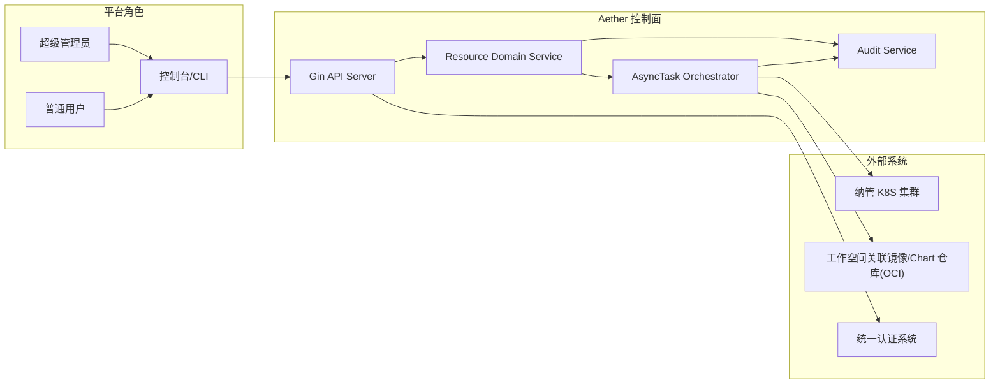

上下文边界说明：

- Aether 控制面负责权限校验、统一资源抽象、任务编排、状态回写、审计落库。
- K8S 集群仅承载运行态对象（Workload/Service/PVC/Secret），不承载控制面业务语义。
- OCI 仓库用于镜像与发布 Chart 的推拉，不承担业务关系存储。

### 3.2 逻辑架构图

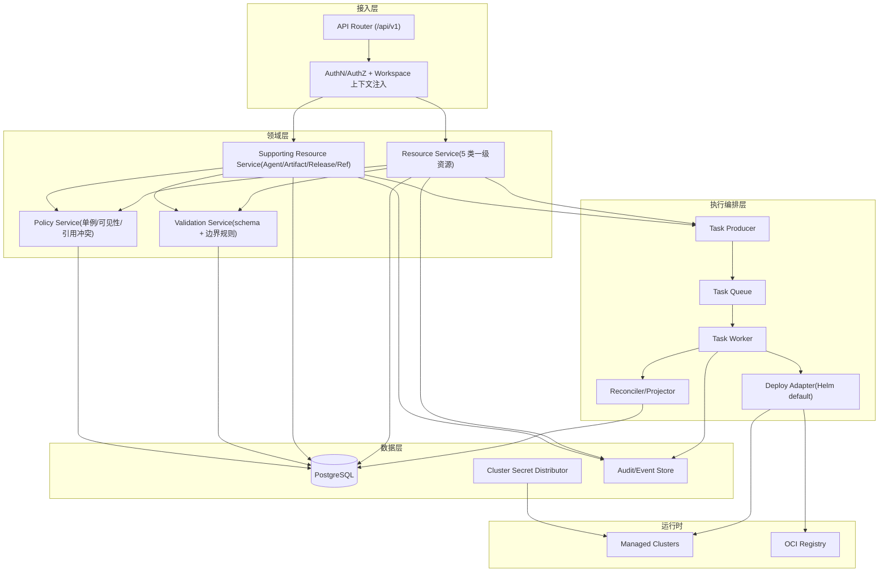

分层职责：

- 接入层：统一认证、租户上下文注入、幂等键透传、并发版本检查入口。
- 领域层：只处理领域规则，不直接操作 K8S。
- 执行层：统一 CUD 链路，按 `resource_kind` 分派适配器，确保新增资源不重写主流程。
- 数据层：PostgreSQL 为唯一控制面事实源，运行态经 Projector 回写快照。

执行基础设施选型定稿（T19/T20）：

| 能力 | 候选方案 | 结论 | 取舍理由 |
| --- | --- | --- | --- |
| 任务队列 | PG `SKIP LOCKED`；Redis Streams；Kafka | 采用 PG 任务表（单一事实源） | 与 `async_tasks` 同事务，避免双写，峰值 `>=2.4 task/s` 满足目标。 |
| 分布式锁 | PG advisory lock；Redis Redlock | 采用 PG advisory lock + fencing token | 无新增中间件；锁与任务同库；fencing 防过期持锁写入。 |
| Outbox Relay | 轮询 Relay；CDC | 采用轮询 Relay（200ms 基线） | 实现复杂度低，可与事务一致提交；满足事件秒级可见性。 |
| 事件总线 | RabbitMQ Streams；Kafka | 采用 RabbitMQ Streams（Super Stream） | 保持至少一次投递；支持按 `ordering_key` 分区有序消费、位点管理与 DLQ 重放。 |

定稿约束：

- 队列、锁、Outbox 的事实源统一为 PostgreSQL；跨组件状态以 `task_id`/`event_id` 关联。
- EventBus 只承载“已提交事实”的分发，不承载控制面主状态。
- 新增资源类型不得引入第二套任务队列或独立锁服务。
- EventBus 拓扑固定为 `aether.domain.events.v1` Super Stream（`16` 分区流），分区数变更需走 `15.2` 变更流程。
- `event_outbox.ordering_key` 为唯一分区输入；路由规则固定 `partition = xxhash32(ordering_key) % 16`。
- 消费者位点采用“Broker offset 提交 + 本地 `processed_event_id` 去重表”双保险，避免回放与重复消费导致副作用重放。

### 3.3 统一资源抽象与扩展点

统一抽象元组：

- `TemplateOrArtifact`：部署来源（平台模板、导入 Helm、高代码镜像/Chart 制品）。
- `Instance`：运行实体（5 类一级资源 + 支撑资源实例）。
- `Relation`：实例关系（Application-Agent、Application-DataService、Owner-Embedded）。
- `ReleaseRecord`：发布与导出沉淀（DevBox 发布记录、HighCodeReleaseChart）。

统一 CUD 执行主链路（对应 `R-ABS-002`）：

1. 请求校验：鉴权、工作空间边界、参数 schema、`resource_version` 并发检查。
2. 任务入队：生成 `AsyncTask`，写入串行化键，返回 `task_id`。
3. 渲染与部署：适配器执行 `render -> apply/upgrade/delete`。
4. 状态回写：更新资源状态、最近任务、失败原因、运行快照。
5. 审计记录：落库请求与结果，关联 `request_id/task_id/resource_id`。

扩展点契约（新增资源类型时只新增 schema 与适配器）：

| 扩展点 | 输入 | 输出 | 约束 |
| --- | --- | --- | --- |
| `SchemaValidator` | `resource_kind + payload` | 标准化参数 | 参数非法返回 `400/422` |
| `TemplateResolver` | `template/artifact ref` | 可渲染包 | 必须返回确定版本与 digest |
| `DeployAdapter` | 统一部署上下文 | K8S 操作结果 | 默认 Helm，必须支持幂等重试 |
| `StatusProjector` | 任务结果 + 集群观测 | 领域状态快照 | 不直接暴露 Pod 作为主实体 |
| `AuditEmitter` | 请求/任务上下文 | 审计事件 | 关键动作必须留痕 |

统一标签规范（对应 `R-ABS-005`）：

- `workspace_id`
- `cluster_id`
- `resource_kind`
- `resource_id`
- `owner_kind`
- `owner_id`

### 3.4 部署视图（Aether 与外部环境边界）

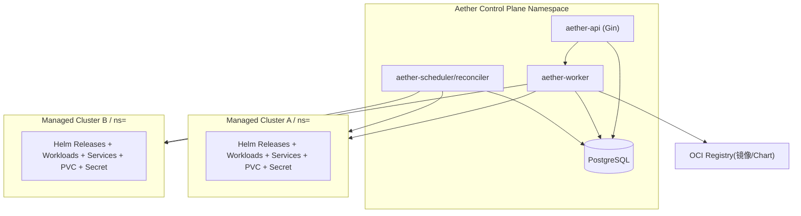

部署边界规则：

- 控制面统一部署在平台集群，业务资源部署在纳管集群目标 namespace。
- `workspace + cluster` 决定唯一部署边界，不允许跨集群关联。
- 镜像凭证由平台下发到目标 namespace，供部署与发布流程消费。

### 3.5 核心时序图（CUD/发布/回收）

#### 3.5.1 通用 CUD 时序（创建/更新/删除）

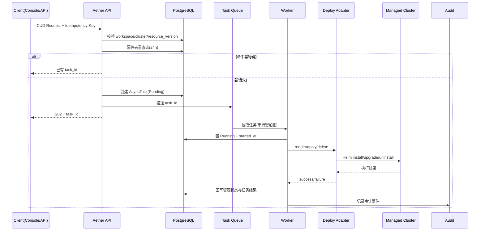

#### 3.5.2 高代码应用发布与 Chart 沉淀时序

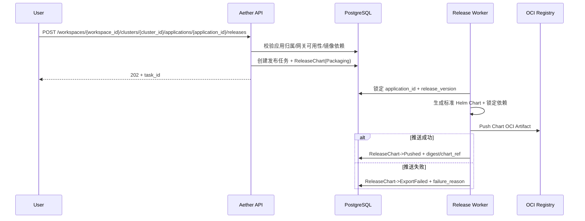

#### 3.5.3 级联删除与补偿时序（含 409 冲突）

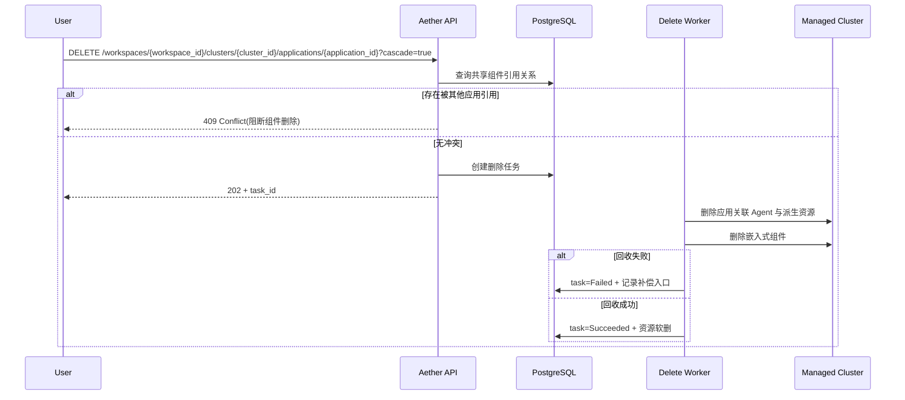

## 4. 功能域设计（对应需求拆解）

### 4.1 工作空间、集群与镜像仓库（R-ENV-001~010）

职责边界：

- 工作空间主数据 CRUD 与集群纳管主数据 CRUD 属于平台管理面能力，Aether 不提供对应租户接口。
- 集群纳管（kubeconfig）与工作空间绑定结果由平台管理面产出，Aether 仅消费其只读视图/内部契约。
- 业务资源 API 仅消费已生效的 `workspace_cluster_bindings` 与 `workspace_registry_bindings`，不直接修改绑定关系。
- 绑定管理动作统一任务化（新增/更新/冻结解绑/恢复/回收/凭证轮转/回滚），并按 `binding_id` 串行执行；
  上述动作为“管理面到 Aether 的内部编排动作”，不等价于 Workspace/ManagedCluster 主数据 CRUD。

主数据读写责任矩阵（T19）：

| 表 | owner | 写入入口（唯一） | Aether 权限 | 平台管理面权限 |
| --- | --- | --- | --- | --- |
| `workspaces` | 平台管理面 | 平台管理面主数据服务 | `SELECT`（只读视图） | `SELECT/INSERT/UPDATE/DELETE` |
| `managed_clusters` | 平台管理面 | 平台管理面纳管服务 | `SELECT`（只读视图） | `SELECT/INSERT/UPDATE/DELETE` |
| `WSCB` | 管理面意图 / Aether 落库 | `workspace-cluster-bindings` internal 契约 | `S/I/U`（关键外键不可变） | 仅可调用 internal API |
| `WSRB` | 管理面意图 / Aether 落库 | `workspace-registry-bindings` internal 契约 | `S/I/U`（版本化写入） | 仅可调用 internal API |

补充说明：

- `workspace-cluster-bindings*` 包含 create/update/freeze/validate/recover/reclaim。
- `workspace-registry-bindings*` 包含 create/update/rotate-credential/rollback。
- `WSCB` = `workspace_cluster_bindings`；入口 `/internal/v1/workspace-cluster-bindings*`。
- `WSRB` = `workspace_registry_bindings`；入口 `/internal/v1/workspace-registry-bindings*`。
- 平台管理面与租户系统均不得直连写入 bindings 表。

实现级防越界约束：

- Aether 生产账号分离为 `aether_rw` 与 `aether_ro`：`aether_rw` 显式拒绝写
  `workspaces/managed_clusters`。
- 平台管理面账号不授予 Aether 库中 bindings 表写权限；仅允许经 internal API 写入。
- bindings 表 immutable 字段（`workspace_id/cluster_id/registry_id`）由数据库触发器强制保护。
- 任一越界写入尝试必须落审计事件 `masterdata_boundary_violation` 并触发 `P1` 告警。

规则落地：

- `R-ENV-001`：纳管集群以 `ManagedCluster` 为事实源，保存 `kubeconfig_ref` 与连通性状态；部署前做集群可达性探测。
- `R-ENV-002`：工作空间创建及其与集群、仓库关联由平台管理面负责；Aether 仅接受平台内部契约调用并消费生效绑定。
  对租户侧直接调用统一拒绝（`403 FORBIDDEN_ACTION`）。
  关联入口固定为内部契约：
  `POST/PUT /internal/v1/workspace-cluster-bindings`、
  `POST/PUT /internal/v1/workspace-registry-bindings`。
- `R-ENV-003`：建立 `workspace + cluster` 绑定时自动创建/复用同名 namespace，写回 `namespace_name`。
- `R-ENV-004`：所有业务请求先校验用户是否关联工作空间，不通过直接拒绝并审计。
- `R-ENV-005`：业务 API 路径必须显式包含 `workspace_id/cluster_id`；`namespace` 由绑定表反查注入，不接受请求体覆写。
- `R-ENV-006`：仓库绑定变更采用版本化绑定记录（`binding_version`），动作覆盖“新增、更新、轮转、回滚”。
  其中回滚通过内部接口
  `POST /internal/v1/workspace-registry-bindings/{binding_id}:rollback`
  执行到指定历史版本，并触发凭证重新下发。
- `R-ENV-007`：凭证下发以 namespace 为粒度生成 `imagePullSecret` 与 Helm OCI 登录凭据，供部署器与发布器消费。
- `R-ENV-008`：跨集群关联在提交阶段拦截，返回 `422 SCHEMA_VALIDATION_FAILED`（原因 `cross_cluster_association_forbidden`）。
- `R-ENV-009`：解绑流程固定为 `Frozen -> Validating -> RecoveryWindow(24h) -> Reclaiming`。
- `R-ENV-010`：解绑仅超管可发起，且必须二次确认（请求体 `confirmation_token`）；全过程写审计事件。

绑定状态与能力矩阵：

| 绑定状态 | Query | CUD | Recover | Reclaim |
| --- | --- | --- | --- | --- |
| `Active` | 允许 | 允许 | 不适用 | 不适用 |
| `Frozen` | 允许 | 拒绝 | 允许 | 拒绝 |
| `Validating` | 允许 | 拒绝 | 允许 | 拒绝 |
| `RecoveryWindow` | 允许 | 拒绝 | 允许 | 仅系统触发 |
| `Reclaiming` | 允许 | 拒绝 | 拒绝 | 进行中 |
| `Unbound` | 允许历史读 | 拒绝 | 拒绝 | 完成 |

绑定可变更动作矩阵（T12，`R-ENV-002`、`R-ENV-006`）：

| 动作 | 接口索引 | 权限 | 并发与幂等 | 审计动作 |
| --- | --- | --- | --- | --- |
| 新增工作空间-集群绑定 | `I1` | super_admin | `Idempotency-Key`；按 binding 串行 | `created` |
| 更新工作空间-集群绑定 | `I2` | super_admin | `resource_version`；按 binding 串行 | `updated` |
| 发起解绑（冻结） | `I3` | super_admin | `confirmation_token`；按 binding 串行 | `freeze_requested` |
| 新增工作空间-仓库绑定 | `I4` | super_admin | `Idempotency-Key`；按 binding 串行 | `created` |
| 更新工作空间-仓库绑定 | `I5` | super_admin | `resource_version`；按 binding 串行 | `updated` |
| 仓库绑定回滚 | `I6` | super_admin | `Idempotency-Key`；按 binding 串行 | `rolledback` |

接口索引（对应 7.6）：

- `I1`: `POST /internal/v1/workspace-cluster-bindings`
- `I2`: `PUT /internal/v1/workspace-cluster-bindings/{binding_id}`
- `I3`: `POST /internal/v1/workspace-cluster-bindings/{binding_id}:freeze`
- `I4`: `POST /internal/v1/workspace-registry-bindings`
- `I5`: `PUT /internal/v1/workspace-registry-bindings/{binding_id}`
- `I6`: `POST /internal/v1/workspace-registry-bindings/{binding_id}:rollback`

仓库绑定回滚约束（`R-ENV-006`）：

| 校验项 | 约束 | 失败码 |
| --- | --- | --- |
| 权限 | 仅超级管理员可调用，且必须携带 `confirmation_token` | `403 FORBIDDEN_ACTION` / `422 CONFIRMATION_TOKEN_INVALID` |
| 目标版本 | `target_binding_version` 必须存在且不可等于当前版本 | `404 BINDING_VERSION_NOT_FOUND` / `409 BINDING_STATE_CONFLICT` |
| 绑定状态 | 仅 `Active` 允许回滚；`Frozen/Validating/RecoveryWindow/Reclaiming/Unbound` 禁止回滚 | `409 BINDING_STATE_CONFLICT` |
| 并发 | 同一 `binding_id` 存在 `Pending/Running` 的轮转或回滚任务时拒绝新回滚 | `409 RESOURCE_BUSY` |
| 执行结果 | 成功后更新 `binding_version`，并对 `Active` 集群 namespace 触发凭证重下发 | 失败进入 `registry_credential_redispatch` 补偿任务 |

### 4.2 统一资源抽象与可扩展部署行为（R-ABS-001~008）

统一抽象（对 5 类一级资源一致）：

- `source`：模板或制品来源（内置 Helm / 导入 Helm / 镜像制品）。
- `instance`：领域实例（含状态、版本、审计字段）。
- `relation`：引用与归属关系（共享引用、宿主归属）。
- `release_record`：发布与导出记录（适用于高代码发布）。

统一执行契约：

- 创建/更新/删除均调用统一 `ExecuteCUD(ctx, resource_kind, action, payload)`。
- 执行器强制五阶段：`validate -> resolve -> render -> apply/delete -> project`。
- 每阶段输出标准结构：`step`、`result`、`failure_reason`、`artifacts`，写入 `async_tasks.result`。

统一可观测结构（`R-ABS-006`）：

```json
{
  "status": "Running",
  "last_task": {"task_id": "uuid", "status": "Succeeded", "ended_at": "2026-02-23T10:00:00Z"},
  "events": [{"level": "Warning", "reason": "ProbeFailed", "at": "2026-02-23T09:59:00Z"}],
  "runtime": {"workload_ready": true, "replicas": "3/3"}
}
```

`R-ABS-007` 配额统计与审计报表口径落地：

- 统计对象：仅统计 5 类一级资源：
  `DataServiceInstance`、`LowCodePlatformInstance`、`DevBoxInstance`、
  `GatewayInstance`、`HighCodeApplication`。
- 聚合键：`workspace_id + cluster_id + resource_kind + status + day`。
- 统计边界：`deleted_at is null` 参与“当前配额”；软删资源仅进入审计报表历史视图。
- 支撑资源口径：`AgentInstance`、`HighCodeReleaseChart` 等仅作为 drill-down 明细，不参与一级配额占用计数。
- 读模型路径：
  - 配额统计：`GET /workspaces/{workspace_id}/clusters/{cluster_id}/quota-summary?date=YYYY-MM-DD`
  - 审计报表：`GET /workspaces/{workspace_id}/clusters/{cluster_id}/audit-reports/resources?from=&to=&resource_kind=`
- 报表示例：
  - 配额统计示例：`resource_kind=highcode_application, limit=2000, used=438, utilization=21.9%`。
  - 审计报表示例：`2026-02-23` 日内 `application.release` 成功 `154` 次，失败 `7` 次，失败 Top1 原因为 `image_dependency_unavailable`。

扩展约束：

- 新增资源类型只允许新增：
  - 参数 schema；
  - `TemplateResolver` 分支；
  - `DeployAdapter` 分支；
  - 读模型 projector 映射。
- 禁止修改任务队列、鉴权中间件、审计主流程（`R-ABS-004`）。
- 控制面实体不直接建模 Pod；Pod 仅作为 `runtime` 观测字段来源（`R-ABS-008`）。

### 4.3 数据服务组件（R-DSP-001~012）

资源域范围：

- 固定类型：`Postgres`、`Redis`、`mem0`、`milvus`、`weaviate`、`pgvector`、`neo4j`、`NebulaGraph`、`MongoDB`、`MinIO`。
- 模板来源：全部平台内置 Helm，按 `template_version` 可升级。

实例分类与接口边界：

- `shared`：对用户暴露独立 CRUD，进入共享列表与选择器。
- `embedded`：仅随宿主管理，不提供独立创建入口，不进入共享列表。
- `embedded` 必须携带 `owner_kind/owner_id`，
  且 `owner_kind` 仅允许 `lowcode_platform` 或
  `highcode_application`。

部署参数（`R-DSP-005`）：

- `resource_spec`：cpu/memory requests&limits。
- `storage`：`storage_class` + `size_gi`。
- `replica_count`：支持横向扩缩。
- `env`：非敏感环境变量。
- `service_exposure`：`ClusterIP` 或 `NodePort`。

运维动作（`R-DSP-006`）：

- 扩缩容：更新 `replica_count`。
- 升级/回滚：更新 `template_version` 与 values。
- 滚动重启：注解触发 `rollout restart`。
- 健康检查：统一读 `readiness/liveness` + 事件。

Service 命名策略（`R-DSP-007`）：

- 冲突优先级 `P1 > P2 > P3`（与 `9.4` 一致）：
  - `P1`：应用创建时直接关联 shared 组件，强制自动生成 `svc-{application_name}-{component_alias}`。
  - `P2`：shared 组件独立创建且显式传入 `service_name`，使用用户名称（同 namespace 唯一）。
  - `P3`：其余自动命名场景统一使用 `svc-{kind}-{resource_name}`。

隔离规则（`R-DSP-008~012`）：

- 低代码依赖组件标记 `embedded_by_lowcode_platform`。
- Chart 自带组件标记 `embedded_by_highcode_chart`。
- 嵌入式组件禁止被其他宿主复用绑定。
- 删除宿主时嵌入式组件必须回收；失败进入补偿任务。

### 4.4 低代码平台（R-LCP-001~010）

模板与来源：

- 内置模板固定 `Dify`、`FastGPT`（`R-LCP-001`）。
- 导入模板仅接受 Helm Chart（`Coze Studio`、`n8n`、外部 `Dify/FastGPT`）。

导入契约（`R-LCP-003`，T16）：

- 导入端点：`POST /workspaces/{workspace_id}/clusters/{cluster_id}/lowcodes/imports`
  （仅 `super_admin` 可调用）。
- 请求最小字段：
  `instance_name`、`platform_type`、`chart_ref`、`chart_version`、
  `entry_url`、`admin_account_ref`、`version`（`values_override` 可选）。
- 入参校验：
  - `chart_ref` 必须为 Helm OCI 引用（`oci://`），禁止镜像地址混用；
  - `chart_version` 必须显式指定，禁止 `latest`；
  - `platform_type` 仅允许 `coze/n8n/dify/fastgpt`；
  - `admin_account_ref` 必须为 `secret://` 引用。
- 异步语义：导入请求统一返回 `202 + task_id`，执行链路见 `8.2.1`。
- 错误码最小集合：
  - `400 INVALID_ARGUMENT`（参数缺失/格式错误）；
  - `422 SCHEMA_VALIDATION_FAILED`（`import_chart_not_helm`、`import_values_invalid`）；
  - `409 RESOURCE_VERSION_CONFLICT`（同实例版本冲突）；
  - `403 FORBIDDEN_ACTION`（非超管）；
  - `503 DEPENDENCY_UNAVAILABLE`（仓库或集群依赖不可用）。

权限与可见性：

- 开通/更新/删除默认仅超级管理员（`R-LCP-002`）。
- 普通用户仅可查看状态与入口 URL（`R-LCP-009`）。

实例规则：

- `allow_multi_instance` 默认值固定为 `false`（同 workspace+cluster+platform_type 默认单活动实例）。
- 若工作空间配置 `allow_multi_instance=true`，可放开为多实例（`R-LCP-008`）。
- 配置范围与变更策略：
  - 配置域：`workspace + cluster + platform_type`。
  - 变更权限：仅超级管理员可修改。
  - 生效时机：仅对“新建实例”即时生效，不追溯改写存量实例。
  - 收敛策略：从 `true -> false` 时，若现存活动实例 `>1`，系统阻断新增并提示先收敛到单实例。
- 实例详情必须记录：`entry_url`、`admin_account_ref`、`dependency_topology`、`version`（`R-LCP-007`）。

删除契约（`R-LCP-004`，T16）：

- 删除端点：`DELETE /workspaces/{workspace_id}/clusters/{cluster_id}/lowcodes/{lowcode_id}`。
- 请求约束：必须携带 `Idempotency-Key`，并显式提交
  `resource_version=<n>`（`cascade` 可选，默认 `true`，仅作用于宿主派生的
  `embedded` 依赖回收）。
- 并发与幂等：同 `idempotency_scope + request_fingerprint` 复用同一 `task_id`；
  同 scope 异指纹返回 `409 IDEMPOTENCY_PAYLOAD_MISMATCH`。
- 异步语义：返回 `202 + task_id`，删除成功后实例软删并回写 `delete_task_id`；
  若 `embedded` 回收失败，进入 `8.6` 补偿链路。

`R-LCP-007` 字段语义与约束（T15 定稿）：

| 字段 | 类型 | 可空性 | 更新策略 | 校验规则 |
| --- | --- | --- | --- | --- |
| `entry_url` | `text` | 非空（创建后） | 允许 `PUT /lowcodes/{id}` 更新 | 必须是 `https://` 或受控内网 `http://` URL；长度 `<=1024` |
| `admin_account_ref` | `text` | 非空（创建后） | 仅允许引用更新，禁止明文口令 | 指向 `secret_versions` 条目；格式见下文 |
| `dependency_topology` | `jsonb` | 非空（默认 `{}`） | 允许更新；必须全量覆盖写入 | 顶层键仅允许 `dataservices/components/edges`，且可序列化为稳定 JSON |
| `version` | `text` | 非空 | 允许更新（升级/回滚均通过该字段表达） | 版本格式 `^[A-Za-z0-9][A-Za-z0-9._-]{0,63}$` |

字段可见性约束：

`admin_account_ref` 引用格式：`secret://{namespace}/{secret_name}.v{n}`。

- `entry_url`、`dependency_topology`、`version` 在详情接口可读。
- `admin_account_ref` 仅返回引用值，不返回明文凭证；普通用户读取时按策略脱敏为
  `secret://{namespace}/{secret_name}.v***`。
- `dependency_topology` 在列表接口默认不展开；需显式 `expand=dependency_topology` 才返回摘要拓扑。

依赖组件策略：

- 内置 Dify/FastGPT 安装时自动创建嵌入式依赖（数据库、缓存等），并写 owner 归属（`R-LCP-005`）。
- 低代码依赖组件不进入共享组件运维面板（`R-LCP-006`）。

非目标约束：

- 不提供低代码平台内部 Agent/Workflow CRUD 代理接口（`R-LCP-010`）。

### 4.5 DevBox（R-DBX-001~009）

定位与生命周期：

- DevBox 是开发运行时实例（非发布环境工作负载）。
- 生命周期动作：创建、配置更新、停止、删除、查询（`R-DBX-003`）。

配置模型：

- 模板：内置框架 Helm 模板（`R-DBX-001`）。
- 运行配置：`repo_mount`、`resource_quota`、`env`、`secret_refs`（`R-DBX-004`）。
- 创建时强制绑定 workspace+cluster（`R-DBX-002`）。

发布门禁：

- DevBox 发布动作生成 `DevBoxPublishRecord`，写入 `publish_version/image_ref/digest/publisher/published_at`（`R-DBX-007`）。
- 仅 `published` 记录可转 `highcode_artifact` 被应用选择（`R-DBX-006`）。
- 发布流程失败不影响 DevBox 实例存活，但记录失败任务与原因。

镜像 push 凭证消费链路（`R-ENV-007`、`R-DBX-005/007`，T16）：

- 发布任务开始时，Worker 固定读取 `workspace_registry_bindings` 当前
  `binding_version + credential_ref`，并将版本号写入任务上下文。
- 推送前执行仓库登录：使用临时凭证文件完成
  `docker/buildah login -> push -> digest verify`。
- 推送成功后，`DevBoxPublishRecord` 除最小字段外额外记录
  `registry_binding_version` 与 `credential_version`，用于问题回溯。
- 推送失败分类：
  - 可重试：网络超时、Registry `5xx`、限流；
  - 不可重试：凭证无效、权限拒绝、仓库路径不存在。
- 失败结果最小字段：
  `registry_binding_version`、`image_ref`、`digest`（可空）、
  `failure_reason`、`retry_count`。

模板兼容（`R-DBX-008`）：

- 更新模板版本前先做 schema 兼容校验。
- 不兼容变更返回 `422 SCHEMA_VALIDATION_FAILED`（原因 `template_incompatible`）。

删除策略：

- 删除 DevBox 不删除历史发布镜像与发布记录（`R-DBX-009`）。

### 4.6 网关（Higress）（R-GTW-001~006）

能力边界：

- 网关承载三类流量能力：应用发布入口、AI 网关、MCP 网关（`R-GTW-001`）。
- 部署模板仅平台内置 Helm（`R-GTW-002`）。

单例约束：

- 同一 workspace+cluster 仅允许一个网关实例（`R-GTW-003`）。
- 创建时若存在活动实例，返回 `422 SCHEMA_VALIDATION_FAILED`（原因 `gateway_singleton_violation`）。

生命周期：

- 支持 CRUD、状态查询、版本升级、回滚（`R-GTW-004`）。
- 配置变更采用灰度参数执行，失败自动回滚（`R-GTW-006`）。

灰度参数模板（T13 定稿）：

| 参数 | 类型 | 默认值 | 约束 | 说明 |
| --- | --- | --- | --- | --- |
| `strategy` | enum | `weighted_route` | 固定值 | 当前版本仅支持按流量权重灰度。 |
| `initial_weight` | int | `10` | `5~50`，步长 `5` | 灰度首批流量占比。 |
| `step_weight` | int | `10` | `5~30`，步长 `5` | 每轮放量增量。 |
| `interval_seconds` | int | `120` | `60~600` | 每轮放量观察窗口。 |
| `success_threshold` | int | `3` | `1~10` | 连续通过探针次数达到阈值才允许下一轮放量。 |
| `error_rate_threshold` | number | `0.05` | `0.01~0.20` | 窗口内错误率阈值。 |
| `latency_p95_ratio_threshold` | number | `1.50` | `1.10~3.00` | 与基线版本相比的 P95 时延倍率阈值。 |
| `max_consecutive_failures` | int | `5` | `1~20` | 连续失败阈值；命中即回切。 |
| `rollback_mode` | enum | `immediate` | `immediate`/`graceful` | 回滚模式：立即全量回切或按步长回切。 |
| `post_stable_observe_seconds` | int | `300` | `120~1800` | 100% 放量后稳定观察窗口。 |

失败回切触发条件（任一命中即回切）：

- 连续探针失败次数 `>= max_consecutive_failures`。
- 连续两个观察窗口 `error_rate > error_rate_threshold`。
- 连续两个观察窗口 `p95_latency_ratio > latency_p95_ratio_threshold`。
- 网关控制面健康探针失败或配置下发任务超时。

回滚与审计字段（最小集合）：

- 回滚动作固定回到上一个稳定 `config_revision`，并将流量权重恢复为稳定版本 `100%`。
- 审计字段最小集合：
  `gray_release_id`、`gateway_instance_id`、`from_revision`、`to_revision`、
  `weight_plan`、`rollback_trigger_metric`、`rollback_reason`、`operator_id`、
  `task_id`、`started_at`、`rolled_back_at`。

灰度演练口径（用于 `TC-GTW-01`）：

- 演练至少覆盖一次“阈值触发自动回滚”与一次“全量放量成功”。
- 演练证据必须包含分轮权重变化、阈值命中点、回滚 revision、审计事件 ID。

发布前置校验（`R-GTW-005`）：

- 高代码/低代码应用对外发布前必须校验：
  - 网关实例存在；
  - 状态为 `Running`；
  - 最近配置变更任务非 `Running`。

### 4.7 高代码应用（R-HCA-001~014）

来源类型（`R-HCA-001`）：

- `devbox_published_image`
- `uploaded_image`
- `uploaded_helm_chart`

部署形态：

- 镜像来源：`1 Agent + 0..N shared data service`（`R-HCA-002`）。
- Chart 来源：`1..N Agent + 0..N shared + 0..N embedded`（`R-HCA-003`）。

创建流程（`R-HCA-004`）：

- 两阶段：先创建 Agent，再绑定组件并创建 Application。
- 一阶段：一次提交中创建 Agent、绑定 shared、创建 Application。

关系约束：

- Application 与 Agent 为 `1:N`（`R-HCA-005`）。
- `agent_instance_id` 在有效关系中唯一归属一个 Application。
- shared 组件绑定必须同 workspace+cluster+namespace（`R-HCA-006`）。

Chart 专属规则（`R-HCA-007`）：

- 必选 `chart_version`。
- 可选 `values_override`。
- 提交前做依赖镜像可用性校验（基于工作空间绑定仓库）。

运行时编排（`R-HCA-008~010`）：

- 自动生成/管理 Workload、Service、ConfigMap/Secret。
- 连接信息按 shared 绑定关系注入（host/port/user/pass ref）。
- 敏感信息仅 Secret 引用注入，用户不可读明文（`R-HCA-009`）。
- 支持 CRUD、扩缩容、升级/回滚、滚动重启（`R-HCA-010`）。

删除语义（`R-HCA-011~014`）：

- 默认 `cascade=false`：仅删应用，不删 shared 组件。
- `cascade=true`：删除应用关联 Agent 与独占派生资源。
- 若 shared 组件仍被他应用引用，返回 `409 REFERENCE_CONFLICT`（`R-HCA-012`）。
- Chart 自带 embedded 组件始终随应用生命周期回收，不进入共享池（`R-HCA-014`）。

### 4.8 高代码应用发布与 Helm Chart 沉淀（R-PKG-001~006）

发布结果定义：

- 每次发布必须产出一个标准 Helm Chart 包（`R-PKG-001`）。
- `release_version` 在应用内唯一，与发布记录一一对应（`R-PKG-002`）。

发布流水线：

1. 锁定应用版本与输入 values。
2. 生成标准化 Chart（含模板、values、`Chart.lock`）。
3. 推送 OCI Artifact 到工作空间绑定仓库（`R-PKG-003`）。
4. 写入 `HighCodeReleaseChart` 元数据与状态。
5. 提供下载导出接口（`R-PKG-004`）。

外部环境导入闭环（`R-PKG-004`）：

1. 用户下载发布包：`GET /workspaces/{workspace_id}/clusters/{cluster_id}/charts/{chart_id}/package`。
2. 下载后执行产物校验：校验 `sha256`、`chart_ref`、`digest` 与 `values_digest` 一致。
3. 在外部环境执行导入：`helm registry login` + `helm pull` 或离线包 `helm install`。
4. 外部环境运行验证：校验 release 状态 `deployed`、核心 workload ready、服务入口可达。
5. 回传验收证据：记录导入命令输出、`helm status`、`kubectl get pods/svc` 与访问探活结果。

E2E 通过条件（发布验收门禁）：

- 下载产物可校验通过；
- 外部环境导入命令执行成功（无重试失败残留）；
- 导入后 10 分钟内关键 workload ready；
- 入口健康检查连续 3 次成功；
- 证据归档可追溯到 `application_id + release_version + chart_id`。

元数据最小集（`R-PKG-005`）：

- `application_id`
- `release_version`
- `chart_ref`
- `source_type`
- `source_version`
- `digest`
- `created_by`
- `created_at`

可复现保障（`R-PKG-006`）：

- 固化渲染后必要 values；
- 固化依赖锁定文件；
- 固化镜像 digest 映射。

### 4.9 应用关系持久化与资源可见性（R-DATA-001~008）

关系持久化：

- 高代码应用保存三类成员关系：`agent_refs`、`shared_dataservice_refs`、`embedded_dataservice_refs`（`R-DATA-001`）。
- 低代码平台保存 `platform_instance + embedded_dataservice_refs`（`R-DATA-002`）。
- 关系查询输出必须带 `visibility` 与 `owner_kind/owner_id`（`R-DATA-003`）。

查询与展示规则：

- Query 路径不做跨资源实时聚合状态计算（`R-DATA-004`）。
- 应用详情固定展示：Agent 集合、组件集合、入口地址、发布 Chart 版本（`R-DATA-007`）。
- 共享选择器仅展示 `visibility=shared` 且 `deleted_at is null`（`R-DATA-006`）。

删除与审计：

- 软删字段：`deleted_at`、`deleted_by`、`delete_task_id`（`R-DATA-005`）。
- 绑定/解绑/级联删除均写审计事件（`R-DATA-008`）。

### 4.10 CRUD、权限与异步任务（R-OPS-001~010）

统一读写语义：

- 5 类一级资源 CUD 全异步，Query 全同步（`R-OPS-001`）。
- CUD 强制 `Idempotency-Key`，24h 内重复返回同 `task_id`（`R-OPS-002`）。

权限边界：

- 角色固定：超级管理员 + 普通用户（`R-OPS-003`）。
- 跨 workspace/cluster/namespace 请求一律拒绝并审计（`R-OPS-004`）。

并发与串行：

- 同资源串行键执行（`R-OPS-005`）。
- 更新/删除必须带 `resource_version`（`R-OPS-006`）。

任务可靠性：

- 支持重试、超时、取消与失败诊断（`R-OPS-007`）。
- 结果最小字段必须包含：`resource_kind`、`resource_id`、`started_at`、`ended_at`、`failure_reason`（`R-OPS-008`）。
- 宿主删除触发嵌入式资源回收，失败转补偿任务并可重试（`R-OPS-009`）。

审计闭环：

- 创建、更新、删除、发布、导出五类关键动作必写审计（`R-OPS-010`）。
- 审计事件关联 `request_id + task_id + resource_id`，支持端到端追溯。

## 5. 领域模型与数据设计

### 5.1 领域模型总览（5 类一级资源 + 支撑资源）

模型分层：

- 一级资源（L1）：`DataServiceInstance`、`LowCodePlatformInstance`、`DevBoxInstance`、`GatewayInstance`、`HighCodeApplication`。
- 支撑资源：`AgentInstance`、`HighCodeArtifact`、`DevBoxPublishRecord`、`HighCodeReleaseChart`、关系引用、`AsyncTask`、`SecretVersion`。
- 运行态对象：K8S Workload/Service/PVC/Secret 仅作为投影对象，由 `resource_kind/resource_id` 回挂。

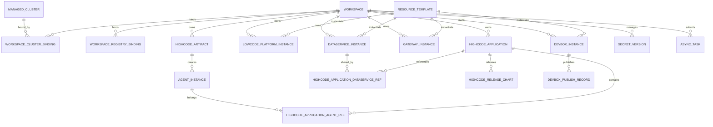

### 5.2 核心实体定义

#### 5.2.1 通用列（适用于可软删实体）

| 字段 | 类型 | 约束/说明 |
| --- | --- | --- |
| `id` | `uuid` | 主键 |
| `workspace_id` | `uuid` | 资源归属工作空间 |
| `cluster_id` | `uuid` | 部署目标集群 |
| `namespace` | `text` | 由 workspace 映射生成，不允许自定义 |
| `status` | `text` | 领域状态，受状态机约束 |
| `resource_version` | `bigint` | 乐观并发控制，单调递增 |
| `created_at/by` | `timestamptz,text` | 创建审计 |
| `updated_at/by` | `timestamptz,text` | 更新审计 |
| `deleted_at/by` | `timestamptz,text` | 软删审计（为空表示有效） |
| `delete_task_id` | `uuid` | 触发删除的任务追踪 |
| `last_task_id` | `uuid` | 最近一次任务 |

#### 5.2.2 一级资源实体

| 实体 | 关键字段（除通用列） | 唯一性/约束 |
| --- | --- | --- |
| `data_service_instances` | `type,name,visibility,owner,template,spec,secret` | `shared/embedded`；embedded 必带 owner |
| `lowcode_platform_instances` | 关键字段见 4.4（四字段）与 5.2.4（模型） | `platform_type+instance_name` 唯一 |
| `devbox_instances` | `instance_name`、`template_id`、`repo_url`、`runtime_spec` | 支持 `Stopped/Publishing` 扩展状态 |
| `gateway_instances` | `instance_name text`、`template_id uuid`、`gateway_spec jsonb` | `workspace_id+cluster_id` 全局单例 |
| `highcode_applications` | `application_name`、`source_type`、`release_channel`、`runtime_spec` | 创建时必须至少关联 1 个 Agent |

#### 5.2.3 支撑资源实体

| 实体 | 关键字段 | 唯一性/约束 |
| --- | --- | --- |
| `highcode_artifacts` | `name,version,type,image/chart,digest` | `artifact_type` 仅三种来源 |
| `agent_instances` | `agent_instance_name`、`artifact_id`、`deploy_spec jsonb` | 同时刻仅允许归属一个 Application（由关系表约束） |
| `devbox_publish_records` | `devbox_instance_id`、`publish_version`、`image_ref`、`digest`、`published_at/by` | 只归档不物理删除 |
| `highcode_release_charts` | `app_id,release_ver,chart_ref,digest,source,status` | `release_version` 单应用唯一 |
| `highcode_application_agent_refs` | `application_id,agent_instance_id,created_at/by` | app-agent 唯一；agent 单归属 |
| `highcode_application_dataservice_refs` | `application_id,data_service_instance_id,created_at/by` | 仅允许 shared 组件 |
| `async_tasks` | 幂等与任务字段见 `8.1`（canonical 命名） | `idempotency_scope` 24h 唯一；指纹不一致返回 `409` |
| `secret_versions` | `secret_name`、`version`、`namespace`、`encrypted_data_ref`、`is_current` | 每个 `secret_name` 仅一个当前版本 |

#### 5.2.4 `lowcode_platform_instances` 字段明细（T15）

| 字段 | 类型 | 默认值 | 可空性 | 约束 |
| --- | --- | --- | --- | --- |
| `entry_url` | `text` | 无 | 否 | `chk_lc_entry_url_format`，只接受合法 URL |
| `admin_account_ref` | `text` | 无 | 否 | `chk_lc_admin_ref_secret_uri`，仅 `secret://` 引用 |
| `dependency_topology` | `jsonb` | `'{}'::jsonb` | 否 | `chk_lc_dependency_topology_object`，仅对象结构 |
| `version` | `text` | `'unknown'`（迁移期） | 否 | `chk_lc_version_pattern`，创建后不得为 `'unknown'` |

字段写入策略：

- 创建：四字段均允许写入；若调用方未传 `dependency_topology`，写入 `{}`。
- 更新：`PUT /lowcodes/{lowcode_id}` 必须携带 `resource_version`；四字段按“全量替换”语义写入。
- 回滚：低代码平台版本回滚通过更新 `version` + `spec` 完成，并记录 `from_version/to_version` 审计。

### 5.3 关系模型（Application-Agent-DataService）

关系约束：

- `HighCodeApplication` 与 `AgentInstance`：`1:N`，通过 `highcode_application_agent_refs` 建模。
- 同一 `AgentInstance` 在有效关系中仅可被一个 `Application` 绑定。
- `HighCodeApplication` 与共享 `DataServiceInstance`：`N:M`，通过 `highcode_application_dataservice_refs` 建模。
- `embedded` 数据服务不进入共享关联表，改由 `owner_kind/owner_id` 直接归属。

引用完整性规则：

- `application`、`agent`、`dataservice` 三者必须同 `workspace_id + cluster_id + namespace`。
- 级联删除 `cascade=true` 时，先校验共享组件引用；命中冲突直接 `409`。
- 删除低代码平台或 Chart 型高代码应用时，只回收其 `embedded` 组件。

聚合状态规则（对应 `R-DATA-004`）：

- Query 读路径不做跨资源实时聚合计算。
- 应用状态以应用自身最近成功/失败任务结果为准，成员状态以独立字段展示。
- 应用详情读模型固定输出：`agent_instances`、`dataservice_instances`、`entrypoints`、`release_charts`，满足关系可视化展示要求。

### 5.4 唯一性约束与索引策略

主约束（仅列核心）：

| 表 | 唯一约束 |
| --- | --- |
| `workspaces` | `uq_workspaces_name(workspace_name)` |
| `managed_clusters` | `uq_clusters_name(cluster_name)` |
| `workspace_cluster_bindings` | `uq_wcb_workspace_cluster(workspace_id,cluster_id)` |
| `workspace_registry_bindings` | `uq_wrb_workspace_registry(workspace_id,registry_id)` |
| `resource_templates` | `uq_tpl_kind_name_ver(template_kind,template_name,template_version)` |
| `highcode_artifacts` | `uq_art_workspace_name_ver_type(workspace_id,artifact_name,artifact_version,artifact_type)` |
| `data_service_instances` | `uq_ds_workspace_cluster_name(workspace_id,cluster_id,instance_name)` |
| `lowcode_platform_instances` | `uq_lc_ws_cl_type_name(workspace_id,cluster_id,platform_type,instance_name)` |
| `devbox_instances` | `uq_db_workspace_cluster_name(workspace_id,cluster_id,instance_name)` |
| `gateway_instances` | `uq_gw_workspace_cluster(workspace_id,cluster_id)` |
| `highcode_applications` | `uq_app_workspace_cluster_name(workspace_id,cluster_id,application_name)` |
| `agent_instances` | `uq_agent_workspace_cluster_name(workspace_id,cluster_id,agent_instance_name)` |
| `highcode_application_agent_refs` | `uq_ref_app_agent(...) + uq_ref_agent_single_owner(...)` |
| `highcode_application_dataservice_refs` | `uq_ref_app_ds(application_id,data_service_instance_id)` |
| `highcode_release_charts` | `uq_chart_app_release(application_id,release_version)` |
| `async_tasks` | `uq_task_idempotency_scope(idempotency_scope)` |
| `secret_versions` | `uq_secret_workspace_ns_name_ver(workspace_id,namespace,secret_name,version)` |

索引策略：

- 列表查询索引：`idx_<table>_workspace_cluster_status_deleted(workspace_id,cluster_id,status,deleted_at)`。
- 任务查询索引：`idx_async_tasks_serialized_status(serialized_key,status,created_at desc)`。
- 幂等清理索引：`idx_async_tasks_idempotency_expire(idempotency_expire_at)`。
- 低代码平台索引：
  `idx_lc_entry_url(workspace_id,cluster_id,entry_url) where deleted_at is null`、
  `idx_lc_admin_ref(workspace_id,cluster_id,admin_account_ref) where deleted_at is null`、
  `idx_lc_version(workspace_id,cluster_id,platform_type,version) where deleted_at is null`。
- 关系查询索引：`idx_ref_agent_app(agent_instance_id,application_id)`、
  `idx_ref_ds_app(data_service_instance_id,application_id)`。
- 审计追踪索引：`idx_<table>_last_task(last_task_id)`、`idx_<table>_delete_task(delete_task_id)`。

实现说明：

- 所有业务唯一索引均采用“`deleted_at is null`”部分唯一索引，保证软删后可重建同名资源。
- 大表新增索引使用 `CREATE INDEX CONCURRENTLY`，避免阻塞写流量。

### 5.5 软删与审计字段策略

软删策略：

- 一级资源与大部分支撑资源使用软删；关系引用表可硬删（删除时必须写审计事件）。
- `deleted_at` 仅由删除任务写入，禁止业务接口直接更新。
- 软删后保留 `delete_task_id`，用于任务级追溯与补偿重放。

审计事件最小字段：

- `request_id`、`task_id`、`resource_kind`、`resource_id`
- `action`（create/update/delete/publish/export/bind/unbind）
- `actor`、`workspace_id`、`cluster_id`
- `before_snapshot`、`after_snapshot`、`result`、`failure_reason`
- `occurred_at`

### 5.6 发布制品模型（Artifact/ReleaseChart）

`HighCodeArtifact` 设计：

- 统一承载三类来源：DevBox 已发布镜像、用户上传镜像、用户上传 Helm Chart。
- 关键字段：`artifact_type`、`image_ref/chart_ref`、`digest`、`source_meta`。
- 与 `AgentInstance` 为 `1:N`（一个制品可创建多个 Agent）。

`HighCodeReleaseChart` 设计：

- 每次应用发布生成一个 `release_version`。
- 状态机：`Packaging -> Pushed | ExportFailed`。
- 元数据满足 `R-PKG-005` 最小集，并额外记录 `package_size`、`values_digest` 以支持复现。

### 5.7 工作空间-集群-仓库绑定模型与 namespace 映射

绑定模型：

- `workspace_cluster_bindings`：维护 `namespace_name`、`binding_status`、`freeze_at`、`recovery_deadline`。
- `workspace_registry_bindings`：维护仓库地址、凭证引用、最后下发版本。

namespace 映射规则：

- `namespace_name = workspace_name`，在绑定建立时创建或复用。
- 所有资源实例持久化写入 `namespace` 冗余列，便于查询与跨边界校验。
- 解绑进入冻结态后，禁止新建/更新任务，仅允许查询、撤销解绑、系统回收任务。

读写边界实现约束（T19）：

| 对象 | 数据访问策略 | 约束实现 |
| --- | --- | --- |
| `workspaces`、`managed_clusters` | Aether 仅读 `vw_workspaces/vw_managed_clusters` | 移除 Aether 写权；Repository 仅 Query |
| `workspace_cluster_bindings` | Aether internal API + Worker 写入状态列 | DDL 触发器阻断不可变字段更新；`resource_version` 必填 |
| `workspace_registry_bindings` | Aether internal API + Worker 写版本/同步状态 | 快照表与主写同事务提交 |

注：快照表名为 `workspace_registry_binding_history`。

数据库角色与权限：

- `role_platform_masterdata_rw`：可写 `workspaces/managed_clusters`，不可写 bindings。
- `role_aether_binding_rw`：可写 bindings 与 history/outbox/task，不可写
  `workspaces/managed_clusters`。
- `role_aether_runtime_ro`：只读主数据与绑定快照，用于 Query 与投影。

### 5.8 数据迁移与兼容策略

迁移原则：

- 向前兼容优先：新增列使用可空 + 默认值；写路径双写，读路径灰度切换。
- 约束分阶段：先建非唯一索引，再回填数据，再切换唯一/检查约束。
- 失败可回滚：每个 migration 对应 `up/down` 脚本，禁止跨版本隐式变更。

迁移阶段：

1. `Phase A`：建表与通用字段（不加严格外键）。
2. `Phase B`：回填历史数据（`workspace_id/cluster_id/resource_version`）。
3. `Phase C`：启用部分唯一索引与关键外键。
4. `Phase D`：清理废弃字段并冻结旧写路径。

`R-LCP-007` 专项迁移步骤（T15）：

1. `Step-1` 加字段：为 `lowcode_platform_instances` 新增
   `entry_url/admin_account_ref/dependency_topology/version`，先允许空值并给默认值。
2. `Step-2` 回填：
   - `entry_url`：优先取历史 `spec.entry.url`，缺失时回填为实例历史入口快照。
   - `admin_account_ref`：将历史明文字段迁移为 `secret://` 引用；无法映射时标记为
     `migration_pending_ref` 并阻断更新写入。
   - `dependency_topology`：由历史依赖关系表重建，缺失回填 `{}`。
   - `version`：优先取 `spec.version`，缺失回填 `'unknown'`。
3. `Step-3` 灰度切换：读路径先兼容“新列优先 + 旧字段兜底”，灰度完成后切换为仅读新列。
4. `Step-4` 强校验：开启四字段非空与格式校验，移除旧字段写入口。
5. `Step-5` 回滚策略：若 `Step-3/Step-4` 失败，回滚到“新列保留但仅读旧字段”模式，
   并通过补偿任务 `lowcode_field_backfill_retry` 重新回填。

## 6. 状态机与生命周期设计

### 6.1 一级资源状态机

```mermaid
stateDiagram-v2
  [*] --> Creating: CreateTask accepted
  Creating --> Running: deploy success + health pass
  Creating --> Failed: deploy failure/timeout

  Running --> Updating: UpdateTask accepted
  Updating --> Running: update success
  Updating --> Degraded: partial available
  Updating --> Failed: update failure/timeout

  Degraded --> Updating: retry/update
  Degraded --> Running: self-healed or repair success

  Running --> Deleting: DeleteTask accepted
  Degraded --> Deleting: DeleteTask accepted
  Failed --> Deleting: DeleteTask accepted

  Deleting --> Deleted: recycle success
  Deleting --> DeleteFailed: recycle failure/timeout
  DeleteFailed --> Deleting: compensation retry
```

状态触发与补偿入口：

| 场景 | 触发条件 | 失败分支 | 补偿入口 |
| --- | --- | --- | --- |
| 创建 | `AsyncTask(create)` 被 worker 执行 | `Failed` | 重试创建任务或转删除清理 |
| 更新 | `AsyncTask(update)` 执行 | `Degraded/Failed` | 重试更新、回滚版本 |
| 删除 | `AsyncTask(delete)` 执行 | `DeleteFailed` | 幂等重试删除、人工介入 |

资源特化状态：

- `DevBoxInstance` 额外状态：`Stopped`、`Publishing`。
- `GatewayInstance` 不支持多实例并行升级，`Updating` 期间同 cluster 下拒绝新变更。

### 6.2 AgentInstance 状态机

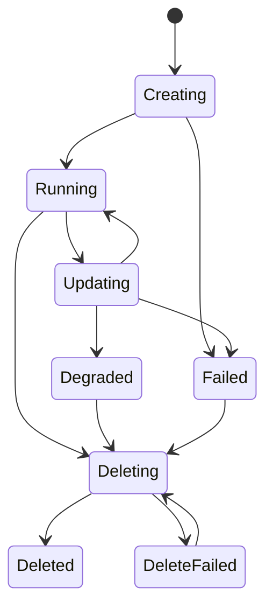

Agent 归属约束（非状态字段）：

- `agent_instance_id` 在有效关系中唯一归属一个 `application_id`。
- 应用解绑 Agent 后，Agent 可保持 `Running`（独立资源语义），或由应用删除任务级联回收。

### 6.3 ReleaseChart 状态机

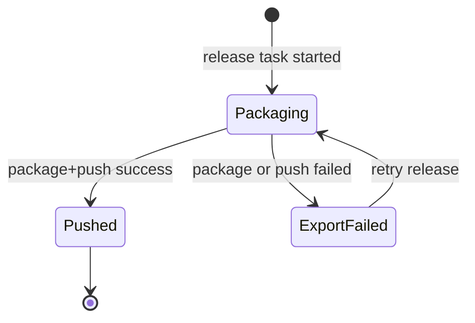

发布失败分支：

- 生成失败：Chart 渲染/依赖锁定失败，记录 `failure_reason=package_failed`。
- 推送失败：OCI 鉴权或网络失败，记录 `failure_reason=push_failed`。
- 重试策略遵循任务框架（最多 5 次指数退避）。

### 6.4 AsyncTask 状态机

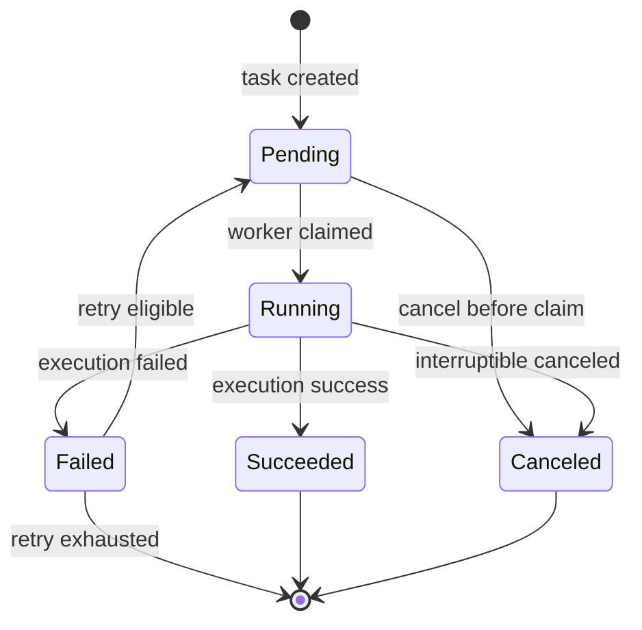

任务控制规则：

- 串行化键：`workspace_id:cluster_id:resource_kind:resource_id_or_name`。
- 重试上限：5 次；退避：`5s/15s/45s/135s/300s`。
- 默认超时：创建/更新 30 分钟，删除 15 分钟，发布导出 20 分钟。
- 结果字段：`resource_kind`、`resource_id`、`started_at`、`ended_at`、`failure_reason`、`retry_count`、`serialized_key`。

### 6.5 工作空间与集群解绑状态机（冻结->校验->24h 可恢复窗口->回收）

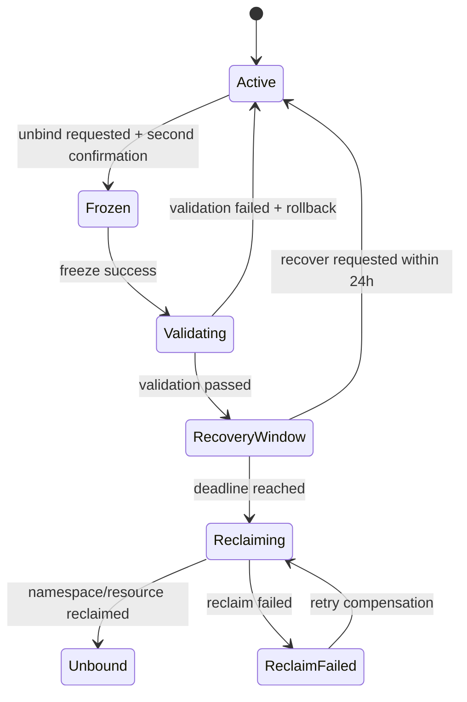

关键约束：

- `Frozen` 后拒绝新 CUD，仅允许 Query 与恢复操作。
- `RecoveryWindow` 默认 24 小时（`ADR-055`）。
- 回收阶段失败进入 `ReclaimFailed`，保留重试与人工补偿入口。

### 6.6 外部环境事件驱动状态同步（非 Aether 发起）

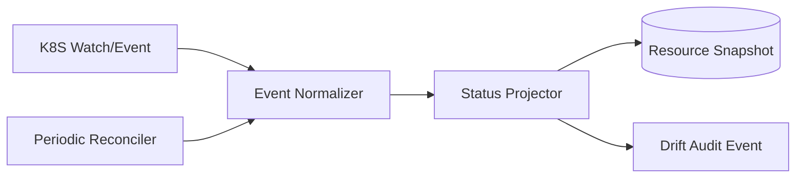

同步规则：

- 外部删除/变更导致与期望态不一致时，资源状态先置 `Degraded`，并记录漂移事件。
- 若下一轮 reconcile 自动修复成功，状态回到 `Running`；否则保持 `Failed/Degraded` 并触发告警。
- Projector 只更新状态快照与观测字段，不修改业务关系模型。

## 7. 接口契约与 API 设计

### 7.1 通用契约（前缀、幂等、并发控制、响应结构）

- 协议与前缀：
  - Base URL：`/api/v1`
  - 媒体类型：`application/json`
  - 认证：`Authorization: Bearer <token>`
- 租户上下文：
  - 外部资源接口统一采用工作空间/集群分层路径：
    `/api/v1/workspaces/{workspace_id}/clusters/{cluster_id}/...`
  - 服务端以路径参数为准注入租户上下文，禁止请求体覆盖 `workspace_id/cluster_id/namespace`。
- 同步与异步语义：
  - Query（GET）：同步返回领域读模型。
  - CUD（POST/PUT/DELETE）：统一返回 `202 Accepted + task_id`，由任务系统异步执行。
- 幂等控制：
  - 所有 CUD 必须携带 `Idempotency-Key`（长度 8~128）。
  - 24h 内同作用域重复提交返回首次 `task_id`（见 8.4）。
- 并发控制：
  - 更新与删除必须提交 `resource_version`。
  - 版本不一致返回 `409 RESOURCE_VERSION_CONFLICT`。
- 请求追踪：
  - 可选 `X-Request-Id`；未传时服务端生成并回传。
  - 所有响应均回传 `request_id`。

统一响应结构：

```json
{
  "code": "OK",
  "message": "success",
  "request_id": "req_01J...",
  "data": {}
}
```

异步提交响应（`202`）：

```json
{
  "code": "ACCEPTED",
  "message": "task accepted",
  "request_id": "req_01J...",
  "data": {
    "task_id": "2de65c58-9e35-4f63-8cc4-3fb1beebf18c",
    "status": "Pending",
    "deduplicated": false
  }
}
```

错误响应结构：

```json
{
  "code": "RESOURCE_VERSION_CONFLICT",
  "message": "resource_version mismatch",
  "request_id": "req_01J...",
  "error": {
    "retryable": false,
    "details": [
      {
        "field": "resource_version",
        "reason": "expected 17, got 16"
      }
    ]
  }
}
```

分页与过滤约定（列表 Query 通用）：

- `page`（默认 1）、`page_size`（默认 20，最大 100）
- `sort`（如 `created_at.desc`）
- `status`、`keyword`、`visibility`（按资源域可选）

### 7.2 错误码与异常模型

错误码分层：

- HTTP 状态码：表达传输层语义（认证失败、未找到、冲突等）。
- 业务错误码：表达稳定可编程语义，供前端和自动化重试策略消费。

错误码词典（T17 冻结）：

| HTTP | Canonical 业务码 | 场景 | 是否可重试 | 兼容别名策略 |
| --- | --- | --- | --- | --- |
| 400 | `INVALID_ARGUMENT` | 参数缺失、格式非法 | 否 | 无 |
| 401 | `UNAUTHORIZED` | Token 无效或过期 | 否 | 无 |
| 403 | `FORBIDDEN_WORKSPACE` | 无工作空间权限，或跨 workspace/cluster/namespace 边界调用 | 否 | 无 |
| 403 | `FORBIDDEN_ACTION` | 动作越权（含非超管执行超管动作、租户调用 internal 接口） | 否 | 兼容 `FORBIDDEN`：`v1.11~v1.12` 仅做响应解析兼容；`v1.13` 下线 |
| 404 | `RESOURCE_NOT_FOUND` | 资源不存在或已软删 | 否 | 无 |
| 409 | `RESOURCE_VERSION_CONFLICT` | `resource_version` 冲突 | 否 | 无 |
| 409 | `REFERENCE_CONFLICT` | `cascade=true` 时 shared 组件仍被外部引用 | 否 | `SHARED_RESOURCE_IN_USE` 兼容至 `v1.12`，`v1.13` 下线 |
| 409 | `RESOURCE_BUSY` | 同资源已有 Running/Pending 任务 | 是 | 无 |
| 409 | `IDEMPOTENCY_PAYLOAD_MISMATCH` | 同幂等作用域但请求指纹不一致 | 否 | 无 |
| 409 | `BINDING_STATE_CONFLICT` | 绑定状态不允许回滚或目标版本与当前版本一致 | 否 | 无 |
| 422 | `SCHEMA_VALIDATION_FAILED` | 模板/制品参数校验失败 | 否 | 无 |
| 422 | `CONFIRMATION_TOKEN_INVALID` | 二次确认 token 缺失、失效或不匹配 | 否 | 无 |
| 404 | `BINDING_VERSION_NOT_FOUND` | 仓库绑定目标版本不存在 | 否 | 无 |
| 429 | `TOO_MANY_REQUESTS` | 请求超限/队列限流 | 是 | 无 |
| 500 | `INTERNAL_ERROR` | 未分类服务端错误 | 视情况 | 无 |
| 503 | `DEPENDENCY_UNAVAILABLE` | K8S/OCI/DB 短暂不可用 | 是 | 无 |

T17 口径约束（403/409）：

- 403 仅允许 `FORBIDDEN_WORKSPACE` 与 `FORBIDDEN_ACTION` 两个 canonical 业务码，按场景互斥触发。
- 409 shared 引用冲突仅允许 `REFERENCE_CONFLICT`，删除决策表、OpenAPI、验收断言必须同码。
- 兼容窗口内若命中旧码（`FORBIDDEN`、`SHARED_RESOURCE_IN_USE`），网关统一归并为 canonical 码并记录告警日志 `error_code_legacy_alias_total`。

异常字段约定：

- `code`：稳定业务码（机器可读）。
- `message`：可读摘要（人读）。
- `error.retryable`：调用方是否可自动重试。
- `error.details[]`：字段级错误（`field/reason`）。

### 7.3 资源接口分组与路径规范

资源分组：

- 作用域前缀：`{scope}=/workspaces/{workspace_id}/clusters/{cluster_id}`

| 分组 | Tag | 路径前缀 |
| --- | --- | --- |
| 数据服务组件 | `DataService` | `{scope}/dataservices` |
| 低代码平台 | `LowCodePlatform` | `{scope}/lowcodes` |
| DevBox | `DevBox` | `{scope}/devboxes` |
| 网关 | `Gateway` | `{scope}/gateways` |
| 高代码应用 | `HighCodeApplication` | `{scope}/applications` |
| Agent 实例 | `AgentInstance` | `{scope}/agents` |
| 嵌入式组件运维（超管） | `EmbeddedDataServiceAdmin` | `{scope}/embeddeddataservices` |
| 资源模板 | `Template` | `{scope}/templates` |
| 高代码制品 | `HighCodeArtifact` | `{scope}/artifacts` |
| DevBox 发布记录 | `DevBoxPublishRecord` | `{scope}/devboxes/{devbox_id}/publishes` |
| 发布 Chart 包 | `ReleaseChart` | `{scope}/charts` |
| 异步任务 | `AsyncTask` | `{scope}/tasks` |

标准 CRUD 模板（示例）：

- Create：`POST /.../{resources}`
- List：`GET /.../{resources}`
- Get：`GET /.../{resources}/{resource_id}`
- Update：`PUT /.../{resources}/{resource_id}`
- Delete：`DELETE /.../{resources}/{resource_id}?resource_version=<n>&cascade=<bool>`

以下端点为文档 canonical path（T7 统一口径）：

模板与制品查询接口：

- `GET /workspaces/{workspace_id}/clusters/{cluster_id}/templates?kind={dataservice|lowcode|devbox|gateway}`
- `GET /workspaces/{workspace_id}/clusters/{cluster_id}/templates/{template_id}`
- `GET /workspaces/{workspace_id}/clusters/{cluster_id}/artifacts`
- `GET /workspaces/{workspace_id}/clusters/{cluster_id}/artifacts/{artifact_id}`

DevBox 发布记录接口：

- `POST /workspaces/{workspace_id}/clusters/{cluster_id}/devboxes/{devbox_id}/publishes`
- `GET /workspaces/{workspace_id}/clusters/{cluster_id}/devboxes/{devbox_id}/publishes`
- `GET /workspaces/{workspace_id}/clusters/{cluster_id}/publishes/{publish_id}`

低代码平台接口（T15 字段闭环）：

- 创建：`POST /workspaces/{workspace_id}/clusters/{cluster_id}/lowcodes`
- 导入：`POST /workspaces/{workspace_id}/clusters/{cluster_id}/lowcodes/imports`
- 列表：`GET /workspaces/{workspace_id}/clusters/{cluster_id}/lowcodes`
- 详情：`GET /workspaces/{workspace_id}/clusters/{cluster_id}/lowcodes/{lowcode_id}`
- 更新：`PUT /workspaces/{workspace_id}/clusters/{cluster_id}/lowcodes/{lowcode_id}`
- 删除：`DELETE /workspaces/{workspace_id}/clusters/{cluster_id}/lowcodes/{lowcode_id}`

低代码 Helm 导入接口补充（T16）：

- `POST /.../lowcodes/imports` 仅允许 `super_admin` 调用，返回 `202 + task_id`。
- 请求体最小字段：
  `instance_name/platform_type/chart_ref/chart_version/entry_url/admin_account_ref/version`。
- 错误码最小集合：
  `400 INVALID_ARGUMENT`、`422 SCHEMA_VALIDATION_FAILED`
  （`import_chart_not_helm/import_values_invalid`）、
  `409 RESOURCE_VERSION_CONFLICT`（版本冲突）、
  `403 FORBIDDEN_ACTION`、`503 DEPENDENCY_UNAVAILABLE`。

低代码平台四字段契约（`R-LCP-007`）：

| 接口 | `entry_url` | `admin_account_ref` | `dependency_topology` | `version` |
| --- | --- | --- | --- | --- |
| `POST /lowcodes` | 可写，必填 | 可写，必填，仅引用 | 可写，选填（默认 `{}`） | 可写，必填 |
| `PUT /lowcodes/{id}` | 可写 | 可写（仅允许切换引用） | 可写（全量替换） | 可写（升级/回滚） |
| `GET /lowcodes/{id}` | 返回明文 URL | 返回引用（按角色脱敏） | 返回完整拓扑 | 返回当前版本 |
| `GET /lowcodes` | 默认返回 | 默认返回脱敏摘要 | 默认不返回；`expand=dependency_topology` 返回摘要 | 默认返回 |

低代码平台字段错误码（最小集合）：

- `422 SCHEMA_VALIDATION_FAILED`：
  `entry_url_invalid`、`admin_account_ref_invalid`、
  `dependency_topology_invalid`、`version_pattern_invalid`。
- `404 RESOURCE_NOT_FOUND`：`admin_account_ref` 引用不存在或不可见。

高代码发布与发布包接口：

- 关系查询：`GET /workspaces/{workspace_id}/clusters/{cluster_id}/applications/{application_id}/relations`
- 发布：`POST /workspaces/{workspace_id}/clusters/{cluster_id}/applications/{application_id}/releases`
- 发布包列表：`GET /workspaces/{workspace_id}/clusters/{cluster_id}/applications/{application_id}/charts`
- 下载发布包：`GET /workspaces/{workspace_id}/clusters/{cluster_id}/charts/{chart_id}/package`

下载发布包鉴权与缓存策略（T13 定稿）：

- 下载链路定稿为“API 鉴权 + 临时签名 URL”（不采用控制面直连回源）。
- 第 1 跳：客户端调用下载接口，控制面执行 `BearerAuth`、workspace/cluster 边界与
  `chart_id` 归属校验（`NFR-014`）。
- 第 2 跳：校验通过后签发临时 URL，返回 `302 Found` + `Location`；
  签名有效期固定 `300s`，并绑定
  `workspace_id + cluster_id + chart_id + chart_digest + requester_id`。
- 控制面响应头固定 `Cache-Control: no-store`；对象存储响应头固定
  `Cache-Control: private, max-age=60, must-revalidate`。
- URL 过期后必须回到控制面重新换签，禁止客户端缓存签名参数到持久化存储（`NFR-012`）。
- 下载审计最小字段：
  `chart_id`、`release_version`、`digest`、`requested_by`、`request_ip`、
  `signed_url_expire_at`、`download_request_id`、`audit_trace_id`（`NFR-013/015`）。

超管专用 `embedded` 组件独立运维接口（满足权限矩阵）：

- `GET /workspaces/{workspace_id}/clusters/{cluster_id}/embeddeddataservices/{embedded_dataservice_id}`
- `PUT /workspaces/{workspace_id}/clusters/{cluster_id}/embeddeddataservices/{embedded_dataservice_id}`
- `DELETE /workspaces/{workspace_id}/clusters/{cluster_id}/embeddeddataservices/{embedded_dataservice_id}`

任务接口：

- 查询任务：`GET /workspaces/{workspace_id}/clusters/{cluster_id}/tasks/{task_id}`
- 查询任务结果：`GET /workspaces/{workspace_id}/clusters/{cluster_id}/tasks/{task_id}/result`
- 任务列表：`GET /workspaces/{workspace_id}/clusters/{cluster_id}/tasks?resource_kind=&resource_id=&status=`
- 取消任务：`POST /workspaces/{workspace_id}/clusters/{cluster_id}/tasks/{task_id}:cancel`

关键请求 Schema（OpenAPI 组件）：

```yaml
AsyncAccepted:
  type: object
  required: [task_id, status, deduplicated]
  properties:
    task_id: { type: string, format: uuid }
    status:
      type: string
      enum: [Pending, Running, Succeeded, Failed, Canceled]
    deduplicated: { type: boolean }

UpdateRequest:
  type: object
  required: [resource_version, spec]
  properties:
    resource_version: { type: integer, format: int64, minimum: 1 }
    spec: { type: object, additionalProperties: true }

ReleaseCreateRequest:
  type: object
  required: [resource_version]
  properties:
    resource_version: { type: integer, format: int64, minimum: 1 }
    release_version: { type: string, minLength: 1, maxLength: 64 }
    values_override: { type: object, additionalProperties: true }

LowCodeCreateRequest:
  type: object
  required: [instance_name, platform_type, template_id, resource_version, entry_url, admin_account_ref, version]
  properties:
    instance_name: { type: string, minLength: 1, maxLength: 64 }
    platform_type: { type: string, enum: [dify, fastgpt, coze, n8n] }
    template_id: { type: string, format: uuid }
    resource_version: { type: integer, format: int64, minimum: 1 }
    entry_url: { type: string, format: uri, maxLength: 1024 }
    admin_account_ref: { type: string, pattern: "^secret://.+" }
    dependency_topology: { type: object, additionalProperties: true, default: {} }
    version: { type: string, pattern: "^[A-Za-z0-9][A-Za-z0-9._-]{0,63}$" }

LowCodeImportRequest:
  type: object
  required: [instance_name, platform_type, chart_ref, chart_version, entry_url, admin_account_ref, version]
  properties:
    instance_name: { type: string, minLength: 1, maxLength: 64 }
    platform_type: { type: string, enum: [dify, fastgpt, coze, n8n] }
    chart_ref: { type: string, pattern: "^oci://.+" }
    chart_version: { type: string, minLength: 1, maxLength: 64 }
    values_override: { type: object, additionalProperties: true }
    entry_url: { type: string, format: uri, maxLength: 1024 }
    admin_account_ref: { type: string, pattern: "^secret://.+" }
    version: { type: string, pattern: "^[A-Za-z0-9][A-Za-z0-9._-]{0,63}$" }

LowCodeSummary:
  type: object
  required: [id, instance_name, platform_type, status, entry_url, admin_account_ref, version]
  properties:
    id: { type: string, format: uuid }
    instance_name: { type: string }
    platform_type: { type: string }
    status: { type: string }
    entry_url: { type: string, format: uri }
    admin_account_ref: { type: string }
    dependency_topology:
      type: object
      additionalProperties: true
      description: "仅在 expand=dependency_topology 时返回摘要"
    version: { type: string }
```

### 7.4 Query 读路径与非聚合语义

读路径规则（落实 `R-DATA-004` 与 `ADR-056`）：

- Query 仅读取控制面读模型（PostgreSQL 快照 + 最近任务信息）。
- 不在 Query 阶段触发跨资源实时聚合计算。
- 详情接口展示成员列表及各自状态，不重算“应用聚合状态”。

应用详情固定返回结构（示例字段）：

- `application`：应用主信息与 `status/resource_version/last_task`
- `agent_instances[]`：成员 Agent 的独立状态
- `dataservice_instances[]`：区分 `shared/embedded` 与 `owner`
- `release_charts[]`：发布版本与 `chart_ref/digest/status`

读一致性策略：

- 默认 `read_committed`；
- 若请求带 `?consistent=true`，在单次事务中读取主资源与关系表，保证详情页同读一致。

低代码平台 Query 读路径补充（T15）：

- `GET /lowcodes` 默认返回字段集合：
  `id/instance_name/platform_type/status/entry_url/admin_account_ref(version masked)/version/last_task`。
- `GET /lowcodes` 仅在 `expand=dependency_topology` 时返回拓扑摘要字段：
  `dependency_topology.components_count`、`dependency_topology.edge_count`。
- `GET /lowcodes/{id}` 返回完整字段：
  `entry_url`、`admin_account_ref`（按角色脱敏）、`dependency_topology`、`version`。
- 读路径不做实时拓扑重算：`dependency_topology` 来源于最近一次成功任务写回快照。

### 7.5 OpenAPI 3.0 组织方式

规范组织：

- 根文件：`openapi/aether-deploy.yaml`
- 分文件：按 tag 拆分 `paths/*.yaml`，共用模型放 `components/schemas/*.yaml`
- 复用对象：`components/parameters`（分页、路径参数、`resource_version`）
- 安全定义：`components/securitySchemes/BearerAuth`

T7+T12 必选路径落盘（要求端点 -> OpenAPI 路径文件）：

| 要求端点（需求口径） | Canonical path（设计口径） | OpenAPI 文件建议 |
| --- | --- | --- |
| `/templates` | `{scope}/templates` | `paths/templates.yaml` |
| `/artifacts` | `{scope}/artifacts` | `paths/artifacts.yaml` |
| `/devboxes/{devbox_id}/publishes` | `{scope}/devboxes/{devbox_id}/publishes` | `paths/devbox_publishes.yaml` |
| `/publishes/{publish_id}` | `{scope}/publishes/{publish_id}` | `paths/devbox_publishes.yaml` |
| `/tasks/{task_id}/result` | `{scope}/tasks/{task_id}/result` | `paths/tasks.yaml` |
| `/lowcodes` | `{scope}/lowcodes` | `paths/lowcodes.yaml` |
| `/lowcodes/imports` | `{scope}/lowcodes/imports` | `paths/lowcode_imports.yaml` |
| `/lowcodes/{lowcode_id}` | `{scope}/lowcodes/{lowcode_id}` | `paths/lowcodes.yaml` |
| `applications relations` | `{scope}/applications/{application_id}/relations` | `paths/application_relations.yaml` |
| `/applications/{application_id}/charts` | 见 7.3「发布包列表」接口 | `paths/highcode_charts.yaml` |
| `/charts/{chart_id}/package` | `{scope}/charts/{chart_id}/package` | `paths/highcode_charts.yaml` |
| `embedded` 运维（super_admin） | `{scope}/embeddeddataservices/{id}` | `paths/embedded_ds_admin.yaml` |

OpenAPI 统一约束：

- 每个 CUD 接口声明请求头参数 `Idempotency-Key`（`required: true`）。
- 每个 Update/Delete 请求显式声明 `resource_version`。
- 每个异步接口响应必须包含 `202` 与 `AsyncAccepted`。
- 每个接口统一定义错误响应：`400/401/403/404/409/422/429/500/503`（按适用裁剪）。
- `403` 仅声明 `FORBIDDEN_WORKSPACE`、`FORBIDDEN_ACTION`；`FORBIDDEN` 仅用于历史兼容解析，不得新增到新接口。
- shared 引用冲突统一声明 `409 REFERENCE_CONFLICT`；`SHARED_RESOURCE_IN_USE` 仅保留为兼容别名。

T13 下载接口落盘约束（`paths/highcode_charts.yaml`）：

- `GET {scope}/charts/{chart_id}/package` 必须声明 `security: BearerAuth`。
- 响应模型固定包含：
  - `302`：携带 `Location`（临时签名 URL）与 `Cache-Control: no-store`；
  - `403 FORBIDDEN_WORKSPACE`：跨 workspace/cluster 或无权限；
  - `404 RESOURCE_NOT_FOUND`：`chart_id` 不存在或不归属作用域；
  - `429 TOO_MANY_REQUESTS`：短时换签频率超限；
  - `503 DEPENDENCY_UNAVAILABLE`：签名服务或对象存储不可用。
- 必须在 operation 扩展字段中声明审计动作：
  `x-audit-action: chart_package_download_issue_signed_url`。

T15 低代码平台路径落盘约束（`paths/lowcodes.yaml`）：

- `GET {scope}/lowcodes/{lowcode_id}` 必须显式返回：
  `entry_url`、`admin_account_ref`、`dependency_topology`、`version`。
- `GET {scope}/lowcodes` 必须声明 `expand=dependency_topology` 查询参数与默认不展开行为。
- `POST/PUT {scope}/lowcodes` 必须在 schema 中声明：
  - `admin_account_ref` 为引用语义（`pattern: ^secret://`）；
  - `entry_url` 为 URI；
  - `version` 版本格式约束；
  - `dependency_topology` 为 object。
- `paths/lowcodes.yaml` 必须声明操作审计动作：
  `x-audit-action: lowcode_instance_write_fields`.

T16 低代码导入与删除落盘约束（`paths/lowcode_imports.yaml` + `paths/lowcodes.yaml`）：

- `POST {scope}/lowcodes/imports` 必须声明：
  - `security: BearerAuth` 且 operation 级权限限定 `super_admin`；
  - 请求模型 `LowCodeImportRequest`；
  - `202 AsyncAccepted` 与最小错误集
    `400/403/409/422/503`。
- `DELETE {scope}/lowcodes/{lowcode_id}` 必须声明：
  - 请求头 `Idempotency-Key`（必填）；
  - 查询参数 `resource_version`（必填）与 `cascade`（可选）；
  - `202 AsyncAccepted`；
  - operation 扩展审计动作
    `x-audit-action: lowcode_instance_delete`.

落地建议：

- 使用 `oapi-codegen` 生成 Gin handler 接口与模型；
- handler 层只做鉴权与参数绑定，业务语义下沉 service；
- service 统一调用任务生产器，禁止绕过任务框架直接写 K8S。

### 7.6 内部接口与事件契约（workspace/cluster/registry 绑定与解绑）

内部接口（平台管理面调用，不对租户开放）：

| 接口 | 方法 | 语义 |
| --- | --- | --- |
| `/internal/v1/workspace-cluster-bindings` | `POST` | 新建工作空间-集群绑定（自动创建/复用 namespace） |
| `/internal/v1/workspace-cluster-bindings/{binding_id}` | `PUT` | 更新工作空间-集群绑定元数据（含 `resource_version`） |
| `/internal/v1/workspace-cluster-bindings/{binding_id}:freeze` | `POST` | 发起解绑冻结（含二次确认） |
| `/internal/v1/workspace-cluster-bindings/{binding_id}:validate` | `POST` | 校验冻结后任务与资源状态 |
| `/internal/v1/workspace-cluster-bindings/{binding_id}:recover` | `POST` | 24h 窗口内撤销解绑 |
| `/internal/v1/workspace-cluster-bindings/{binding_id}:reclaim` | `POST` | 执行 namespace 回收 |
| `/internal/v1/workspace-registry-bindings` | `POST` | 新建工作空间-仓库绑定并触发首轮凭证下发 |
| `/internal/v1/workspace-registry-bindings/{binding_id}` | `PUT` | 更新仓库绑定（凭证引用/策略）并触发重下发 |
| `/internal/v1/workspace-registry-bindings/{binding_id}:rotate-credential` | `POST` | 轮转仓库凭证并触发下发 |
| `/internal/v1/workspace-registry-bindings/{binding_id}:rollback` | `POST` | 回滚仓库绑定到指定历史版本并触发全量重下发 |
| `/internal/v1/event-dlq/{event_id}:replay` | `POST` | 重放事件死信（super_admin 专用） |

范围说明：

- 以上仅为“平台管理面 -> Aether”的内部同步/编排契约，不等价于
  Workspace/ManagedCluster 主数据 CRUD。
- Aether 不对租户侧暴露工作空间/集群创建、删除、纳管、退管接口。
- internal API 固定要求 `mTLS + service_account`，并校验请求头
  `X-Caller-System=platform-control-plane`；不满足返回 `403 FORBIDDEN_ACTION`。

绑定新增/更新内部契约（T12）：

- `POST /internal/v1/workspace-cluster-bindings`：
  请求体最小字段
  `workspace_id`、`cluster_id`、`reason`；成功返回 `202 + task_id`，任务结果包含
  `namespace_name` 与 `binding_id`。
- `PUT /internal/v1/workspace-cluster-bindings/{binding_id}`：
  请求体最小字段
  `resource_version`、`reason`、`labels_override`（可选）；禁止变更
  `workspace_id/cluster_id`，否则返回 `422 SCHEMA_VALIDATION_FAILED`。
- `POST /internal/v1/workspace-registry-bindings`：
  请求体最小字段
  `workspace_id`、`registry_id`、`credential_ref`、`reason`；成功后生成
  `binding_version=1` 并触发 Active clusters 凭证下发。
- `PUT /internal/v1/workspace-registry-bindings/{binding_id}`：
  请求体最小字段
  `resource_version`、`credential_ref`、`reason`；成功后 `binding_version+1` 并写
  `workspace_registry_binding_history` 快照。

绑定新增/更新错误码（最小集合）：

| HTTP | 业务码 | 触发条件 |
| --- | --- | --- |
| `403` | `FORBIDDEN_ACTION` | 非超级管理员调用 |
| `404` | `RESOURCE_NOT_FOUND` | 目标 `workspace/cluster/registry/binding` 不存在 |
| `409` | `RESOURCE_VERSION_CONFLICT` | `resource_version` 不匹配 |
| `409` | `RESOURCE_BUSY` | 同 `binding_id` 存在 `Pending/Running` 绑定任务 |
| `409` | `BINDING_STATE_CONFLICT` | 绑定处于 `Frozen/Validating/RecoveryWindow/Reclaiming` 且不允许更新 |
| `422` | `SCHEMA_VALIDATION_FAILED` | 违反不可变字段约束或参数非法 |
| `503` | `DEPENDENCY_UNAVAILABLE` | namespace 创建或凭证下发依赖暂不可用 |

仓库绑定回滚内部契约（T11）：

- 端点：`POST /internal/v1/workspace-registry-bindings/{binding_id}:rollback`
- 请求头：`Idempotency-Key`（必填）
- 请求体最小字段：

```json
{
  "target_binding_version": 12,
  "resource_version": 39,
  "reason": "credential_rotation_regression",
  "confirmation_token": "confirm_01J..."
}
```

- 成功响应：`202 Accepted`，`data` 复用 `AsyncAccepted`，并附带
  `rollback_meta={binding_id,from_binding_version,to_binding_version}`。

回滚接口错误码（最小集合）：

| HTTP | 业务码 | 触发条件 |
| --- | --- | --- |
| `403` | `FORBIDDEN_ACTION` | 非超级管理员调用 |
| `404` | `RESOURCE_NOT_FOUND` | `binding_id` 不存在或已软删 |
| `404` | `BINDING_VERSION_NOT_FOUND` | `target_binding_version` 不存在 |
| `409` | `RESOURCE_VERSION_CONFLICT` | `resource_version` 不匹配 |
| `409` | `BINDING_STATE_CONFLICT` | 绑定状态不允许回滚，或目标版本等于当前版本 |
| `409` | `RESOURCE_BUSY` | 同 `binding_id` 已有 `Running/Pending` 轮转或回滚任务 |
| `422` | `CONFIRMATION_TOKEN_INVALID` | 二次确认 token 校验失败 |
| `503` | `DEPENDENCY_UNAVAILABLE` | 凭证重下发依赖不可用（可重试） |

事件主题与载荷（Outbox -> EventBus）：

- `workspace.binding.state.changed.v1`
- `workspace.cluster.binding.changed.v1`
- `workspace.registry.binding.changed.v1`
- `workspace.registry.credential.rotated.v1`
- `workspace.registry.binding.rolledback.v1`
- `task.lifecycle.changed.v1`

事件总线与 Outbox 定稿（T20）：

- Outbox 表：`event_outbox(event_id, topic, ordering_key, payload, status, retry_count, next_retry_at, created_at)`。
- Relay：`aether-outbox-relay` 每 `200ms` 轮询 `status=Pending` 事件，批量投递到 RabbitMQ Super Stream `aether.domain.events.v1`。
- 投递语义：至少一次；消费者按 `event_id` 去重（`processed_event_id` 本地表）。
- 顺序语义：同 `ordering_key=workspace_id:binding_id` 固定路由到同一 partition stream（`partition=xxhash32(ordering_key)%16`）并串行消费。
- 路由键语义：`routing_key=<topic>.p<partition>`，其中 `topic` 必须携带版本后缀（如 `.v1`），禁止与历史 subject 命名混用。
- 位点语义：消费者组按 `offset_commit_interval=1s` 或每 `100` 条消息提交 offset；崩溃恢复从最近 commit offset 继续并依赖 `processed_event_id` 去重。
- 失败语义：Relay 重试上限 `20` 次后转 `event_outbox_dlq`；消费失败超过 `16` 次转 `event_consumer_dlq`，触发 `P2` 告警并支持人工重放。

`workspace.binding.state.changed.v1` 载荷示例：

```json
{
  "event_id": "evt_01J...",
  "binding_id": "a6f4dcae-88dc-4315-8f6f-d8f489fb0a00",
  "workspace_id": "ws_...",
  "cluster_id": "cl_...",
  "from_status": "Validating",
  "to_status": "RecoveryWindow",
  "occurred_at": "2026-02-23T10:00:00Z"
}
```

`workspace.registry.binding.rolledback.v1` 载荷示例（按 cluster fan-out 发出）：

```json
{
  "event_id": "evt_01J...",
  "workspace_id": "ws_...",
  "cluster_id": "cl_...",
  "binding_id": "rbd_...",
  "from_version": 15,
  "to_version": 12,
  "actor": "admin_01",
  "result": "Succeeded",
  "occurred_at": "2026-02-23T11:08:00Z"
}
```

## 8. 异步任务与执行编排设计

### 8.1 任务模型与串行化键

- 任务实体：`async_tasks`（见 5.2.3），关键字段如下。

| 字段 | 类型 | 说明 |
| --- | --- | --- |
| `task_id` | `uuid` | 主键 |
| `task_type` | `text` | `create/update/delete/release/export/...` |
| `resource_kind` | `text` | 一级资源或支撑资源类型 |
| `resource_id` | `uuid/null` | 目标资源 ID（创建前可空） |
| `workspace_id/cluster_id` | `uuid` | 租户与部署边界 |
| `serialized_key` | `text` | 串行化执行键 |
| `idempotency_key` | `text` | 原始请求头值（审计追溯） |
| `idempotency_scope` | `text` | 幂等作用域哈希（24h 去重唯一键） |
| `request_fingerprint` | `text` | 规范化 `body+query` 哈希 |
| `idempotency_expire_at` | `timestamptz` | 幂等过期时间（首次接收 + 24h） |
| `status` | `text` | `Pending/Running/Succeeded/Failed/Canceled` |
| `retry_count/max_retry` | `int` | 重试计数与上限 |
| `timeout_seconds` | `int` | 任务超时阈值 |
| `cancel_requested` | `bool` | 协作式取消标记 |
| `payload/result` | `jsonb` | 输入上下文与输出结果 |

串行化键规则（对应 `R-OPS-005`）：

- 有 `resource_id`：`ws:{ws}:cl:{cl}:rk:{kind}:id:{id}`
- 创建前无 `resource_id`：`ws:{ws}:cl:{cl}:rk:{kind}:name:{normalized_name}`
- 发布任务：`ws:{ws}:cl:{cl}:rk:highcode_application:id:{app_id}:release`
- 解绑链路：`ws:{ws}:cl:{cl}:rk:workspace_cluster_binding:id:{binding_id}`
- 仓库绑定回滚链路：`ws:{ws}:rk:workspace_registry_binding:id:{binding_id}`

#### 8.1.1 执行基础设施语义定稿（T19/T20）

队列分层（lane）：

- `lane_cud`：默认 CUD 任务。
- `lane_reclaim_high`：解绑回收、级联删除、补偿重试（高优先级）。
- `lane_projection`：统计投影与报表刷新（低优先级）。

投递与消费语义：

- 生产者入队与任务落库同事务提交，投递采用至少一次语义。
- 消费者必须实现幂等执行（依据 `task_id + serialized_key + step`）。
- 死信任务进入 `async_task_dlq`，保留原始 `payload/result/failure_reason` 供重放。

锁与 fencing 语义：

- 锁键：`serialized_key` 的 `xxhash64` 映射到 PostgreSQL advisory lock。
- 每次获取锁分配单调递增 `fencing_token`；适配器写回状态前校验 token，旧 token 写入一律拒绝。
- 锁冲突不直接失败，按 `8.5` 重试退避；达到上限后返回 `409 RESOURCE_BUSY`。

EventBus 语义（RabbitMQ Streams）：

- 主题到流映射：`topic` 固定写入消息头；所有事件统一进入 Super Stream `aether.domain.events.v1`。
- 分区与路由：
  - `partition = xxhash32(ordering_key) % 16`。
  - partition stream 命名：`aether.domain.events.v1-{00..15}`。
  - 同 `ordering_key` 必须落同一分区，保证单键有序。
- 消费位点：
  - `consumer_name = <service>.<group>.<partition>`；
  - offset 提交策略：每 `1s` 或每 `100` 条消息；
  - 重启后从最近已提交 offset 恢复，结合 `processed_event_id` 幂等表抵御重复投递。

### 8.2 生产者流程

生产者位于 API Service（Handler -> Service -> TaskProducer）：

1. 校验认证、工作空间边界、参数 schema、`resource_version`。
2. 计算 `idempotency_scope + request_fingerprint` 并查重（24h）。
3. 命中幂等记录且指纹一致：直接返回历史 `task_id`。
4. 命中幂等记录但指纹不一致：返回 `409 IDEMPOTENCY_PAYLOAD_MISMATCH`。
5. 未命中：在单事务内写入 `async_tasks`、审计草稿、Outbox 事件。
6. 提交事务后投递队列（至少一次）。
7. 返回 `202 + task_id`。

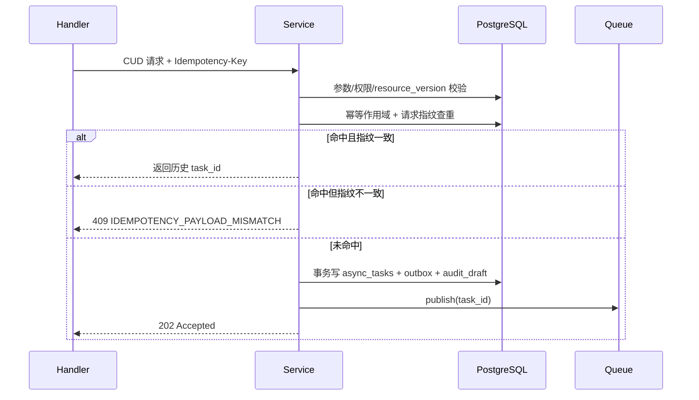

#### 8.2.1 低代码 Helm 导入任务编排（T16）

执行步骤（`R-LCP-003`）：

1. 准入校验：校验 `super_admin` 权限、作用域边界、`LowCodeImportRequest`
   schema。
2. 导入校验：解析 `chart_ref/chart_version`，校验 Chart 元数据、values schema
   与 `platform_type` 兼容性。
3. 幂等判定：按 `idempotency_scope + request_fingerprint` 判重，命中则复用
   `task_id`。
4. 入队落库：写入 `async_tasks` 与低代码实例草稿（`status=Creating`）。
5. Worker 执行：拉取 Chart、渲染、部署、健康检查、状态回写。
6. 审计落盘：记录 `lowcode_import_requested/lowcode_import_completed`
   事件与失败原因。

失败语义：

- Chart 非 Helm 或 values 校验失败：`422 SCHEMA_VALIDATION_FAILED`。
- 版本冲突（同实例版本重复或回退非法）：`409 RESOURCE_VERSION_CONFLICT`。
- 仓库/集群依赖异常：`503 DEPENDENCY_UNAVAILABLE`（可重试）。

### 8.3 消费者流程

消费者位于 Worker（QueueConsumer -> Executor -> Adapter）：

1. 通过 `FOR UPDATE SKIP LOCKED` 抢占可执行任务。
2. 对 `serialized_key` 加分布式互斥锁（PostgreSQL advisory lock）并生成 `fencing_token`。
3. 状态置 `Running` 并写 `started_at`。
4. 构造统一执行上下文（模板/制品、凭证、cluster client）。
5. 调用 `DeployAdapter` 执行 `apply/upgrade/delete/package/push`。
6. 成功：回写资源状态、任务结果、审计完成事件。
7. 失败：按 8.5 判定重试或终态失败，必要时进入 8.6 补偿。

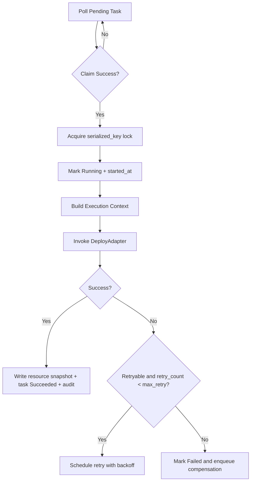

### 8.4 幂等与去重策略

幂等字段与作用域（落库统一口径）：

- `idempotency_key`：原始请求头，保留用于审计检索。
- `idempotency_scope = sha256(`
  `actor_id + workspace_id + cluster_id + method + route_template + idempotency_key)`。
- `request_fingerprint = sha256(canonical_json_body + canonical_query)`。
- `idempotency_expire_at = first_seen_at + 24h`（去重窗口从首次接收时间起算）。

判定规则：

- 作用域存在且当前时间未超过 `idempotency_expire_at`，且请求指纹一致：返回原 `task_id`。
- 作用域存在且当前时间未超过 `idempotency_expire_at`，但请求指纹不一致：返回 `409 IDEMPOTENCY_PAYLOAD_MISMATCH`。
- 作用域不存在或已过期：创建新任务并写入幂等字段。

实现要点：

- 幂等记录与任务写入同事务提交，避免“查重命中但任务不存在”。
- DDL 使用唯一约束 `uq_task_idempotency_scope(idempotency_scope)`。
- TTL 清理任务每 10 分钟执行：删除 `idempotency_expire_at < now()` 的过期幂等记录，不影响审计事件表。
- 兼容策略：历史数据中仅带 `idempotency_key` 的记录继续用于审计检索；新请求统一按 `idempotency_scope + request_fingerprint` 判重，禁止回退到 key 唯一判重。

### 8.5 重试、超时与取消策略

重试策略（对应 `R-OPS-007`）：

- 默认最大重试 `5` 次。
- 退避：`5s -> 15s -> 45s -> 135s -> 300s`。
- 可重试错误：`DEPENDENCY_UNAVAILABLE`、网络抖动、临时锁冲突。
- 不可重试错误：参数错误、权限错误、引用冲突、版本冲突。
- 锁冲突策略：`fencing_token` 校验失败或 advisory lock 获取失败归类为可重试；
  连续超过 `max_retry` 返回 `409 RESOURCE_BUSY`。

DevBox 镜像 push 补充策略（`R-ENV-007`、`R-DBX-005/007`，T16）：

- 发布任务固定阶段：`registry_login -> image_push -> digest_verify`。
- 可重试错误：
  `DEPENDENCY_UNAVAILABLE`、Registry `5xx`、网络超时、`TOO_MANY_REQUESTS`。
- 不可重试错误：
  `FORBIDDEN_ACTION`（仓库权限拒绝）、`INVALID_ARGUMENT`（镜像地址非法）、
  `RESOURCE_NOT_FOUND`（仓库路径不存在）。
- 失败后 `task.result` 最小字段：
  `registry_binding_version/image_ref/digest/failure_reason/retry_count`。

超时策略：

| 任务类型 | 默认超时 |
| --- | --- |
| `create/update` | 30 分钟 |
| `delete` | 15 分钟 |
| `release/export` | 20 分钟 |
| `freeze/validate/recover/reclaim/registry_rollback` | 10 分钟 |

取消策略：

- API：`POST /.../tasks/{task_id}:cancel`
- `Pending`：直接转 `Canceled`。
- `Running`：置 `cancel_requested=true`，适配器在阶段边界检查并协作中断。
- 取消成功后写入审计 `action=cancel_task` 与 `canceled_by/canceled_at`。

### 8.6 补偿与一致性策略

补偿触发场景（对应 `R-OPS-009`）：

- 删除宿主资源后嵌入式组件回收失败。
- 创建/升级过程中部分 K8S 对象成功、部分失败。
- 发布流程中“打包成功但推送失败”。
- 仓库绑定回滚后，部分 namespace 凭证重下发失败。

一致性策略：

- 任务状态与资源快照回写采用单事务，避免“任务成功但资源状态未更新”。
- 跨系统副作用（K8S/OCI）采用 Outbox 记录步骤，失败后按步骤反向补偿。
- 补偿任务独立 `task_type=compensation`，继承原 `serialized_key` 串行执行。
- Outbox 事件投递由 Relay 托管并写入 RabbitMQ Streams；业务事务不直接调用 EventBus，避免“主事务成功但消息发送失败”。
- 事件消费补偿固定两级：
  - Relay 级失败进入 `event_outbox_dlq`；
  - Consumer 级失败进入 `event_consumer_dlq`，由 super_admin 执行重放。

补偿时序（删除宿主 + 嵌入式回收失败）：

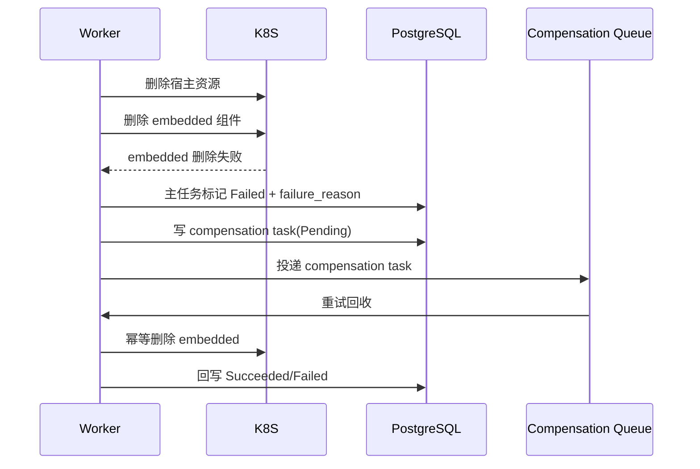

结果字段最小集合（对应 `R-OPS-008`）：

- `resource_kind`
- `resource_id`
- `started_at`
- `ended_at`
- `failure_reason`
- `retry_count`
- `serialized_key`

任务结果查询契约（T7 补齐）：

- 端点：`GET /workspaces/{workspace_id}/clusters/{cluster_id}/tasks/{task_id}/result`
- 语义：返回任务结果快照（若任务仍在 `Pending/Running`，`result` 可为空对象）。
- 最小返回字段：`resource_kind/resource_id/started_at/ended_at/failure_reason/retry_count/serialized_key`。

### 8.7 仓库绑定回滚任务编排（T11）

执行步骤（`R-ENV-006`、`R-ENV-007`）：

1. 准入校验：校验超管身份、`confirmation_token`、`resource_version`、目标版本存在性与绑定状态。
2. 幂等判定：按 `idempotency_scope + request_fingerprint` 判重，命中则返回同一 `task_id`。
3. 版本切换：在单事务中读取 `from_version`，切换 `workspace_registry_bindings.binding_version=target_binding_version` 并写任务阶段结果。
4. 凭证重下发：对该 workspace 下所有 `Active` 的 `workspace_cluster_bindings` 执行 namespace 凭证重下发。
5. 结果回写：汇总 cluster 级重下发结果，更新任务 `result` 与绑定最新下发版本。
6. 审计与事件：写入审计日志并发送 `workspace.registry.binding.rolledback.v1`（按 cluster fan-out）。

失败分支与补偿：

- `步骤 1/2` 失败：直接拒绝请求，不入队或复用历史任务（幂等命中）。
- `步骤 3` 失败：任务终态 `Failed`，不触发外部下发副作用。
- `步骤 4` 部分失败：主任务标记 `Failed`，写 `failure_reason=credential_redispatch_partial_failed`，
  自动创建补偿任务 `task_type=registry_credential_redispatch` 继承同一 `serialized_key` 重试。
- 补偿任务达到重试上限仍失败：保留失败明细（按 `cluster_id`），触发 `P2` 告警并要求人工 runbook 介入。

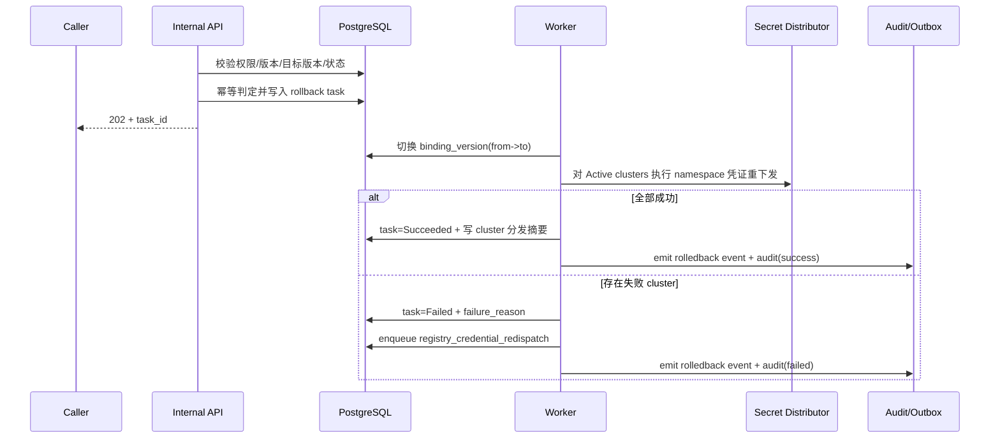

### 8.8 绑定新增/变更任务编排（T12）

绑定新增/变更统一任务类型：

- `workspace_cluster_binding_create`
- `workspace_cluster_binding_update`
- `workspace_registry_binding_create`
- `workspace_registry_binding_update`

执行步骤（`R-ENV-002`、`R-ENV-006`）：

1. 准入校验：校验 super_admin 身份、`resource_version`（更新场景）与绑定状态。
2. 幂等判定：按 `idempotency_scope + request_fingerprint` 判重。
3. 绑定落库：
   - cluster 绑定：写入/更新 `workspace_cluster_bindings`，并创建或校验 namespace。
   - registry 绑定：写入历史快照并切换 `binding_version`。
4. 副作用执行：
   - cluster 绑定新增：补齐 namespace 标签与最小准入资源配额（平台默认）。
   - registry 绑定新增/更新：对 Active clusters 触发凭证下发。
5. 结果回写：写任务 `result`、绑定 `last_synced_at/last_sync_status`。
6. 审计与事件：写审计并发送 `workspace.cluster.binding.changed.v1` 或
   `workspace.registry.binding.changed.v1`。

失败分支与补偿：

- namespace 创建失败：任务 `Failed`，创建 `cluster_namespace_reconcile` 补偿任务。
- registry 凭证下发部分失败：任务 `Failed`，创建
  `registry_credential_redispatch` 补偿任务。
- 补偿超出重试上限：标记 `manual_intervention_required=true` 并触发 `P2` 告警。

### 8.9 优先级队列与重放操作规程（T19/T20）

优先级策略：

- `P0`：`lane_reclaim_high`（解绑回收、级联删除、补偿）保底并发 `>=40%`。
- `P1`：`lane_cud`（常规 CUD）弹性并发 `<=50%`。
- `P2`：`lane_projection`（报表/投影）限流并发 `<=10%`。

拥塞降级：

- 当 `aether_task_queue_wait_ms{lane_cud}` 连续 10 分钟 `P95>5s` 时，
  自动提升 `lane_reclaim_high` 配额并压缩 `lane_projection` 到 `5%`。
- 当总 backlog 超阈值（`>20000`）时暂停低优先级投影任务入队。

死信与重放：

1. 任务进入 `async_task_dlq` 后，必须保留原 `task_id` 与 `idempotency_scope`。
2. 运维重放仅允许 super_admin 执行
   `POST /internal/v1/tasks/{task_id}:replay`，并写审计 `task_replay_requested`。
3. 重放任务生成新 `task_id`，继承原 `serialized_key`，并在结果中回挂
   `source_task_id`。

事件死信与重放（RabbitMQ Streams）：

1. Relay 投递失败超过 `20` 次，事件进入 `event_outbox_dlq`（保留
   `event_id/topic/ordering_key/payload/retry_count/failure_reason`）。
2. Consumer 处理失败超过 `16` 次，事件进入 `event_consumer_dlq`（附
   `consumer_group/partition/offset/last_error_code`）。
3. 事件重放仅允许 super_admin 执行
   `POST /internal/v1/event-dlq/{event_id}:replay`，并写审计
   `event_replay_requested`。
4. 重放策略：
   - 默认从 DLQ 事件原 offset 后重投；
   - 若指定 `force_from_offset`，必须先暂停对应 consumer group；
   - 重放始终保留原 `event_id`，由消费者幂等表去重。
5. 位点异常恢复 Runbook（最小流程）：
   - 停止目标 `consumer_group`；
   - 对账 `broker committed offset` 与本地 `processed_event_id` 最新点；
   - 选择 `resume_offset = min(committed_offset, processed_max_offset)`；
   - 恢复消费并观察 `aether_eventbus_consumer_lag_messages` 在 10 分钟内回落到阈值内。

## 9. 资源编排与 K8s 交互设计

### 9.1 模板与制品技术路线（内置 Helm/导入 Helm/镜像转 Chart）

三类输入统一转换为 Helm release：

| 输入类型 | 来源 | 转换策略 | 输出 |
| --- | --- | --- | --- |
| 内置 Helm 模板 | 平台模板中心 | 直接按 `template_version` 渲染 | Helm release |
| 导入 Helm 模板 | 管理员导入 Chart | 入库校验后按 `chart_ref` 渲染 | Helm release |
| 镜像型高代码来源 | DevBox 发布镜像/上传镜像 | 平台先生成标准 Chart，再走 Helm | Helm release |

模板与制品解析规则：

- `TemplateResolver` 必须返回确定版本（不可使用 `latest`）与 digest。
- Chart 依赖统一产出 `Chart.lock`，用于发布复现。
- 渲染输入包含：工作空间上下文、集群上下文、资源 spec、secret 引用。

仓库存储策略：

- 平台模板：`oci://<registry>/aether/templates/<kind>/<name>:<version>`
- 发布产物：`oci://<registry>/aether/releases/<application_id>:<release_version>`

### 9.2 Chart Values 合并与参数校验

Values 合并优先级（高到低）：

1. 接口请求 `values_override`（用户显式输入）
2. 资源实例 `spec` 映射 values
3. 工作空间/集群策略默认值（如存储类、镜像拉取策略）
4. 模板 `values.yaml` 默认值

合并与校验流程：

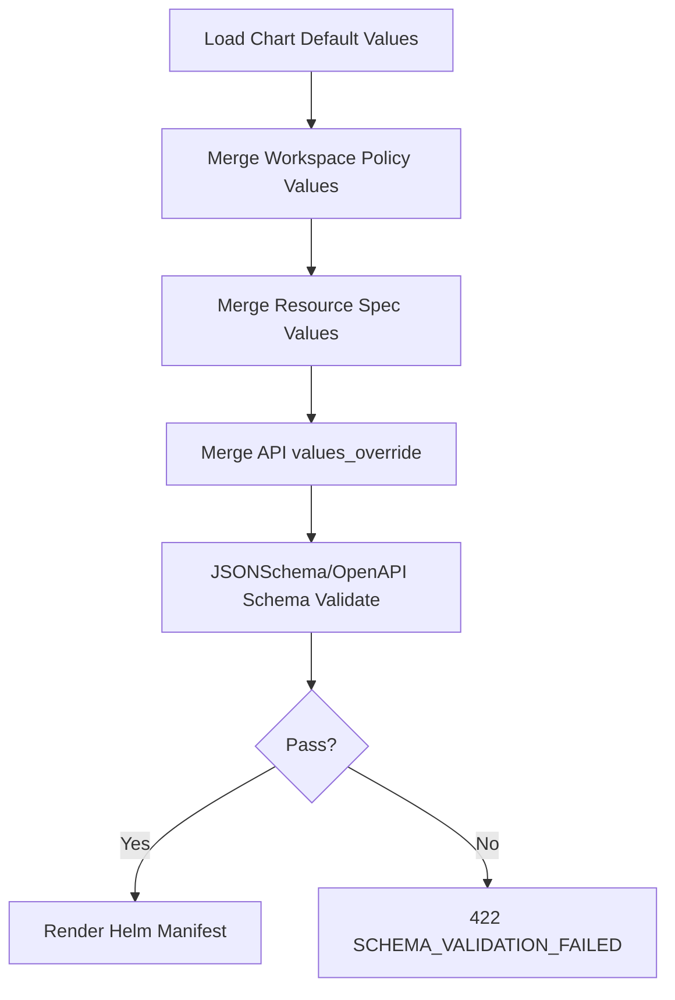

校验策略：

- 字段级：类型、枚举、范围、必填。
- 规则级：跨字段约束（如 NodePort 范围、replicas 与 HPA 冲突）。
- 边界级：跨资源一致性（workspace/cluster/namespace 一致）。

### 9.3 依赖镜像校验与凭证下发消费（平台负责 namespace 级分发）

依赖镜像校验：

- 高代码 Chart 发布/部署前解析所有镜像引用。
- 逐项检查目标工作空间绑定仓库是否可拉取（存在性 + 鉴权）。
- 任一镜像不可用则阻断任务，返回 `422`（原因 `image_dependency_unavailable`）。

凭证下发机制：

- 仓库凭证由控制面生成 namespace 级 Secret：
  - 镜像拉取：`kubernetes.io/dockerconfigjson`
  - Helm OCI：`Opaque`（registry auth）
- 下发更新采用版本号推进，Worker 读取当前版本引用。

消费路径：

- 拉取链路（Deploy/Release）：
  - DeployAdapter 读取目标 namespace 当前凭证版本；
  - 在 Helm 操作前完成 `helm registry login`；
  - Workload 模板注入 `imagePullSecrets`，保障运行时拉取。
- 推送链路（DevBox Publish，T16）：
  - 读取 workspace 当前 `registry_binding_version` 与凭证引用版本；
  - 生成临时 docker config 并执行 `docker/buildah login`；
  - 执行 `push` 并校验远端 manifest digest；
  - 将 `registry_binding_version + image_ref + digest` 写入发布记录与任务结果。

一致性约束（push/pull 同口径）：

- 镜像与 Chart 均使用同一 workspace 绑定仓库凭证来源，禁止“Chart 可用但 image push 无凭证”。
- push/pull 失败均复用 `8.5` 重试策略并写统一失败字段：
  `failure_reason`、`retry_count`、`registry_binding_version`。

### 9.4 资源命名与标签规范

命名规则（同 namespace 唯一）：

- Release 名：`{kind}-{resource_name}-{short_id}`
- Service 名：
  - `P1`：应用创建时直接关联 shared 数据服务组件，强制 `svc-{application_name}-{component_alias}`。
  - `P2`：shared 组件独立创建且显式传入 `service_name`，使用用户名称（校验 DNS-1123 + 唯一性）。
  - `P3`：其余平台自动命名统一 `svc-{kind}-{resource_name}`。
- Secret 名：`{secret_name}.v{version}`
- ConfigMap 名：`cfg-{kind}-{resource_name}-v{resource_version}`

K8s 标签规范（强制）：

- `workspace_id`
- `cluster_id`
- `resource_kind`
- `resource_id`
- `owner_kind`
- `owner_id`
- `managed_by=aether`

注解规范（建议）：

- `aether.io/task-id`
- `aether.io/release-version`
- `aether.io/template-version`

### 9.5 部署、升级、回滚与漂移处理

部署/升级/回滚主流程：

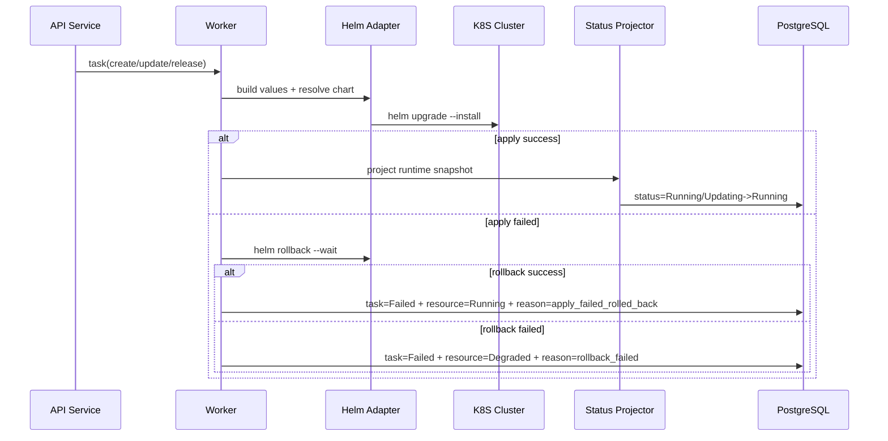

漂移处理（集群实际态偏离期望态）：

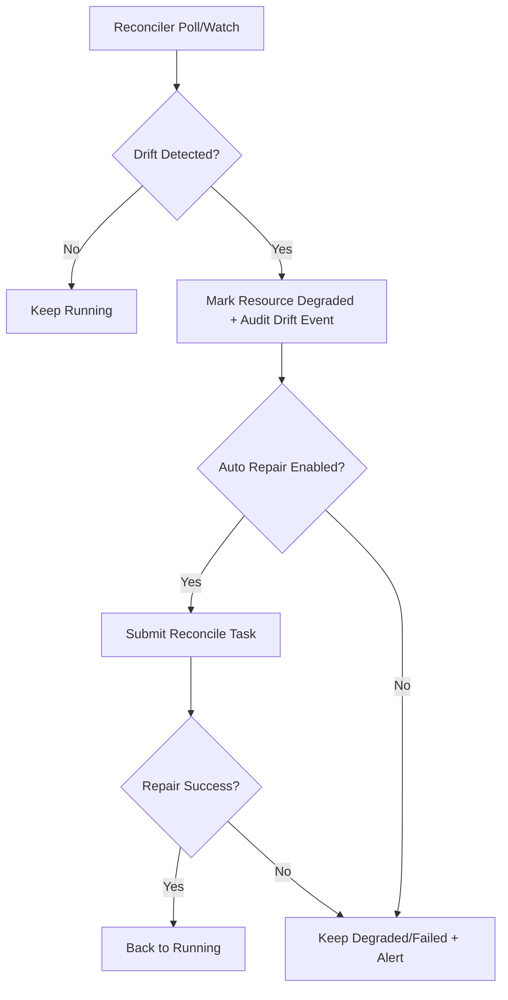

执行策略：

- Helm 参数统一启用 `--atomic --wait --timeout=<task_timeout>`。
- 升级失败优先自动回滚到上一个成功 revision。
- 漂移修复任务与业务变更任务使用同一串行键，避免并发覆盖。

## 10. 权限与安全设计

### 10.1 认证与授权模型

认证链路采用“统一身份 + 工作空间边界注入 + 动作级授权”三段式，默认拒绝（fail closed）：

1. `AuthN`：接入层校验来自统一认证系统的访问令牌，提取
   `actor_id`、`role`、`workspace_memberships`。
2. `TenantContext`：从路径解析 `workspace_id`、`cluster_id`，查询
   `WorkspaceClusterBinding` 获得 `namespace_name` 与绑定状态。
3. `AuthZ`：按 `role + action + resource_scope` 判定是否允许。

控制面上下文对象（供 handler/service/worker 透传）：

```go
type RequestContext struct {
    RequestID    string
    ActorID      string
    Role         string // super_admin | user
    WorkspaceID  string
    ClusterID    string
    Namespace    string
    BindingState string // Active/Frozen/Validating/RecoveryWindow/Reclaiming/...
}
```

授权判定规则：

- `super_admin`：允许跨工作空间执行平台管理动作，但仍需显式传入目标
  `workspace_id/cluster_id` 并记录审计。
- `user`：必须满足“已关联目标工作空间 + 资源归属一致”；否则拒绝。
- 资源不存在或不在可见范围时，读取接口返回 `404`；变更接口返回 `403` 并审计。

### 10.2 权限动作矩阵落地

策略引擎输入：

- `actor_role`
- `action`（如 `dataservice.create`、`application.release`）
- `workspace_id`
- `cluster_id`
- `resource_kind/resource_id`

动作分层：

- 平台管理动作：`workspace.*`、`cluster.*`、`registry.*`、`template.import`、
  `gateway.manage`、`lowcode.manage`、`embedded_dataservice.manage`
  （默认仅超管）。
- 租户内业务动作：`dataservice.*`、`devbox.*`、`agent.*`、`application.*`、
  `task.read`（用户在已关联工作空间可执行）。
- 受限动作：`secret.read_plaintext` 永久拒绝，保留平台服务账号内部能力。

`embedded` 组件运维权限收敛（`R-DSP-011`、`R-DSP-012`）：

| 场景 | super_admin | user | 说明 |
| --- | --- | --- | --- |
| 通过 `dataservices` 独立接口读取/更新/删除 `embedded` | 拒绝（`404`） | 拒绝（`404`） | shared-only 接口，embedded 不可见 |
| 通过 `embeddeddataservices` 独立接口读取/更新/删除 `embedded` | 允许 | 拒绝（`403 FORBIDDEN_ACTION`） | 超管专用路径，满足需求权限矩阵“嵌入式组件独立运维” |
| 通过高代码应用宿主执行 `embedded` 运维（升级/重启/回收） | 允许 | 允许（需有该应用权限） | 以宿主动作鉴权，不单独下发 `embedded` 权限 |
| 通过低代码平台宿主执行 `embedded` 运维 | 允许 | 拒绝（`403 FORBIDDEN_ACTION`） | 低代码平台管理动作仅超管 |
| 宿主删除触发 `embedded` 回收补偿 | 允许 | 允许触发宿主删除；补偿由系统执行 | 审计记录操作者与系统补偿任务 |

实现约束：

- 鉴权中间件只做“是否可进入 handler”。
- 领域服务再次执行资源归属校验，防止越过路径校验直接构造跨边界引用。
- Worker 执行任务前重放一次授权快照（防止长队列期间权限变化导致越权执行）。

错误映射：

| 场景 | HTTP | 业务码 |
| --- | --- | --- |
| 未认证 | `401` | `UNAUTHORIZED` |
| 无工作空间权限 | `403` | `FORBIDDEN_WORKSPACE` |
| 操作超管限定动作 | `403` | `FORBIDDEN_ACTION` |
| 租户调用 internal 接口 | `403` | `FORBIDDEN_ACTION` |
| 资源不存在或不可见 | `404` | `RESOURCE_NOT_FOUND` |

### 10.3 Secret 生命周期与版本化

Secret 采用“版本对象 + 当前版本指针”模型：

- K8S 对象命名：`{secret_name}.v{n}`（对应 `S-SEC-003`）。
- 数据库主表：`SecretVersion`（记录版本元数据、哈希、状态、创建人）。
- 指针表：`SecretCurrentPointer(secret_name, current_version)`。
- 命名空间范围：固定为工作空间映射 namespace（`S-SEC-001`）。

生命周期动作：

- 创建：写入 `v1`，更新当前指针到 `1`。
- 更新：写入新版本 `v(n+1)`，切换当前指针，旧版本保留。
- 回滚：选择历史版本 `vk` 作为源内容，创建新版本 `v(n+1)`，再切换指针；
  不直接把当前指针回拨到旧版本，避免“历史被覆盖”。
- 清理：默认保留最近 `10` 个版本；超出部分标记 `Archived` 并删除对应 K8S
  Secret 对象（`S-SEC-004`）。

版本状态：

- `Active`：当前指针版本。
- `Retained`：历史可回滚版本。
- `Archived`：超过保留窗口，仅保留审计元数据。

Secret 版本时序：

```mermaid
sequenceDiagram
  participant U as User/API
  participant S as SecretService
  participant K as K8S
  participant DB as PostgreSQL
  participant A as Audit

  U->>S: update secret_ref(name, value)
  S->>DB: lock current pointer
  S->>K: apply Secret {name}.v{n+1}
  K-->>S: ok
  S->>DB: insert SecretVersion(v{n+1}) + switch pointer
  S->>DB: archive versions > 10
  S->>A: emit secret.updated
```

并发控制：

- Secret 更新使用 `resource_version` + 行级锁，避免并发写同名版本号冲突。
- 幂等更新按 `Idempotency-Key` 去重，重复请求返回同一 `task_id`。

### 10.4 敏感数据保护与加密策略

敏感信息范围：

- 仓库凭证、组件账号密码、应用连接串、管理员初始化口令等。

保护策略（满足 `S-SEC-006` 与 `NFR-012`）：

- 不引入额外 KMS；运行时机密统一落 K8S Secret 默认机制。
- 控制面数据库仅持久化 `secret_ref`、版本号、内容哈希与审计元数据；
  不持久化明文字段。
- API schema 将敏感字段标记为 `writeOnly`，响应仅返回 `secret_ref`。
- 日志脱敏：命中字段名 `password/token/secret/key` 自动替换为 `******`。
- 任务失败详情禁止回显 Secret 原文，只输出定位所需错误上下文。

`admin_account_ref` 专项保护（T15）：

- `admin_account_ref` 固定为“引用语义”字段，禁止写入账号明文、密码明文或 Token 明文。
- 控制面仅校验 `admin_account_ref` 可解析且可访问，不解密后回写到业务表。
- API 与日志输出规则：
  - super_admin 可见完整引用值（不含明文内容）；
  - user 仅可见脱敏值（`secret://{namespace}/{secret_name}.v***`）；
  - 日志中命中 `admin_account_ref` 时仅输出 `secret_name` 与版本号后 2 位。
- 历史兼容：迁移阶段发现明文字段时先转为 `secret_versions` 引用，再删除旧明文字段。

传输与访问控制：

- 控制面与集群、仓库通信统一 TLS。
- 仅控制面服务账号具备 Secret 明文读取权限；普通用户只可引用不可读取（`S-SEC-002`）。

### 10.5 审计日志设计

审计事件为独立存储模型，写入不可阻断主业务路径（异步缓冲 + 失败重试）：

| 字段 | 说明 |
| --- | --- |
| `audit_id` | 审计主键 |
| `request_id` | 请求链路 ID |
| `task_id` | 关联任务 ID（可空） |
| `actor` | 操作者 |
| `action` | 动作（create/update/delete/release/export/rollback/...） |
| `resource_kind/resource_id` | 资源定位 |
| `workspace_id/cluster_id` | 租户与部署边界 |
| `result` | success/failed |
| `failure_reason` | 失败原因（可空） |
| `created_at` | 事件时间 |

Secret 专项最小字段（`S-SEC-007`）：

- `secret_name`
- `version`
- `action`
- `actor`
- `workspace_id`
- `cluster_id`
- `timestamp`
- `request_id`
- `result`

仓库绑定回滚专项最小字段（`R-ENV-006`）：

- `binding_id`
- `workspace_id`
- `cluster_id`
- `from_version`
- `to_version`
- `actor`
- `task_id`
- `result`
- `failure_reason`

低代码平台字段变更专项（`R-LCP-007`，T15）：

- `action`：`lowcode_field_updated`、`lowcode_version_rolled_back`
- `resource_kind`：`lowcode_platform`
- `resource_id`
- `workspace_id`、`cluster_id`
- `field_changes`：至少包含 `entry_url/admin_account_ref/dependency_topology/version` 的 before/after 哈希或摘要
- `from_version`、`to_version`（仅版本变更场景）
- `task_id`、`request_id`、`actor`、`result`、`failure_reason`

低代码 Helm 导入专项（`R-LCP-003`，T16）：

- `action`：`lowcode_import_requested`、`lowcode_import_completed`
- `resource_kind`：`lowcode_platform`
- `resource_id`
- `workspace_id`、`cluster_id`
- `chart_ref`、`chart_version`
- `registry_binding_version`
- `task_id`、`request_id`、`actor`、`result`、`failure_reason`

DevBox 镜像 push 凭证消费专项（`R-ENV-007`、`R-DBX-005/007`，T16）：

- `action`：`devbox_image_push_started`、`devbox_image_push_finished`
- `resource_kind`：`devbox_publish_record`
- `resource_id`（`publish_id`）
- `workspace_id`、`cluster_id`
- `registry_binding_version`、`credential_version`
- `image_ref`、`digest`
- `retry_count`、`failure_reason`
- `task_id`、`request_id`、`actor`、`result`

留存策略（`NFR-013`）：

- 审计日志保留 `>= 180` 天。
- 任务执行日志保留 `>= 30` 天。
- 清理任务按天分区删除，保留汇总统计。

## 11. 多租户与隔离设计

### 11.1 租户上下文接入（Workspace/Cluster/Namespace 约束）

租户上下文固定由路径 + 绑定表推导，不接受请求体覆盖：

- 路径：`/api/v1/workspaces/{workspace_id}/clusters/{cluster_id}/...`
- namespace：从 `WorkspaceClusterBinding.namespace_name` 自动注入。
- 工作空间与集群解绑状态参与准入判定。

准入规则：

- `Active`：允许全部读写。
- `Frozen/Validating/Reclaiming`：仅允许读与恢复相关动作，拒绝新增变更任务。
- `RecoveryWindow`：允许 `recover`，禁止普通业务变更。

错误码：

- 绑定不存在：`422 BINDING_NOT_FOUND`
- 绑定冻结：`422 WORKSPACE_CLUSTER_FROZEN`

### 11.2 跨边界校验策略

跨边界校验在三个阶段执行：

1. 请求阶段：校验路径边界与操作者权限。
2. 关系阶段：校验被引用资源（Agent、DataService、Gateway）与请求边界一致。
3. 执行阶段：Worker 根据标签二次校验资源归属，防止脏数据执行。

硬性一致性约束：

- `workspace_id` 必须一致。
- `cluster_id` 必须一致。
- `namespace` 必须等于工作空间映射 namespace。

拒绝策略（满足 `NFR-014`）：

- 跨工作空间/跨集群/跨 namespace 引用一律拒绝并记录审计。
- 返回 `422 CROSS_SCOPE_REFERENCE`，审计事件 `result=failed`。

主数据越界写入防护（T19）：

- 对 `workspaces`、`managed_clusters` 的写请求在 API 层直接拒绝（`403 FORBIDDEN_ACTION`）。
- 对 bindings 越界写入（非法调用方或不可变字段变更）在 DB 触发器层拒绝并写
  `masterdata_boundary_violation` 审计事件。
- 监控指标 `aether_masterdata_boundary_violation_total` 非 0 即触发 `P1` 告警。

### 11.3 共享与嵌入式资源隔离策略

隔离模型基于 `visibility` + `owner_kind/owner_id`：

| 维度 | shared | embedded |
| --- | --- | --- |
| 创建入口 | 独立资源接口 | 仅随宿主资源创建 |
| 列表可见性 | 出现在共享列表/选择器 | 不出现在共享列表/选择器 |
| 运维入口 | 可独立更新/删除 | 仅通过宿主运维 |
| 复用能力 | 可被多个应用引用 | 仅宿主可用 |
| 回收策略 | 非级联默认保留 | 宿主删除时自动回收 |

接口层过滤规则：

- `GET /workspaces/{workspace_id}/clusters/{cluster_id}/dataservices` 默认 `visibility=shared`。
- 仅
  `GET /workspaces/{workspace_id}/clusters/{cluster_id}/applications/{application_id}/relations`、
  `GET /workspaces/{workspace_id}/clusters/{cluster_id}/lowcodes/{lowcode_id}`
  的详情读模型返回嵌入式关系。
- 对 `embedded` 资源 ID 的独立接口访问（`GET/PUT/DELETE /dataservices/{id}`）统一返回
  `404 RESOURCE_NOT_FOUND`。
- 超管独立运维仅走
  `GET/PUT/DELETE /workspaces/{workspace_id}/clusters/{cluster_id}/embeddeddataservices/{embedded_dataservice_id}`；
  普通用户访问该路径返回 `403 FORBIDDEN_ACTION`。

操作权限与审计动作：

- 权限判定：
  - `embedded` 运维权限分两条路径：
    `embedded_dataservice.manage`（仅 super_admin 独立接口）和宿主派生权限（应用/低代码平台）。
  - 高代码宿主：`application.update/delete` 通过后允许执行对应 `embedded` 运维。
  - 低代码宿主：仅 `lowcode.manage`（超管）可触发 `embedded` 运维。
- 审计动作：
  - `embedded_dataservice.admin_read`
  - `embedded_dataservice.admin_update`
  - `embedded_dataservice.admin_delete`
  - `embedded_dataservice.operate_via_owner`
  - `embedded_dataservice.recycle_via_owner_delete`
  - `embedded_dataservice.compensation_retry`
- 审计最小字段补充：`owner_kind`、`owner_id`、`visibility=embedded`、`trigger_action`。

### 11.4 级联删除与引用冲突处理

高代码应用删除决策表：

| 参数 | shared 组件存在外部引用 | 结果 |
| --- | --- | --- |
| `cascade=false` | 任意 | 仅删除应用并解绑关系，保留 Agent 与 shared 组件 |
| `cascade=true` | 否 | 删除应用 + Agent + 独占派生资源 + 可删 shared 组件 |
| `cascade=true` | 是 | 返回 `409 REFERENCE_CONFLICT` 并阻断 shared 删除 |

执行流程：

```mermaid
flowchart TD
  A[Delete Application Request] --> B{cascade?}
  B -- No --> C[Delete App + Unbind Agent/Shared Relations]
  B -- Yes --> D[Check shared refs count]
  D --> E{Any refs > 1?}
  E -- Yes --> F[409 REFERENCE_CONFLICT + Audit]
  E -- No --> G[Delete App + Agent + Shared + Embedded + Derived]
  C --> H[Submit Compensation if embedded cleanup failed]
  G --> H
```

低代码平台删除策略：

- 仅回收其 `embedded` 组件，不影响共享组件池。
- 回收失败进入补偿任务（`task_type=compensation`）。

### 11.5 工作空间-集群解绑保护机制（冻结、恢复窗口、回收）

解绑状态机（对应 `R-ENV-009/010` 与 ADR-072）：

```mermaid
stateDiagram-v2
  [*] --> Active
  Active --> Frozen: unbind request (super_admin + confirm)
  Frozen --> Validating: start validation task
  Validating --> RecoveryWindow: validation pass
  Validating --> Active: validation fail + rollback
  RecoveryWindow --> Active: recover within 24h
  RecoveryWindow --> Reclaiming: window timeout
  Reclaiming --> Unbound: reclaim success
  Reclaiming --> ReclaimFailed: reclaim failed
  ReclaimFailed --> Reclaiming: retry reclaim
```

关键控制点：

- 进入 `Frozen` 后拒绝所有新建/更新/发布/删除任务。
- `RecoveryWindow` 固定 `24h`，可显式恢复到 `Active`。
- 回收阶段按“namespace -> Helm release -> 残留对象”顺序清理并审计。
- 全流程仅超级管理员可触发，且需要二次确认。

## 12. 可观测性与运维设计

### 12.1 日志设计

日志采用结构化 JSON，统一字段规范：

- `timestamp`
- `level`
- `service`
- `request_id`
- `task_id`
- `workspace_id`
- `cluster_id`
- `resource_kind/resource_id`
- `action`
- `message`
- `error_code`（失败时）

日志分层：

| 日志类型 | 产生日志组件 | 用途 | 保留期 |
| --- | --- | --- | --- |
| 访问日志 | API Server | 请求审计、延迟统计 | 30 天 |
| 任务日志 | Worker/Adapter | 执行步骤与故障定位 | 30 天 |
| 审计日志 | Audit Service | 合规追溯 | 180 天 |

质量约束：

- 任何日志不得输出 Secret 明文。
- 大字段（manifest、values）仅输出摘要与 hash，原文写对象存储并受控访问。

### 12.2 指标设计

指标体系按 `黄金信号 + 业务指标 + 任务指标` 设计，并限制标签基数。

核心指标：

- `aether_api_submit_latency_ms`（`Histogram`）：
  `labels=route/method/code`；`P95<=300ms`，`P99<=800ms`。
- `aether_api_query_latency_ms`（`Histogram`）：
  `labels=route/code`；`P95<=800ms`，`P99<=2s`。
- `aether_task_queue_wait_ms`（`Histogram`）：
  `labels=lane/task_type/resource_kind`；`P95<=5s`。
- `aether_task_duration_ms`（`Histogram`）：
  `labels=task_type/result`；`create/update<=10m`、`delete<=5m`、
  `release<=8m`。
- `aether_outbox_relay_lag_ms`（`Gauge`）：
  `labels=stream`；目标 `<=1000ms`。
- `aether_eventbus_consumer_lag_messages`（`Gauge`）：
  `labels=consumer_group/partition_bucket`；目标 `P95<=5000`。
- `aether_eventbus_dlq_total`（`Counter`）：
  `labels=dlq_type/topic/reason`；目标日增量 `<=100`。
- `aether_eventbus_replay_total`（`Counter`）：
  `labels=result/requester_role`；目标重放成功率 `>=99%`。
- `aether_masterdata_boundary_violation_total`（`Counter`）：
  `labels=table/caller`；目标值 `0`。
- `aether_status_projection_lag_ms`（`Gauge`）：
  `labels=resource_kind`；`<=30s`。
- `aether_task_submit_total`（`Counter`）：
  `labels=task_type/result`；日均 `>=10000` 可承载。
- `aether_release_chart_total`（`Counter`）：
  `labels=result`；日均 `>=2000` 可承载。

标签基数控制：

- 禁止在 Prometheus 标签中直接使用 `workspace_id/resource_id/task_id`。
- 高基数字段仅写日志与追踪；指标层使用 `resource_kind/task_type/result` 聚合。

### 12.3 追踪设计

追踪基于 OpenTelemetry，覆盖 API -> Domain -> Queue -> Worker -> Helm Adapter
端到端链路。

Span 分层：

- `http.request`
- `authorization.check`
- `task.enqueue`
- `task.execute`
- `helm.render`
- `helm.apply/upgrade/delete`
- `status.project`
- `audit.emit`

采样策略：

- 成功请求基础采样率 `10%`。
- 错误请求与超时任务强制 `100%` 采样。
- 通过 `request_id + task_id` 关联日志、指标和 trace。

### 12.4 告警与值班策略

告警分级：

- `P1`：控制面不可用；或 5 分钟错误率 `>5%`；
  或月可用性趋势跌破 `99.9%`。响应时限 `5` 分钟。
- `P2`：`task_queue_wait_p95 > 5s` 持续 10 分钟；
  或 `task_failed_rate > 10%` 持续 10 分钟。响应时限 `15` 分钟。
- `P3`：审计写入失败；或状态投影延迟 `>30s`；
  或单资源失败重试超过阈值。响应时限 `30` 分钟。

值班机制：

- 7x24 值班，P1 自动电话 + IM 双通道通知。
- 告警需绑定 runbook 链接与 owner（后端/SRE）。

### 12.5 运维操作手册

最小 runbook 集合：

1. 任务堆积：检查队列长度、Worker 并发、外部依赖健康，按资源类型限流或扩容 Worker。
2. 任务失败率升高：按 `failure_reason` 聚类，区分参数类错误与依赖类错误。
3. 状态投影延迟：检查 Reconciler 消费滞后与 DB 写入压力。
4. Secret 回滚：执行版本回滚任务并验证关联工作负载重启是否完成。
5. 解绑回收失败：进入 `ReclaimFailed` 后执行补偿重试与残留对象清理。

每份 runbook 必须包含：

- 触发条件
- 影响范围判定
- 操作步骤
- 回滚步骤
- 升级路径（何时升级 P1）

### 12.6 审计检索与追溯（关键操作与关系变更）

审计检索接口（Query 同步）：

- `GET /api/v1/audits?workspace_id=&cluster_id=&action=&actor=&from=&to=`
- `GET /api/v1/audits/{audit_id}`
- `GET /api/v1/resources/{resource_kind}/{resource_id}/audits`

关键追溯场景：

- 资源生命周期：`create -> update -> release -> delete`。
- 关系变更：`bind_dataservice`、`unbind_dataservice`、`cascade_delete`。
- Secret 变更：`secret.create`、`secret.update`、`secret.rollback`。

索引建议：

- `(workspace_id, created_at desc)`
- `(resource_kind, resource_id, created_at desc)`
- `(task_id)`
- `(request_id)`

## 13. 非功能与容量设计

### 13.1 性能目标与预算（NFR-001~005）

性能预算拆解（服务端）：

- CUD 提交延迟：目标 `P95<=300ms`、`P99<=800ms`。
  预算拆分：认证鉴权 `<=80ms` + 参数校验 `<=70ms` + DB 事务 `<=90ms` +
  入队 `<=40ms` + 裕量 `<=20ms`。
- Query 延迟（非聚合）：目标 `P95<=800ms`、`P99<=2s`。
  预算拆分：鉴权 `<=80ms` + DB 读取 `<=500ms` + 结果组装 `<=120ms` +
  裕量 `<=100ms`。
- 排队时延：目标 `P95<=5s`。预算来源为队列消费滞后与 Worker 可用并发。
  其中 `lane_reclaim_high P95<=3s`、`lane_cud P95<=5s`、
  `lane_projection P95<=30s`。
- 事件链路时延：Outbox 写入到消费者完成处理 `P95<=2s`、`P99<=5s`；
  消费积压 `aether_eventbus_consumer_lag_messages P95<=5000`，
  单分区积压持续 `10m` 超阈触发 `P2`。
- 任务执行时长：
  `create/update P95<=10m`；`delete P95<=5m`；`release P95<=8m`。
  预算来源为 Helm 操作、依赖可达性与补偿开销。

超预算处理：

- 连续 3 个观测窗口超预算触发 P2 告警。
- 自动降级策略：限制低优先级任务并保留 delete/recover 高优先级任务配额。

### 13.2 可用性与稳定性目标（NFR-005）

可用性目标：

- 控制面月度可用性 `>=99.9%`（月错误预算 `<=43m12s`）。

SLI 定义：

- `SLI-1`：`2xx/3xx` 的 Query 请求比例。
- `SLI-2`：CUD 提交接口成功受理比例（返回 `task_id`）。
- `SLI-3`：任务系统可消费性（`Pending->Running` 延迟达标率）。

稳定性策略：

- API/Worker 多副本部署，最少 `3` 副本。
- DB 开启主从与定期备份恢复演练。
- 外部依赖不可用时快速失败并返回可诊断错误码，不长时间阻塞连接池。

### 13.3 容量规划（NFR-006~011）

容量目标：

- 工作空间/集群：`>=100` workspace，`>=50` cluster。
- 资源实例下限：
  shared dataservice `>=5000`；lowcode `>=2000`；devbox `>=5000`；
  gateway `>=5000`；application `>=5000`；agent `>=10000`。
- 任务吞吐：日均异步任务 `>=10000`。
- 发布吞吐：日均 Chart 生成入库 `>=2000`。

容量推导（用于初始部署）：

- `10000` 任务/日约等于 `0.12 task/s` 平均负载；按峰值系数 `20x`
  设计，目标峰值处理能力 `>=2.4 task/s`。
- 发布任务按峰值系数 `10x` 设计，目标峰值处理能力 `>=0.25 release/s`。
- Worker 默认并发建议：`50`（可按 `task_type` 分池）。

数据库容量与索引策略：

- 高频表（`AsyncTask`、`AuditLog`）按月分区。
- 归档前在线存储预留 `>=6` 个月容量。
- 所有列表查询必须命中组合索引，禁止全表扫描作为默认路径。

### 13.4 安全与审计约束（NFR-012~015）

| NFR | 约束 | 设计响应 |
| --- | --- | --- |
| NFR-012 | 敏感信息不得明文持久化 | 仅存 `secret_ref` 与摘要；明文仅存 K8S Secret |
| NFR-013 | 审计与任务日志留存 | 审计 `>=180` 天，任务日志 `>=30` 天，按分区清理 |
| NFR-014 | 跨边界请求拒绝并审计 | 三阶段跨边界校验 + `422 CROSS_SCOPE_REFERENCE` + 强制审计 |
| NFR-015 | 发布制品可追溯 | `HighCodeReleaseChart` 固化来源、版本、digest、操作者 |

### 13.5 可扩展性与运维约束（NFR-016~019）

NFR-016（新增资源类型可扩展）：

- 新资源接入仅允许新增：schema、模板解析、适配器实现、资源读模型。
- 禁止修改：任务队列主模型、鉴权主流程、审计主流程。

NFR-017（模板参数 schema 校验）：

- 提交阶段执行 JSONSchema 校验，失败直接 `422 SCHEMA_VALIDATION_FAILED`。
- 校验结果写任务外审计事件（请求被拒绝也需追溯）。

NFR-018（失败可诊断）：

- `failure_reason` 结构：`error_code`、`error_message`、`failed_step`、
  `retryable`、`external_ref`。
- 任务详情接口返回该结构，便于前端与运维定位。

NFR-019（状态更新延迟 <=30s）：

- 状态投影优先消费任务事件流，回退周期性对账（15s 周期）。
- 观测指标 `aether_status_projection_lag_ms` 作为硬阈值告警输入。

T9 运维补充约束：

- 配额与报表任务与业务任务隔离：
  - 统计投影任务运行在独立队列 `report-projector`，避免影响 CUD 主链路。
  - 统计刷新 SLA：T+1 分钟内可见，失败重试不阻断业务任务。
- 外部导入验收可操作性：
  - 发布任务必须输出外部导入指引元数据（`import_command_hint`、`values_digest`、`chart_digest`）。
  - 运维手册需包含“外部导入失败排障”步骤，并在 `TC-PKG-02` 验证可执行性。

### 13.6 压测与容量验收方案

压测分层：

1. 接口压测：CUD 提交与 Query 延迟（验证 `NFR-001/002`）。
2. 队列压测：任务排队与消费能力（验证 `NFR-003/010/011`）。
3. 端到端压测：部署、删除、发布全链路耗时（验证 `NFR-004`）。
4. 稳定性压测：72 小时 soak test + 依赖故障注入（验证 `NFR-005/019`）。

验收门禁：

- 所有 `NFR-001~019` 对应指标均达到阈值。
- P1/P2 告警在演练中可触发且可恢复。
- 审计追溯可在 5 分钟内定位任一关键高风险操作。

## 14. 验收与追踪矩阵

### 14.1 验收标准映射（需求 ID -> 用例）

目标：把 `requirements -> design -> test case -> release gate` 串成可执行验收链路。

用例编号规则：

- `TC-<域>-<序号>`，如 `TC-ENV-01`、`TC-HCA-03`。
- 一个用例可覆盖多个需求 ID，但每个需求 ID 在本表至少出现一次。
- 与 `14.4` 逐条覆盖核对表联动；若 `14.4` 状态不是 `已覆盖`，该需求不得进入发布验收。

| 需求 ID | 测试场景（用例 ID） | 验收标准（通过条件） | 证据产物 |
| --- | --- | --- | --- |
| R-ENV-001~003 | namespace 映射校验（`TC-ENV-01`） | 绑定成功；namespace 存在；binding 为 `Active` | API 响应、DB 快照、`kubectl get ns` |
| R-ENV-004~005、008 | 跨边界请求拦截（`TC-ENV-02`） | 返回 `403 FORBIDDEN_WORKSPACE`/`422`；不入队；有拒绝审计 | 错误响应、任务表查询、审计日志 |
| R-ENV-006~007 | 绑定变更/回滚+凭证闭环（`TC-ENV-04/05、DBX-03`） | 超管可用；回滚成功；复用 `task_id`；镜像 push 可追溯 | 接口响应、任务结果、binding 快照、审计 |
| R-ENV-009~010 | 解绑冻结与恢复窗口（`TC-ENV-03`） | 状态流转正确；仅超管执行且二次确认 | 状态机日志、审计日志、操作录屏 |
| R-ABS-001~004 | 新资源类型接入不改主流程（`TC-ABS-01`） | 仅新增 schema+adapter 即可跑通 CUD；任务、鉴权、审计代码路径无分叉 | PR diff、单测、集成测试报告 |
| R-ABS-005~008 | 标签与 L1 统计口径（`TC-ABS-02`） | K8s 对象带完整标签；控制面不以 Pod 为主资源；报表按 5 类 L1 聚合 | K8s 清单、API 契约测试、配额报表 |
| R-DSP-001~007 | 共享组件创建、扩缩容、升级回滚（`TC-DSP-01`） | 组件 CRUD 与运维动作均走异步任务；Service 命名规则符合策略 | 任务记录、状态快照、Service 清单 |
| R-DSP-008~012 | embedded 隔离与宿主回收（`TC-DSP-02/04`） | `embedded` 不进共享池；`dataservices` 返回 `404`；宿主删除自动回收 | 列表响应、关系表、权限审计 |
| R-LCP-001~004 | 低代码平台内置/导入 Helm（`TC-LCP-01/05`） | 仅 Helm 导入；实例 CRUD（含 `DELETE`）与升级回滚成功；权限正确 | API 响应、任务日志、权限报告 |
| R-LCP-005~006、008~010 | 低代码依赖归属与多实例（`TC-LCP-02`） | 依赖组件标记 `embedded`；多实例默认关闭；普通用户仅查看 | 拓扑详情、列表响应、RBAC、策略审计 |
| R-LCP-007 | 低代码实例四字段闭环（`TC-LCP-04`） | 四字段满足可写、可读、可审计、可回滚 | 契约测试、任务结果、审计日志、迁移回填报告 |
| R-DBX-001~005 | DevBox 创建与发布流程（`TC-DBX-01`） | DevBox 实例可创建/更新/停止/删除；发布流程产出记录完整 | DevBox 实例详情、发布记录 |
| R-DBX-006~009 | 已发布镜像门禁与历史保留（`TC-DBX-02`） | 未发布镜像创建应用被拒绝；删除 DevBox 不删发布记录 | 错误响应、发布记录保留验证 |
| R-GTW-001~006 | 网关单例、灰度变更、发布前校验（`TC-GTW-01`） | workspace+cluster 仅 1 网关实例；灰度失败可回滚；发布前网关可用校验 | 唯一约束验证、任务日志、发布校验日志 |
| R-HCA-001~006 | 高代码应用来源与关系约束（`TC-HCA-01`） | 三类来源均可创建；Application-Agent 关系与跨边界校验生效 | 创建响应、关系表、校验错误日志 |
| R-HCA-007~010 | Chart 版本、values 覆盖、运行编排（`TC-HCA-02`） | Chart 版本可选；values 覆盖优先级正确；Secret 明文不可读 | 渲染产物、部署清单、权限测试 |
| R-HCA-011~014 | 级联冲突 `TC-HCA-03` | cascade=false 保留共享；cascade=true `409 REFERENCE_CONFLICT`；embedded 回收 | 删除响应、关系与补偿 |
| R-PKG-001~006 | 发布打包与导入（`TC-PKG-01`、`TC-PKG-02`） | 每次发布产出版本化 Chart；OCI 推送成功可下载；外部导入通过验证 | Release 记录、OCI 清单、下载与导入验证 |
| R-DATA-001~008 | 关系查询（`TC-DATA-01/02`） | 详情与 `relations` 返回 4 类关系；变更可审计 | 详情响应、relations 响应、审计检索 |
| R-OPS-001~010 | 异步任务、幂等与补偿（`TC-OPS-01`） | CUD 返回 `202+task_id`；同 scope 命中同任务；异指纹返回 `409` | 任务流水、幂等记录、补偿、错误样本 |
| S-SEC-001~007 | Secret 边界、版本与审计（`TC-SEC-01`） | Secret 在 workspace namespace；用户不可读明文；回滚采用新版本并审计 | Secret 版本记录、RBAC、审计 |
| NFR-001~004 | 接口延迟、排队时延、任务执行时长（`TC-NFR-01`） | 满足 13.1 阈值：提交 `P95<=300ms`、Query `P95<=800ms`、排队 `P95<=5s` | 压测报告、监控截图 |
| NFR-005~011 | 可用性、容量、吞吐（`TC-NFR-02`） | 月可用性 `>=99.9%`；容量与吞吐达到 13.2/13.3 目标 | SLI 报表、容量与压测报告 |
| NFR-012~015 | 安全与审计可追溯（`TC-NFR-03`） | 敏感信息不明文持久化；日志留存策略生效；跨边界拒绝强制审计 | 配置检查报告、审计抽样报告 |
| NFR-016~019 | 可扩展、可诊断、状态投影延迟（`TC-NFR-04`） | 新资源扩展不改主流程；`failure_reason` 字段齐全；状态更新延迟 `<=30s` | 扩展演示、故障注入报告、监控曲线 |

端到端验收链路（需求到发布）：

```mermaid
flowchart LR
  R["requirements.md 需求ID"] --> D["design.md 章节条目"]
  D --> T["TC 用例与自动化脚本"]
  T --> G["发布门禁(Gate 1~4)"]
  G --> P["灰度/全量发布"]
  P --> A["验收记录归档(审计+报告)"]
```

#### 14.1.1 T7 接口路径复核样例（canonical path）

| 场景 | Canonical path（统一示例） |
| --- | --- |
| 模板查询 | `GET /api/v1/workspaces/{workspace_id}/clusters/{cluster_id}/templates?kind=dataservice` |
| DevBox 发布记录创建 | `POST /api/v1/workspaces/{workspace_id}/clusters/{cluster_id}/devboxes/{devbox_id}/publishes` |
| 发布记录详情 | `GET /api/v1/workspaces/{workspace_id}/clusters/{cluster_id}/publishes/{publish_id}` |
| 高代码应用关系查询 | `GET /api/v1/workspaces/{workspace_id}/clusters/{cluster_id}/applications/{application_id}/relations` |
| 高代码应用发布包列表 | `GET /api/v1/workspaces/{workspace_id}/clusters/{cluster_id}/applications/{application_id}/charts` |
| 发布包下载 | `GET /api/v1/workspaces/{workspace_id}/clusters/{cluster_id}/charts/{chart_id}/package` |
| 超管 embedded 独立运维 | `GET {scope}/embeddeddataservices/{embedded_dataservice_id}` |
| 任务结果查询 | `GET /api/v1/workspaces/{workspace_id}/clusters/{cluster_id}/tasks/{task_id}/result` |

#### 14.1.2 T9 语义补齐验收样例

| 缺口 | 用例 ID | 通过条件 | 证据 |
| --- | --- | --- | --- |
| 幂等唯一性口径一致化 | `TC-OPS-02` | 同 `idempotency_scope` 且同指纹复用同 `task_id`；异指纹返回 `409` | 请求重放日志、`async_tasks` 查询、错误响应 |
| 配额统计/审计报表口径 | `TC-ABS-03` | 配额与报表按 5 类一级资源聚合，支撑资源仅作为明细展示 | 报表接口响应、SQL 核对结果 |
| 外部导入闭环 | `TC-PKG-02` | 下载校验通过、外部 `helm install` 成功、运行态验证通过 | 下载摘要、命令输出、`helm status`、探活结果 |
| embedded 运维权限统一 | `TC-DSP-03` | 独立 `dataservices/{id}` 对 embedded 返回 `404`；宿主路径按宿主权限执行 | API 调用记录、RBAC 测试、审计事件 |
| 多实例默认值定稿 | `TC-LCP-03` | `allow_multi_instance` 默认 `false`；策略变更仅影响新建实例 | 配置变更审计、实例创建结果 |

#### 14.1.3 T10 幂等基线一致性验收样例

| 缺口 | 用例 ID | 通过条件 | 证据 |
| --- | --- | --- | --- |
| 幂等唯一约束一致性 | `TC-OPS-03` | `requirements` 与 `design` 均以 `idempotency_scope` 为唯一约束 | 文档 diff、评审记录、DDL 草案 |
| 同 scope 异载荷冲突行为一致性 | `TC-OPS-04` | 同 scope+同指纹返回同 `task_id`；异指纹返回 `409` | 请求重放日志、错误响应样本、`async_tasks` 查询 |
| TTL 窗口与清理语义一致性 | `TC-OPS-05` | 去重窗口统一为首次写入后 24h；过期后允许创建新任务且不影响审计检索 | 过期样本数据、清理任务日志、审计查询结果 |

#### 14.1.4 T11 仓库绑定回滚验收样例

| 缺口 | 用例 ID | 通过条件 | 证据 |
| --- | --- | --- | --- |
| 成功回滚 | `TC-ENV-04-A` | `:rollback` 返回 202；任务成功；版本从 `vN` 到 `vK`；凭证重下发成功 | API 响应、任务结果、绑定快照、Secret、审计事件 |
| 目标版本不存在 | `TC-ENV-04-B` | 返回 `404 BINDING_VERSION_NOT_FOUND`，且无新任务入队 | 错误响应、任务表查询、审计拒绝日志 |
| 越权调用 | `TC-ENV-04-C` | 非超管调用返回 `403 FORBIDDEN_ACTION`，且无绑定版本变更 | 鉴权日志、错误响应、绑定版本快照 |
| 重复请求幂等复用 | `TC-ENV-04-D` | 同 key 同体复用同 `task_id`；同 key 异体返回 `409`（`IDEMPOTENCY_PAYLOAD_MISMATCH`） | 请求重放日志、任务记录、错误响应 |

#### 14.1.5 T12 语义缺口补齐验收样例

| 缺口 | 用例 ID | 通过条件 | 证据 |
| --- | --- | --- | --- |
| embedded 权限对齐 | `TC-DSP-04` | `dataservices/{id}=404`；admin 接口 `200`，user `403 FORBIDDEN_ACTION` | API 记录、权限测试、审计事件 |
| relations 端点补齐 | `TC-DATA-02` | `GET /applications/{id}/relations` 返回关系与 owner 字段；可生成契约测试 | 接口响应、OpenAPI 路径、契约测试 |
| 绑定可变更契约补齐 | `TC-ENV-05` | 绑定新增/更新返回 `202 + task_id`；状态与版本回写正确；失败分支进入补偿并审计 | 接口响应、任务结果、binding 快照、补偿任务与审计日志 |

#### 14.1.6 T13 非阻断开放项收敛验收样例

| 缺口 | 用例 ID | 通过条件 | 证据 |
| --- | --- | --- | --- |
| 网关灰度参数模板定稿 | `TC-GTW-01-A` | 按灰度参数执行；阈值命中自动回滚至稳定 `config_revision` | 流量、日志、回滚、审计 |
| 发布包下载鉴权缓存策略定稿 | `TC-PKG-02-A` | 下载返回 `302` 签名 URL；300s 过期；跨边界 `403 FORBIDDEN_WORKSPACE`；审计完整 | 响应头样本、过期复测、权限拦截、审计查询 |
| 安全审计一致性复核 | `TC-NFR-03-A` | 下载链路不落盘敏感签名参数；日志保留策略与制品追溯字段满足 `NFR-012~015` | 配置检查报告、日志留存策略、追溯检索结果 |

#### 14.1.7 T15 R-LCP-007 字段闭环验收样例

| 缺口 | 用例 ID | 通过条件 | 证据 |
| --- | --- | --- | --- |
| 四字段模型与契约一致性 | `TC-LCP-04-A` | `GET/POST/PUT /lowcodes` 四字段与 `5.2/5.4` 一致，无字段漂移 | OpenAPI 契约测试、DDL 校验、接口响应样本 |
| 历史数据迁移与灰度切换 | `TC-LCP-04-B` | 按“加字段 -> 回填 -> 读切换 -> 写强校验”完成；失败可回滚到兼容读模式 | 迁移日志、回填结果、回滚演练记录 |
| `admin_account_ref` 引用语义与脱敏 | `TC-LCP-04-C` | 拒绝明文写入；super_admin 可读引用，user 仅见脱敏引用；日志无明文 | 错误响应、RBAC 测试、日志抽样 |
| 四字段变更审计可追溯 | `TC-LCP-04-D` | 四字段变更均落审计，版本回滚含 `from/to` | 审计检索结果、任务结果、版本快照 |

#### 14.1.8 T16 语义补遗验收样例

| 缺口 | 用例 ID | 通过条件 | 证据 |
| --- | --- | --- | --- |
| 低代码 Helm 导入契约补齐 | `TC-LCP-05-A` | 满足 `T16-A` 判定细则 | 接口样本、OpenAPI 契约、任务结果、审计日志 |
| LowCode DELETE 端点补齐 | `TC-LCP-05-B` | 满足 `T16-B` 判定细则 | 契约测试、任务流水、关系快照、补偿记录 |
| DevBox 镜像 push 凭证闭环 | `TC-DBX-03` | 满足 `T16-C` 判定细则 | 发布日志、任务结果、发布记录、审计检索 |

`T16` 判定细则（对应上表）：

- `T16-A`：
  `POST /lowcodes/imports` 仅 `super_admin` 可调用；
  返回 `202 + task_id`；
  错误码覆盖 `400/403/409/422/503`。
- `T16-B`：
  `DELETE /lowcodes/{lowcode_id}` 支持
  `resource_version + Idempotency-Key`；
  成功写 `delete_task_id`；
  `embedded` 回收失败进入补偿任务。
- `T16-C`：
  发布链路执行 `registry_login -> push -> digest_verify`；
  失败分支按重试策略分类；
  审计字段至少包含
  `registry_binding_version/image_ref/digest/failure_reason`。

#### 14.1.9 T17 错误码命名一致性验收样例

| 缺口 | 用例 ID | 通过条件 | 证据 |
| --- | --- | --- | --- |
| 403 边界收敛 | `TC-SEC-02` | 无 workspace 权限 -> `FORBIDDEN_WORKSPACE`；越权 -> `FORBIDDEN_ACTION`；无新增旧码样本 | 契约测试、错误样本、告警日志 |
| 409 shared 引用冲突收敛 | `TC-HCA-03-A` | `cascade=true` 且 shared 外部引用时返回 `409 REFERENCE_CONFLICT`；无旧码 | 删除响应样本、契约测试、审计日志 |
| 兼容别名窗口与退场策略 | `TC-OPS-06` | 旧码命中会被归并并计入 `error_code_legacy_alias_total`；门禁禁止 `v1.13` 后返回旧码 | 网关映射日志、指标截图、发布门禁记录 |

#### 14.1.10 T18 幂等字段命名统一验收样例

| 缺口 | 用例 ID | 通过条件 | 证据 |
| --- | --- | --- | --- |
| 模型与索引命名统一 | `TC-OPS-07-A` | `5.2.3/5.4` 仅使用 canonical 幂等字段命名 | 文档 diff、DDL 草案、评审记录 |
| 流程与冲突语义命名统一 | `TC-OPS-07-B` | `8.1/8.4` 幂等命中与冲突规则仅引用 canonical 字段 | 时序图审阅记录、接口样本、任务查询结果 |
| 验收与回标命名统一 | `TC-OPS-07-C` | `14.1/14.4` 幂等断言与证据字段命名一致，不出现 `idem_*` | 验收报告、覆盖回标记录、检索截图 |

#### 14.1.11 T19 执行基础设施与主数据边界验收样例

| 缺口 | 用例 ID | 通过条件 | 证据 |
| --- | --- | --- | --- |
| 队列选型与 lane 优先级生效 | `TC-OPS-08-A` | 三条 lane 按配额执行；拥塞时触发降级策略 | 指标曲线、Worker 配置、压测报告 |
| 分布式锁与 fencing 生效 | `TC-OPS-08-B` | 并发写同 `serialized_key` 时旧 token 写入被拒绝；最终仅一条成功路径 | 并发测试日志、任务结果、冲突样本 |
| Outbox 投递 | `TC-OPS-08-C` | Outbox->RMQ 至少一次；`ordering_key` 保序；`event_id` 去重；DLQ 可重放 | outbox 快照、去重表、重放 |
| 主数据写入边界防越界 | `TC-ENV-06` | Aether 写主数据被拒；平台直写 bindings 被拒；越界触发审计告警 | DB 权限测试、错误响应、审计与告警记录 |

#### 14.1.12 T20 事件总线替代验收样例

| 缺口 | 用例 ID | 通过条件 | 证据 |
| --- | --- | --- | --- |
| EventBus 选型基线替换 | `TC-OPS-09-A` | `3.2/8.1.1` 仅保留 RabbitMQ Streams 单口径；无 JetStream 执行语义残留 | 文档 diff、架构评审记录 |
| `ordering_key` 分区与位点恢复 | `TC-OPS-09-B` | 同 `ordering_key` 事件进入同分区且顺序一致；故障恢复后无重复副作用 | 分区路由日志、offset 提交记录、消费幂等表 |
| DLQ 与人工重放闭环 | `TC-OPS-09-C` | `event_outbox_dlq/event_consumer_dlq` 可触发、可重放、可审计 | DLQ 样本、重放请求与结果、审计事件 |

### 14.2 测试分层与关键场景

#### 14.2.1 测试分层

| 层级 | 范围 | 目标 | 通过门槛 |
| --- | --- | --- | --- |
| L1 单元测试 | schema 校验、状态机迁移、幂等指纹计算 | 保证纯业务逻辑正确性 | 覆盖率 `>=80%`，关键包 `>=90%` |
| L2 契约测试 | OpenAPI 契约、错误码、统一响应结构 | 保证接口向前兼容与错误可编程 | 核心接口 100% 覆盖，禁止未声明字段 |
| L3 集成测试 | PostgreSQL + Queue + Helm Adapter（mock K8s） | 验证任务生产/消费与状态回写一致性 | P0 场景全部通过，失败可重放 |
| L4 端到端测试 | 真集群（或等价环境）上的创建、升级、删除、发布 | 验证需求语义与部署副作用一致 | `14.1` 的 P0 用例全部通过 |
| L5 稳定性与故障演练 | 依赖抖动、超时、回滚、补偿、解绑恢复窗口 | 验证可恢复性与运维可执行性 | 连续 72h 演练通过且无 P1 未关闭 |

#### 14.2.2 关键场景（P0）

| 场景 ID | 场景描述 | 覆盖需求 | 判定标准 |
| --- | --- | --- | --- |
| KS-01 | 同资源并发更新冲突与串行化 | R-OPS-005/006 | 仅一个任务进入 Running；冲突请求返回 `409` |
| KS-02 | 幂等重复提交与指纹不一致 | R-OPS-002、ADR-074 | 同指纹返回同 `task_id`；异指纹返回 `409 IDEMPOTENCY_PAYLOAD_MISMATCH` |
| KS-03 | 高代码应用 `cascade=true` 删除冲突 | R-HCA-012 | 被其他应用引用的 shared 组件阻断删除并返回 `409` |
| KS-04 | 低代码平台嵌入式组件隔离 | R-DSP-008~011、R-LCP-005/006 | 嵌入式不进入共享池，不可复用绑定 |
| KS-05 | 发布 Chart 入库失败后的重试与诊断 | R-PKG-001~006、NFR-018 | 任务失败诊断字段完整，重试后可恢复 |
| KS-06 | 工作空间解绑恢复窗口撤销 | R-ENV-009/010 | 24h 窗口内可恢复到 `Active`，且业务可继续 CUD |
| KS-07 | 网关不可用阻断应用发布 | R-GTW-005 | 发布请求被拒绝并给出可诊断错误 |
| KS-08 | Secret 回滚与新版本生成 | S-SEC-003~005、ADR-078 | 回滚生成 `v(n+1)`，不覆盖历史版本 |
| KS-09 | 漂移修复与业务任务串行 | R-ABS-002、ADR-077 | 漂移修复与变更任务不并发执行，状态不互相覆盖 |
| KS-10 | 状态投影延迟阈值验证 | NFR-019 | `aether_status_projection_lag_ms` 满足 `<=30s` |
| KS-11 | 发布包外部环境导入闭环验证 | R-PKG-004、R-PKG-006 | 下载校验、外部导入、运行态验证三步均成功并可追溯到发布版本 |
| KS-12 | embedded 独立接口与宿主派生运维 | R-DSP-011、R-DSP-012 | `dataservices=404`；`embeddeddataservices` 仅超管；宿主路径保留审计 |

#### 14.2.3 缺陷分级与退出标准

- P0 缺陷：导致数据错删、越权、跨边界写入、发布包不可复现。必须在发布前关闭。
- P1 缺陷：核心链路失败但可回避（如特定模板参数异常）。需有修复或降级方案并经评审批准。
- P2/P3 缺陷：不阻断发布，但必须纳入后续迭代计划并跟踪关闭日期。
- 测试退出条件：
  - `14.1` 全部 P0 用例通过；
  - `13.6` 压测与稳定性演练通过；
  - 无未关闭 P0 缺陷，且 P1 缺陷有明确 owner 和发布日期后修复计划。

### 14.3 发布与回滚计划

#### 14.3.1 发布准入门禁（Gate）

| Gate | 检查项 | 责任角色 | 阻断条件 |
| --- | --- | --- | --- |
| Gate-1 需求与设计一致性 | `requirements.md`、`design.md`、`decision.md` 三文档一致；`14.4` 全部为已覆盖 | 架构负责人 | 任一需求 ID 状态非 `已覆盖` |
| Gate-2 测试准入 | `14.1` P0 用例全部通过；无未关闭 P0 缺陷 | QA 负责人 | 任一 P0 用例失败或 P0 缺陷未关闭 |
| Gate-3 NFR 准入 | 满足 `13.1~13.6` 阈值与演练门槛 | SRE 负责人 | 任一 NFR 指标未达标 |
| Gate-4 变更安全 | 迁移脚本回滚验证通过；发布 Runbook 演练通过 | 后端负责人 | migration 无回滚路径或演练失败 |

#### 14.3.2 发布步骤（按批次灰度）

1. 发布准备：冻结主分支变更，确认版本基线、配置基线、数据库迁移清单。
2. 控制面灰度：先灰度 `aether-api/aether-worker` 小流量副本（建议 10%）。
3. 工作空间灰度：按 workspace 批次放量（建议 5% -> 20% -> 50% -> 100%）。
4. 全量发布：完成全量切换并启动 24 小时重点观测窗口。
5. 发布归档：归档版本、变更单、验收报告、回滚结果（如发生）。

#### 14.3.3 回滚触发条件

- 连续两个观测窗口出现以下任一情况：
  - CUD 提交延迟或 Query 延迟超过 `13.1` 阈值；
  - `Pending->Running` 延迟显著劣化，任务积压持续增长；
  - 出现 P0 安全问题（越权、跨边界写入、敏感信息泄露风险）；
  - 发布后出现不可恢复的数据一致性错误。

#### 14.3.4 回滚执行 Runbook

1. 入口决策：发布值班负责人宣布进入回滚，冻结新变更请求。
2. 应用层回滚：执行 Helm revision 回滚到最近稳定版本（API/Worker 分别执行）。
3. 配置层回滚：恢复上一版配置快照，重新加载密钥引用版本。
4. 数据层回滚：仅允许执行已演练过的可逆 migration；不可逆变更改走补偿脚本。
5. 任务队列收敛：暂停新任务入队，等待运行中任务收敛或协作取消。
6. 验证恢复：执行最小验收用例集（`TC-ENV-02`、`TC-OPS-01`、`TC-HCA-03`、`TC-PKG-01`）。
7. 事后复盘：24 小时内完成 RCA，输出修复计划和二次发布条件。

#### 14.3.5 发布与回滚产物

- 发布前：变更清单、风险评估、测试报告、容量报告、回滚演练记录。
- 发布中：灰度批次记录、监控快照、异常事件与处置记录。
- 发布后：验收报告、审计检索结果、RCA（如有）、知识库更新记录。

### 14.4 需求覆盖审计（逐条核对 requirements.md）

#### 14.4.1 审计口径与状态定义

- 审计基线：`docs/requirements.md` 当前版本（T1 编写时版本）。
- 覆盖定义：需求 ID 能映射到至少一个目标设计章节。
- 状态枚举：
  - `已覆盖`：当前 `docs/design.md` 已有可执行级描述（非仅章节占位）。
  - `待补充`：已建立章节落点，但详细设计尚未完成（后续任务补齐）。
  - `不适用`：需求已在基线中确认不属于当前版本交付范围。
- 当前批次（T1）不适用项：无。

#### 14.4.2 需求簇到章节映射（簇级）

| 需求簇 | 主要章节映射 |
| --- | --- |
| `R-ENV` | 4.1、4.5、5.7、6.5、7.6、8.5、8.7~8.8、9.3、10.5、11.1、11.2 |
| `R-ABS` | 3.3、4.2、5.1、8.1~8.6 |
| `R-DSP` | 4.3、5.2、5.3、9.1~9.5、10.2、11.3 |
| `R-LCP` | 4.4、5.2、5.4、5.8、7.3~7.5、8.2.1、9.1~9.5、10.4、10.5、11.3、14.1 |
| `R-DBX` | 4.5、5.2、5.6、9.1~9.5 |
| `R-GTW` | 4.6、5.2、9.1~9.5、11.2 |
| `R-HCA` | 4.7、5.2、5.3、9.1~9.5、11.4 |
| `R-PKG` | 4.8、5.6、8.2~8.6、9.1~9.5 |
| `R-DATA` | 4.9、5.3、5.5、7.3、7.5、11.3、12.6 |
| `R-OPS` | 4.10、7.1~7.6、8.1~8.9、12.6 |
| `S-SEC` | 10.3、10.4、10.5、12.6、13.4 |
| `NFR` | 10、11、12、13、14.1、14.2 |

#### 14.4.3 逐条需求 ID 覆盖核对表

| 需求 ID | 映射章节 | 当前状态 | 备注 |
| --- | --- | --- | --- |
| R-ENV-001 | 4.1、5.7、6.5、7.6、11.1、11.2 | 已覆盖 | 已在 4.1、7.6 明确“纳管主数据由平台管理面负责，Aether 消费 ManagedCluster/绑定只读视图并执行可达性校验”。 |
| R-ENV-002 | 4.1、5.7、6.5、7.6、8.8、11.1、11.2 | 已覆盖 | 已在 4.1、7.6、8.8 明确“工作空间创建与绑定归属平台管理面”，Aether 仅处理内部契约与任务编排。 |
| R-ENV-003 | 4.1、5.7、6.5、7.6、11.1、11.2 | 已覆盖 | 已在 4.1 与 9.3 补齐工作空间绑定、凭证下发与解绑约束。 |
| R-ENV-004 | 4.1、5.7、6.5、7.6、11.1、11.2 | 已覆盖 | 已在 4.1 与 9.3 补齐工作空间绑定、凭证下发与解绑约束。 |
| R-ENV-005 | 4.1、5.7、6.5、7.6、11.1、11.2 | 已覆盖 | 已在 4.1 与 9.3 补齐工作空间绑定、凭证下发与解绑约束。 |
| R-ENV-006 | 4.1、5.7、6.5、7.6、8.7~8.8、11.1、11.2 | 已覆盖 | 已在 4.1、7.6、8.7~8.8 定义绑定新增/更新/回滚契约与补偿，见 `TC-ENV-04/05`。 |
| R-ENV-007 | 4.1、4.5、7.6、8.5、8.7~8.8、9.3、10.5、14.1.8 | 已覆盖 | 已补齐镜像与 Chart push/pull 凭证同口径，覆盖 DevBox push 失败重试与审计字段。 |
| R-ENV-008 | 4.1、5.7、6.5、7.6、11.1、11.2 | 已覆盖 | 已在 4.1 与 9.3 补齐工作空间绑定、凭证下发与解绑约束。 |
| R-ENV-009 | 4.1、5.7、6.5、7.6、11.1、11.2 | 已覆盖 | 已在 4.1 与 9.3 补齐工作空间绑定、凭证下发与解绑约束。 |
| R-ENV-010 | 4.1、5.7、6.5、7.6、11.1、11.2 | 已覆盖 | 已在 4.1 与 9.3 补齐工作空间绑定、凭证下发与解绑约束。 |
| R-ABS-001 | 3.3、4.2、5.1、8.1~8.6 | 已覆盖 | 已在 3.3 与 5.1 固化统一抽象元组与分层模型。 |
| R-ABS-002 | 3.3、4.2、5.1、8.1~8.6 | 已覆盖 | 已在 3.3/3.5 定义统一 CUD 执行链路与时序。 |
| R-ABS-003 | 3.3、4.2、5.1、8.1~8.6 | 已覆盖 | 已在 3.3 固化 Helm 默认适配器与扩展点契约。 |
| R-ABS-004 | 3.3、4.2、5.1、8.1~8.6 | 已覆盖 | 已在 3.2/3.3 明确新增资源仅扩展 schema+adapter。 |
| R-ABS-005 | 3.3、4.2、5.1、8.1~8.6 | 已覆盖 | 已在 3.3 定义统一标签规范。 |
| R-ABS-006 | 3.3、4.2、5.1、8.1~8.6 | 已覆盖 | 已在 3.3/6.6 定义统一状态快照与观测回写机制。 |
| R-ABS-007 | 3.3、4.2、5.1、8.1~8.6 | 已覆盖 | 已在 2.6、4.2 补齐“5 类一级资源用于配额统计与审计报表”的聚合口径与查询路径。 |
| R-ABS-008 | 3.3、4.2、5.1、8.1~8.6 | 已覆盖 | 已在 2.6 固化分层与 Pod 观测边界。 |
| R-DSP-001 | 4.3、5.2、5.3、9.1~9.5、11.3 | 已覆盖 | 已在 4.3 与 9.1~9.5 补齐 shared/embedded 隔离与生命周期。 |
| R-DSP-002 | 4.3、5.2、5.3、9.1~9.5、11.3 | 已覆盖 | 已在 4.3 与 9.1~9.5 补齐 shared/embedded 隔离与生命周期。 |
| R-DSP-003 | 4.3、5.2、5.3、9.1~9.5、11.3 | 已覆盖 | 已在 4.3 与 9.1~9.5 补齐 shared/embedded 隔离与生命周期。 |
| R-DSP-004 | 4.3、5.2、5.3、9.1~9.5、11.3 | 已覆盖 | 已在 4.3 与 9.1~9.5 补齐 shared/embedded 隔离与生命周期。 |
| R-DSP-005 | 4.3、5.2、5.3、9.1~9.5、11.3 | 已覆盖 | 已在 4.3 与 9.1~9.5 补齐 shared/embedded 隔离与生命周期。 |
| R-DSP-006 | 4.3、5.2、5.3、9.1~9.5、11.3 | 已覆盖 | 已在 4.3 与 9.1~9.5 补齐 shared/embedded 隔离与生命周期。 |
| R-DSP-007 | 4.3、5.2、5.3、9.1~9.5、11.3 | 已覆盖 | 已在 4.3 与 9.1~9.5 补齐 shared/embedded 隔离与生命周期。 |
| R-DSP-008 | 4.3、5.2、5.3、9.1~9.5、11.3 | 已覆盖 | 已在 4.3 与 9.1~9.5 补齐 shared/embedded 隔离与生命周期。 |
| R-DSP-009 | 4.3、5.2、5.3、9.1~9.5、11.3 | 已覆盖 | 已在 4.3 与 9.1~9.5 补齐 shared/embedded 隔离与生命周期。 |
| R-DSP-010 | 4.3、5.2、5.3、9.1~9.5、11.3 | 已覆盖 | 已在 4.3 与 9.1~9.5 补齐 shared/embedded 隔离与生命周期。 |
| R-DSP-011 | 4.3、5.2、5.3、9.1~9.5、10.2、11.3 | 已覆盖 | 已在 10.2、11.3 固化两条运维路径：超管独立运维 + 宿主派生权限。 |
| R-DSP-012 | 4.3、5.2、5.3、9.1~9.5、10.2、11.3 | 已覆盖 | 已在 10.2、11.3 固化隔离：`dataservices` 对 embedded 统一 `404`。 |
| R-DSP-013 | 4.3、5.2、5.3、9.1~9.5、11.3 | 已覆盖 | 已在 4.3 与 9.1~9.5 补齐 shared/embedded 隔离与生命周期。 |
| R-LCP-001 | 4.4、5.2、9.1~9.5、11.3 | 已覆盖 | 已在 4.4 与 9.1~9.5 补齐内置/导入 Helm 与依赖归属。 |
| R-LCP-002 | 4.4、5.2、9.1~9.5、11.3 | 已覆盖 | 已在 4.4 与 9.1~9.5 补齐内置/导入 Helm 与依赖归属。 |
| R-LCP-003 | 4.4、7.3、7.5、8.2.1、10.5、14.1.8 | 已覆盖 | 已补齐 `POST /lowcodes/imports` 契约、执行链路、错误码与审计事件，形成“可调用+可验收”闭环。 |
| R-LCP-004 | 4.4、7.3、7.5、8.6、14.1.8 | 已覆盖 | 已显式补齐 `DELETE /lowcodes/{lowcode_id}` 端点与并发/幂等/回收语义，并完成验收映射。 |
| R-LCP-005 | 4.4、5.2、9.1~9.5、11.3 | 已覆盖 | 已在 4.4 与 9.1~9.5 补齐内置/导入 Helm 与依赖归属。 |
| R-LCP-006 | 4.4、5.2、9.1~9.5、11.3 | 已覆盖 | 已在 4.4 与 9.1~9.5 补齐内置/导入 Helm 与依赖归属。 |
| R-LCP-007 | 4.4、5.2.4、5.4、5.8、7.3~7.5、10.4~10.5、14.1.7 | 已覆盖 | `TC-LCP-04` 已验证四字段读写、迁移与审计闭环。 |
| R-LCP-008 | 4.4、5.2、9.1~9.5、11.3 | 已覆盖 | 已在 4.4 定稿 `allow_multi_instance` 默认 `false`、变更权限与生效时机。 |
| R-LCP-009 | 4.4、5.2、9.1~9.5、11.3 | 已覆盖 | 已在 4.4 与 9.1~9.5 补齐内置/导入 Helm 与依赖归属。 |
| R-LCP-010 | 4.4、5.2、9.1~9.5、11.3 | 已覆盖 | 已在 4.4 与 9.1~9.5 补齐内置/导入 Helm 与依赖归属。 |
| R-DBX-001 | 4.5、5.2、5.6、9.1~9.5 | 已覆盖 | 已在 4.5 与 9.1~9.3 补齐 DevBox 生命周期与发布门禁。 |
| R-DBX-002 | 4.5、5.2、5.6、9.1~9.5 | 已覆盖 | 已在 4.5 与 9.1~9.3 补齐 DevBox 生命周期与发布门禁。 |
| R-DBX-003 | 4.5、5.2、5.6、9.1~9.5 | 已覆盖 | 已在 4.5 与 9.1~9.3 补齐 DevBox 生命周期与发布门禁。 |
| R-DBX-004 | 4.5、5.2、5.6、9.1~9.5 | 已覆盖 | 已在 4.5 与 9.1~9.3 补齐 DevBox 生命周期与发布门禁。 |
| R-DBX-005 | 4.5、5.2、5.6、9.1~9.5 | 已覆盖 | 已在 4.5 与 9.1~9.3 补齐 DevBox 生命周期与发布门禁。 |
| R-DBX-006 | 4.5、5.2、5.6、9.1~9.5 | 已覆盖 | 已在 4.5 与 9.1~9.3 补齐 DevBox 生命周期与发布门禁。 |
| R-DBX-007 | 4.5、5.2、5.6、9.1~9.5 | 已覆盖 | 已在 4.5 与 9.1~9.3 补齐 DevBox 生命周期与发布门禁。 |
| R-DBX-008 | 4.5、5.2、5.6、9.1~9.5 | 已覆盖 | 已在 4.5 与 9.1~9.3 补齐 DevBox 生命周期与发布门禁。 |
| R-DBX-009 | 4.5、5.2、5.6、9.1~9.5 | 已覆盖 | 已在 4.5 与 9.1~9.3 补齐 DevBox 生命周期与发布门禁。 |
| R-GTW-001 | 4.6、5.2、9.1~9.5、11.2 | 已覆盖 | 已在 4.6 与 9.1~9.5 补齐单例约束、可用性校验与回滚。 |
| R-GTW-002 | 4.6、5.2、9.1~9.5、11.2 | 已覆盖 | 已在 4.6 与 9.1~9.5 补齐单例约束、可用性校验与回滚。 |
| R-GTW-003 | 4.6、5.2、9.1~9.5、11.2 | 已覆盖 | 已在 4.6 与 9.1~9.5 补齐单例约束、可用性校验与回滚。 |
| R-GTW-004 | 4.6、5.2、9.1~9.5、11.2 | 已覆盖 | 已在 4.6 与 9.1~9.5 补齐单例约束、可用性校验与回滚。 |
| R-GTW-005 | 4.6、5.2、9.1~9.5、11.2 | 已覆盖 | 已在 4.6 与 9.1~9.5 补齐单例约束、可用性校验与回滚。 |
| R-GTW-006 | 4.6、5.2、9.1~9.5、11.2 | 已覆盖 | 已在 4.6 定稿灰度参数模板（步长/阈值/回切）与审计字段，并在 14.1.6 补齐演练验收。 |
| R-HCA-001 | 4.7、5.2、5.3、9.1~9.5、11.4 | 已覆盖 | 已在 4.7 与 9.1~9.5 补齐三种来源、关系约束、级联删除。 |
| R-HCA-002 | 4.7、5.2、5.3、9.1~9.5、11.4 | 已覆盖 | 已在 4.7 与 9.1~9.5 补齐三种来源、关系约束、级联删除。 |
| R-HCA-003 | 4.7、5.2、5.3、9.1~9.5、11.4 | 已覆盖 | 已在 4.7 与 9.1~9.5 补齐三种来源、关系约束、级联删除。 |
| R-HCA-004 | 4.7、5.2、5.3、9.1~9.5、11.4 | 已覆盖 | 已在 4.7 与 9.1~9.5 补齐三种来源、关系约束、级联删除。 |
| R-HCA-005 | 4.7、5.2、5.3、9.1~9.5、11.4 | 已覆盖 | 已在 4.7 与 9.1~9.5 补齐三种来源、关系约束、级联删除。 |
| R-HCA-006 | 4.7、5.2、5.3、9.1~9.5、11.4 | 已覆盖 | 已在 4.7 与 9.1~9.5 补齐三种来源、关系约束、级联删除。 |
| R-HCA-007 | 4.7、5.2、5.3、9.1~9.5、11.4 | 已覆盖 | 已在 4.7 与 9.1~9.5 补齐三种来源、关系约束、级联删除。 |
| R-HCA-008 | 4.7、5.2、5.3、9.1~9.5、11.4 | 已覆盖 | 已在 4.7 与 9.1~9.5 补齐三种来源、关系约束、级联删除。 |
| R-HCA-009 | 4.7、5.2、5.3、9.1~9.5、11.4 | 已覆盖 | 已在 4.7 与 9.1~9.5 补齐三种来源、关系约束、级联删除。 |
| R-HCA-010 | 4.7、5.2、5.3、9.1~9.5、11.4 | 已覆盖 | 已在 4.7 与 9.1~9.5 补齐三种来源、关系约束、级联删除。 |
| R-HCA-011 | 4.7、5.2、5.3、9.1~9.5、11.4 | 已覆盖 | 已在 4.7 与 9.1~9.5 补齐三种来源、关系约束、级联删除。 |
| R-HCA-012 | 4.7、5.2、5.3、9.1~9.5、11.4 | 已覆盖 | 已在 4.7 与 9.1~9.5 补齐三种来源、关系约束、级联删除。 |
| R-HCA-013 | 4.7、5.2、5.3、9.1~9.5、11.4 | 已覆盖 | 已在 4.7 与 9.1~9.5 补齐三种来源、关系约束、级联删除。 |
| R-HCA-014 | 4.7、5.2、5.3、9.1~9.5、11.4 | 已覆盖 | 已在 4.7 与 9.1~9.5 补齐三种来源、关系约束、级联删除。 |
| R-PKG-001 | 4.8、5.6、8.2~8.6、9.1~9.5 | 已覆盖 | 已在 4.8 与 9.1~9.5 补齐打包、入库、下载导出链路。 |
| R-PKG-002 | 4.8、5.6、8.2~8.6、9.1~9.5 | 已覆盖 | 已在 4.8 与 9.1~9.5 补齐打包、入库、下载导出链路。 |
| R-PKG-003 | 4.8、5.6、8.2~8.6、9.1~9.5 | 已覆盖 | 已在 4.8 与 9.1~9.5 补齐打包、入库、下载导出链路。 |
| R-PKG-004 | 4.8、5.6、7.3、7.5、8.2~8.6、9.1~9.5 | 已覆盖 | 已在 7.3/7.5 定稿下载鉴权策略，并在 4.8、14.1.6 补齐外部导入与鉴权验收闭环。 |
| R-PKG-005 | 4.8、5.6、8.2~8.6、9.1~9.5 | 已覆盖 | 已在 4.8 与 9.1~9.5 补齐打包、入库、下载导出链路。 |
| R-PKG-006 | 4.8、5.6、8.2~8.6、9.1~9.5 | 已覆盖 | 已在 4.8 与 9.1~9.5 补齐打包、入库、下载导出链路。 |
| R-DATA-001 | 4.9、5.3、5.5、7.3、7.5、11.3、12.6 | 已覆盖 | 已在 5.3 与 7.3 定义关系持久化与 relations 查询端点。 |
| R-DATA-002 | 4.9、5.3、5.5、7.3、7.5、11.3、12.6 | 已覆盖 | 已在 5.3 定义宿主与 embedded 归属。 |
| R-DATA-003 | 4.9、5.3、5.5、7.3、7.5、11.3、12.6 | 已覆盖 | 已在 5.2/5.3 定义 visibility 与 owner。 |
| R-DATA-004 | 4.9、5.3、5.5、7.3、7.5、11.3、12.6 | 已覆盖 | 已在 5.3 固化 Query 非聚合规则。 |
| R-DATA-005 | 4.9、5.3、5.5、7.3、7.5、11.3、12.6 | 已覆盖 | 已在 5.5 固化软删与删除任务追踪。 |
| R-DATA-006 | 4.9、5.3、5.5、7.3、7.5、11.3、12.6 | 已覆盖 | 已在 5.3 定义 embedded 组件不进入共享关联模型。 |
| R-DATA-007 | 4.9、5.3、5.5、7.3、7.5、11.3、12.6 | 已覆盖 | 已在 5.3、7.3、14.1.5 定义应用详情与 relations 读模型字段集合。 |
| R-DATA-008 | 4.9、5.3、5.5、7.3、7.5、11.3、12.6 | 已覆盖 | 已在 5.5 定义关系变更审计事件最小字段。 |
| R-OPS-001 | 4.10、7.1~7.6、8.1~8.6、12.6 | 已覆盖 | 已在 2.4/2.5 固化异步/同步与角色基线。 |
| R-OPS-002 | 4.10、7.1~7.6、8.1~8.6、12.6 | 已覆盖 | 已在 2.6、5.2.3、8.1、8.4 统一幂等口径并与 `requirements.md` 对齐。 |
| R-OPS-003 | 4.10、7.1~7.6、8.1~8.6、12.6 | 已覆盖 | 已在 2.4/2.5 固化异步/同步与角色基线。 |
| R-OPS-004 | 4.10、7.1~7.6、8.1~8.6、12.6 | 已覆盖 | 已在 7.1、7.3 固化工作空间/集群边界与错误模型。 |
| R-OPS-005 | 4.10、7.1~7.6、8.1~8.6、12.6 | 已覆盖 | 已在 8.1 固化串行化键模型与同资源串行执行。 |
| R-OPS-006 | 4.10、7.1~7.6、8.1~8.6、12.6 | 已覆盖 | 已在 7.1、7.3 固化版本并发控制契约。 |
| R-OPS-007 | 4.10、7.1~7.6、8.1~8.6、12.6 | 已覆盖 | 已在 8.5 固化重试、超时、取消语义。 |
| R-OPS-008 | 4.10、7.1~7.6、8.1~8.6、12.6 | 已覆盖 | 已在 8.6 明确任务结果最小字段集合。 |
| R-OPS-009 | 4.10、7.1~7.6、8.1~8.6、12.6 | 已覆盖 | 已在 8.6 固化补偿触发与一致性策略。 |
| R-OPS-010 | 4.10、7.1~7.6、8.1~8.6、12.6 | 已覆盖 | 已在 7.1、8.2、8.3 纳入关键动作审计点。 |
| S-SEC-001 | 10.3、11.1、11.2 | 已覆盖 | 已在 10.3 固化 Secret 存放范围为工作空间 namespace。 |
| S-SEC-002 | 10.1、10.4 | 已覆盖 | 已在 10.1/10.4 固化“可引用不可明文读取”权限边界。 |
| S-SEC-003 | 10.3 | 已覆盖 | 已在 10.3 固化版本化命名 `{secret_name}.v{n}`。 |
| S-SEC-004 | 10.3 | 已覆盖 | 已在 10.3 固化“新版本写入 + 指针切换 + 保留 10 版”。 |
| S-SEC-005 | 10.3、12.5 | 已覆盖 | 已在 10.3/12.5 固化 Secret 版本回滚流程与运维手册。 |
| S-SEC-006 | 10.4 | 已覆盖 | 已在 10.4 固化“仅使用 K8S Secret 默认机制，不引入额外 KMS”。 |
| S-SEC-007 | 10.5、12.6 | 已覆盖 | 已在 10.5/12.6 固化审计字段与检索路径。 |
| NFR-001 | 10、11、12、13、14.1、14.2 | 已覆盖 | 已在 12.2、13.1 固化接口延迟指标、预算与告警阈值。 |
| NFR-002 | 10、11、12、13、14.1、14.2 | 已覆盖 | 已在 12.2、13.1 固化 Query 延迟预算与观测口径。 |
| NFR-003 | 10、11、12、13、14.1、14.2 | 已覆盖 | 已在 12.2、12.4、13.1 固化队列等待时延指标与告警。 |
| NFR-004 | 10、11、12、13、14.1、14.2 | 已覆盖 | 已在 12.2、13.1、13.6 固化任务时长目标与验收方法。 |
| NFR-005 | 10、11、12、13、14.1、14.2 | 已覆盖 | 已在 12.4、13.2、13.6 固化可用性目标、SLI 与演练门禁。 |
| NFR-006 | 10、11、12、13、14.1、14.2 | 已覆盖 | 已在 13.3 固化 workspace/cluster 容量下限与推导方法。 |
| NFR-007 | 10、11、12、13、14.1、14.2 | 已覆盖 | 已在 13.3 固化 shared 数据服务实例容量目标。 |
| NFR-008 | 10、11、12、13、14.1、14.2 | 已覆盖 | 已在 13.3 固化 lowcode/devbox/gateway 容量目标。 |
| NFR-009 | 10、11、12、13、14.1、14.2 | 已覆盖 | 已在 13.3 固化 application/agent 容量目标。 |
| NFR-010 | 10、11、12、13、14.1、14.2 | 已覆盖 | 已在 12.2、13.3、13.6 固化任务吞吐目标与压测方案。 |
| NFR-011 | 10、11、12、13、14.1、14.2 | 已覆盖 | 已在 12.2、13.3、13.6 固化发布吞吐目标与压测方案。 |
| NFR-012 | 10、11、12、13、14.1、14.2 | 已覆盖 | 已在 10.4、13.4 固化敏感数据持久化边界。 |
| NFR-013 | 10、11、12、13、14.1、14.2 | 已覆盖 | 已在 10.5、12.1、13.4 固化日志留存策略。 |
| NFR-014 | 10、11、12、13、14.1、14.2 | 已覆盖 | 已在 11.2、13.4 固化跨边界拒绝与强制审计。 |
| NFR-015 | 10、11、12、13、14.1、14.2 | 已覆盖 | 已在 10.5、13.4 固化发布制品追溯字段与检索。 |
| NFR-016 | 10、11、12、13、14.1、14.2 | 已覆盖 | 已在 13.5 固化新增资源接入边界与禁改项。 |
| NFR-017 | 10、11、12、13、14.1、14.2 | 已覆盖 | 已在 9.2、13.5 固化 schema 校验前置失败策略。 |
| NFR-018 | 10、11、12、13、14.1、14.2 | 已覆盖 | 已在 8.6、12.5、13.5 固化失败诊断字段与运维路径。 |
| NFR-019 | 10、11、12、13、14.1、14.2 | 已覆盖 | 已在 12.2、12.4、13.5 固化状态延迟指标、阈值与告警。 |

#### 14.4.4 T7 覆盖回标记录（2026-02-23）

| 回标项 | 关联需求 | T7 前状态 | T7 后状态 | 证据章节 |
| --- | --- | --- | --- | --- |
| 模板/制品/发布记录端点补齐（见 7.3 端点清单） | R-DBX-007、R-DBX-009、R-ABS-001 | 待补充 | 已覆盖 | 7.3、7.5、14.1.1 |
| 发布包与下载端点补齐（`applications/*/charts`、`charts/*/package`） | R-PKG-001~006 | 待补充 | 已覆盖 | 7.3、7.5、14.1.1 |
| 任务结果端点补齐（`/tasks/{task_id}/result`） | R-OPS-008 | 待补充 | 已覆盖 | 7.3、8.6、14.1.1 |
| 文档路径示例统一为 canonical path（去除旧路径示例） | R-ENV-005、R-OPS-004 | 待补充 | 已覆盖 | 3.5、11.3、14.1.1 |

#### 14.4.5 T8 冲突修订回标记录（2026-02-23）

| 回标项 | 关联需求 | T8 前状态 | T8 后状态 | 证据章节 |
| --- | --- | --- | --- | --- |
| API Path 命名冲突修正（旧路径 -> `dataservices/lowcodes/applications/agents`） | 接口契约要求（路径命名） | 待补充 | 已覆盖 | 7.3、7.5、11.3、14.1.1 |
| Update 方法统一（`PATCH` -> `PUT`） | 接口契约要求（资源更新语义） | 待补充 | 已覆盖 | 7.1、7.3 |
| Service 自动命名统一（两种规则按优先级并存） | R-DSP-007 | 待补充 | 已覆盖 | 4.3、9.4 |
| 幂等落库口径统一（`idempotency_key` 与 `idempotency_scope`、唯一索引、24h TTL） | R-OPS-002 | 待补充 | 已覆盖 | 5.2.3、5.4、8.1、8.4 |
| 冲突修订留痕与需求变更流程补充 | 变更流程治理要求 | 待补充 | 已覆盖 | 15.2、`docs/decision.md`（ADR-085） |

#### 14.4.6 T9 语义补齐回标记录（2026-02-23）

| 回标项 | 关联需求 | T9 前状态 | T9 后状态 | 证据章节 |
| --- | --- | --- | --- | --- |
| 幂等唯一性表达统一为“`idempotency_scope` 唯一 + `idempotency_key` 审计” | R-OPS-002 | 待补充 | 已覆盖 | 2.6、5.2.3、8.1、8.4、14.1.2 |
| 配额统计与审计报表仅按 5 类一级资源聚合 | R-ABS-007 | 待补充 | 已覆盖 | 4.2、13.5、14.1.2 |
| 下载导出到外部环境导入成功闭环与 E2E 证据定义 | R-PKG-004、R-PKG-006 | 待补充 | 已覆盖 | 4.8、14.1、14.1.2、14.2.2 |
| embedded 组件独立运维权限与可见性统一 | R-DSP-011、R-DSP-012 | 待补充 | 已覆盖 | 10.2、11.3、14.1.2、14.1.5 |
| `allow_multi_instance` 默认值与变更策略定稿，并收敛开放问题 | R-LCP-008 | 待补充 | 已覆盖 | 4.4、15.3.3 |

#### 14.4.7 T10 幂等基线一致性回标记录（2026-02-23）

| 回标项 | 关联需求 | T10 前状态 | T10 后状态 | 证据章节 |
| --- | --- | --- | --- | --- |
| `AsyncTask` 唯一约束已收敛为 `idempotency_scope` | R-OPS-002 | 待补充 | 已覆盖 | `requirements`（模型/规则）、5.2.3、5.4 |
| 同 scope+异指纹冲突语义在需求/设计/验收三处一致 | R-OPS-002 | 待补充 | 已覆盖 | `docs/requirements.md`（任务规则/错误码）、8.4、14.1.3 |
| 幂等去重窗口与 TTL 清理边界在需求/设计一致并具备验收证据 | R-OPS-002 | 待补充 | 已覆盖 | `docs/requirements.md`（任务规则）、8.4、14.1.3 |

#### 14.4.8 T11 仓库绑定回滚契约回标记录（2026-02-23）

| 回标项 | 关联需求 | T11 前状态 | T11 后状态 | 证据章节 |
| --- | --- | --- | --- | --- |
| 仓库绑定 rollback 内部接口与请求模型补齐（路径、字段、错误码） | R-ENV-006 | 待补充 | 已覆盖 | 7.6、7.2、14.1.4 |
| 回滚执行链路补齐（版本切换 -> 凭证重下发 -> 结果回写 -> 审计/事件） | R-ENV-006、R-ENV-007 | 待补充 | 已覆盖 | 4.1、8.7、10.5 |
| 验收闭环补齐（成功回滚、版本不存在、越权、重复请求幂等复用） | R-ENV-006 | 待补充 | 已覆盖 | 14.1（`TC-ENV-04`）、14.1.4、15.2.2 |

#### 14.4.9 T12 语义缺口补齐回标记录（2026-02-23）

| 回标项 | 关联需求 | T12 前状态 | T12 后状态 | 证据章节 |
| --- | --- | --- | --- | --- |
| embedded 独立运维权限口径对齐（超管独立接口 + 宿主派生运维） | R-DSP-011、R-DSP-012 | 待补充 | 已覆盖 | 10.2、11.3、14.1.5 |
| `applications relations` canonical path 与 OpenAPI 落盘补齐 | R-DATA-001~008（接口契约要求） | 待补充 | 已覆盖 | 7.3、7.5、14.1.1、14.1.5 |
| `workspace-cluster/registry` 绑定可变更契约补齐（新增/更新/解绑/回滚） | R-ENV-002、R-ENV-006 | 待补充 | 已覆盖 | 4.1、7.6、8.8、14.1.5 |
| 覆盖回标与变更复核链路补齐 | R-DSP-011、R-DSP-012、R-ENV-002、R-ENV-006 | 待补充 | 已覆盖 | 14.4.3、14.4.9、15.2.2 |

#### 14.4.10 T13 非阻断开放项收敛回标记录（2026-02-23）

| 回标项 | 关联需求 | T13 前状态 | T13 后状态 | 证据章节 |
| --- | --- | --- | --- | --- |
| 网关灰度参数模板定稿（权重步长、失败回切阈值、审计字段） | R-GTW-006 | 待补充 | 已覆盖 | 4.6、14.1.6、15.3.3 |
| 发布包下载鉴权缓存策略定稿（临时签名 URL、TTL、缓存与审计） | R-PKG-004、NFR-012~015 | 待补充 | 已覆盖 | 7.3、7.5、14.1.6、15.3.3 |
| 开放问题关单与证据回写（OQ-02/OQ-03） | R-GTW-006、R-PKG-004 | 待补充 | 已覆盖 | 14.4.10、15.3.3、`docs/decision.md`（ADR-090） |

#### 14.4.11 T14 范围边界对齐回标记录（2026-02-23）

| 回标项 | 关联需求 | T14 前状态 | T14 后状态 | 证据章节 |
| --- | --- | --- | --- | --- |
| 工作空间/集群主数据 CRUD 责任边界对齐（归属平台管理面） | R-ENV-001、R-ENV-002 | 表述易歧义 | 已覆盖 | 2.3、4.1、7.6 |
| 内部绑定接口语义澄清（同步/编排契约，非主数据 CRUD） | R-ENV-002、R-ENV-006 | 表述易歧义 | 已覆盖 | 4.1、7.6、8.8 |
| 覆盖回标备注更新（避免将范围外能力误判为漏设计） | R-ENV-001、R-ENV-002 | 待补充 | 已覆盖 | 14.4.3、14.4.11 |

#### 14.4.12 T15 R-LCP-007 字段闭环回标记录（2026-02-23）

| 回标项 | 关联需求 | T15 前状态 | T15 后状态 | 证据章节 |
| --- | --- | --- | --- | --- |
| 低代码实例四字段模型补齐（字段类型/可空性/更新策略/校验规则） | R-LCP-007 | 待补充 | 已覆盖 | 4.4、5.2、5.4 |
| 低代码接口契约与 OpenAPI 落盘（列表/详情/创建/更新单口径） | R-LCP-007 | 待补充 | 已覆盖 | 7.3、7.4、7.5 |
| 历史数据迁移与灰度切换策略补齐（可回滚） | R-LCP-007 | 待补充 | 已覆盖 | 5.8、14.1.7 |
| `admin_account_ref` 引用语义与四字段审计补齐 | R-LCP-007、S-SEC-002、NFR-012 | 待补充 | 已覆盖 | 10.4、10.5、14.1.7 |
| 验收用例与覆盖回标闭环（防回归） | R-LCP-007 | 待补充 | 已覆盖 | 14.1（`TC-LCP-04`）、14.4.3、14.4.12 |

#### 14.4.13 T16 语义补遗回标记录（2026-02-23）

| 回标项 | 关联需求 | T16 前状态 | T16 后状态 | 证据章节 |
| --- | --- | --- | --- | --- |
| 低代码 Helm 导入接口契约补齐（端点/请求/校验/错误码） | R-LCP-003 | 待补充 | 已覆盖 | 4.4、7.3、7.5、8.2.1、10.5、14.1.8 |
| LowCode DELETE 端点与并发幂等语义补齐 | R-LCP-004 | 待补充 | 已覆盖 | 4.4、7.3、7.5、8.6、14.1.8 |
| DevBox 镜像 push 凭证消费闭环补齐（重试与审计） | R-ENV-007、R-DBX-005/007 | 待补充 | 已覆盖 | 4.5、8.5、9.3、10.5、14.1.8 |

#### 14.4.14 T17 错误码命名一致性回标记录（2026-02-23）

| 回标项 | 关联需求 | T17 前状态 | T17 后状态 | 证据章节 |
| --- | --- | --- | --- | --- |
| `403` 权限语义收敛（`FORBIDDEN_WORKSPACE/FORBIDDEN_ACTION`） | R-ENV-004、R-OPS-003、R-OPS-004 | 待补充 | 已覆盖 | 7.2、10.2、14.1.9 |
| `409` shared 引用冲突 canonical 统一（`REFERENCE_CONFLICT`） | R-HCA-012、R-OPS-007 | 待补充 | 已覆盖 | 7.2、11.4、14.1、14.1.9 |
| OpenAPI、验收断言与变更流程联动收敛（含兼容别名退场） | R-ABS-002、R-OPS-010 | 待补充 | 已覆盖 | 7.5、14.1.9、15.2、`docs/decision.md`（ADR-093） |

#### 14.4.15 T18 幂等字段命名统一回标记录（2026-02-23）

| 回标项 | 关联需求 | T18 前状态 | T18 后状态 | 证据章节 |
| --- | --- | --- | --- | --- |
| `async_tasks` 模型字段统一为 `idempotency_*` 命名 | R-OPS-002 | 待补充 | 已覆盖 | 2.6、5.2.3、5.4 |
| 幂等流程与冲突语义仅使用 canonical 字段命名 | R-OPS-002 | 待补充 | 已覆盖 | 8.1、8.4、14.1.10 |
| 历史缩写字段别名兼容边界与退场策略落盘 | R-OPS-002、R-OPS-010 | 待补充 | 已覆盖 | 2.6、15.2.2、`docs/decision.md`（ADR-094） |

#### 14.4.16 T19 执行基础设施与主数据边界回标记录（2026-02-23）

| 回标项 | 关联需求 | T19 前状态 | T19 后状态 | 证据章节 |
| --- | --- | --- | --- | --- |
| 队列/分布式锁/Outbox/EventBus 选型定稿并落盘故障语义 | R-OPS-005/007/009、NFR-003 | 待补充 | 已覆盖 | 3.2、8.1.1、8.3~8.6、8.9、12.2、13.1 |
| 主数据读写责任矩阵与唯一写入入口落盘 | R-ENV-001、R-ENV-002、R-ENV-006 | 待补充 | 已覆盖 | 4.1、5.7、7.6、11.2 |
| 验收用例补齐（基础设施生效与边界防越写） | R-ENV-001、R-OPS-005、R-OPS-010 | 待补充 | 已覆盖 | 14.1.11 |
| 变更流程新增 T19 复核检查点并关闭开放问题 OQ-04 | R-OPS-010、NFR-003 | 待补充 | 已覆盖 | 15.2.2、15.3.1~15.3.3、`docs/decision.md`（ADR-095） |

#### 14.4.17 T20 事件总线替代回标记录（2026-02-24）

| 回标项 | 关联需求 | T20 前状态 | T20 后状态 | 证据章节 |
| --- | --- | --- | --- | --- |
| EventBus 由 JetStream 替换为 RabbitMQ Streams 并固化分区规则 | R-OPS-005、R-OPS-009、NFR-003 | 待补充 | 已覆盖 | 3.2、7.6、8.1.1 |
| Outbox 投递、消费者位点、DLQ/重放语义补齐为可编码约束 | R-OPS-007、R-OPS-009 | 待补充 | 已覆盖 | 7.6、8.6、8.9、12.2 |
| 验收与治理链路联动更新（`TC-OPS-08-C`、新增 `TC-OPS-09-*`） | R-OPS-010、NFR-003 | 待补充 | 已覆盖 | 14.1.11、14.1.12、15.2.2、ADR-096 |

## 15. 交付物与需求管理

### 15.1 设计交付物清单

| 交付物 ID | 交付物 | 内容范围 | 验收标准 | 责任角色 |
| --- | --- | --- | --- | --- |
| D-01 | 设计主文档 | `docs/design.md` 全章节（1~15） | 与 `requirements.md` 无冲突，T1~T20 DoD 全满足 | 架构负责人 |
| D-02 | 决策记录 | `docs/decision.md` ADR 闭环 | 关键决策均有“原因+影响+替代关系” | 架构负责人 |
| D-03 | 需求基线 | `docs/requirements.md` | 需求 ID 稳定可追踪，可测试 | 产品负责人 |
| D-04 | 任务跟踪 | `docs/task/task_design.md` | T1~T20 状态与设计实际一致 | 项目负责人 |
| D-05 | API 契约包 | OpenAPI 根文件与分组路径定义 | 可用于生成服务端桩代码与契约测试 | 后端负责人 |
| D-06 | 数据模型包 | ERD、DDL 约束、迁移计划 | 可直接拆分 repository 层实现任务 | 后端负责人 |
| D-07 | 测试与验收包 | `14.1/14.2` 用例、压测与演练方案 | 可执行且覆盖 P0/P1 场景 | QA 负责人 |
| D-08 | 发布运行包 | `14.3` 发布与回滚 Runbook | 完成一次演练并可在值班手册落地 | SRE 负责人 |

交付完成判定：

- D-01~D-08 全部达成且评审通过，方可将设计阶段标记为完成。
- 任一交付物变更必须同步更新 `14.4` 覆盖状态与 `15.2` 版本记录。

### 15.2 需求变更管理流程

#### 15.2.1 触发条件

以下任一情况触发“需求变更 -> 设计同步”流程：

- 新增/删除需求 ID（`R-*`、`S-SEC-*`、`NFR-*`）。
- 既有需求语义变化（边界、口径、优先级、验收标准变化）。
- 设计输入变化（状态机、唯一性约束、接口契约、任务语义变化）。

#### 15.2.2 变更流程（强制）

1. 变更提案：在需求评审中提交变更项，至少包含 `change_id`、影响需求 ID、变更原因、风险、期望生效版本。
2. 决策固化：在 `docs/decision.md` 新增 ADR，记录决策、原因、影响、替代关系。
3. 需求更新：更新 `docs/requirements.md` 对应条目，确保需求文本可验收、可测试。
4. 基线偏离处理：若设计拟偏离需求基线（如 API 路径命名、
   HTTP Method、核心数据约束），必须先 ADR 说明并同步修订
   `requirements.md`，禁止仅修改 `design.md` 形成双口径。
5. 幂等与并发口径复核：凡涉及 `R-OPS-002`、`R-OPS-006` 的变更，
   必须在实体定义、索引、任务编排、接口契约四处做单口径核对，
   并同步校验 `requirements.md` 的 `AsyncTask` 唯一约束与冲突语义
   （含 `IDEMPOTENCY_PAYLOAD_MISMATCH`）一致。
6. 绑定回滚契约复核：凡涉及 `R-ENV-006/R-ENV-007` 的变更，必须同步核对
   回滚接口契约（7.6）、执行链路（8.7）与验收用例（14.1.4），确保“可回滚”可调用、可审计、可验收。
7. T12 缺口类型复核：凡涉及权限口径冲突、接口缺项、绑定可变更契约缺项，
   必须同步核对 `10.2/11.3`、`7.3/7.5`、`4.1/7.6/8.8` 与 `14.1/14.4` 证据闭环。
8. T15 字段闭环复核：凡涉及 `R-LCP-007` 的变更，必须同步核对
   `4.4/5.2/5.4/5.8`、`7.3~7.5`、`10.4/10.5` 与 `14.1.7/14.4.12`，
   禁止出现“功能描述已写但模型缺字段”。
9. 设计追踪更新：更新本文件 `14.4` 覆盖表，调整受影响需求 ID 的章节映射与状态。
10. 设计正文更新：更新受影响章节（如 4/5/6/7/8/9/10/11/12/13/14）。
11. 任务同步：更新 `docs/task/task_design.md` 的任务状态、DoD 与依赖关系。
12. 评审与发布：完成评审后再进入实现任务拆分，禁止“需求已改、设计未改”直接开发。
13. T16 语义补遗复核：凡涉及 `R-LCP-003/R-LCP-004/R-ENV-007` 的变更，
    必须同步核对 `4.4/4.5`、`7.3/7.5`、`8/9.3`、`10.5`、`14.1.8/14.4.13`，
    并执行“`待补充 -> 已覆盖`”回标闭环。
14. 错误码词典一致性复核：凡涉及 `403/409` 语义变更，必须同步核对
    `7.2`（词典）、`10.2`（权限映射）、`11.4`（级联冲突）、`7.5`（OpenAPI）
    与 `14.1.9/14.4.14`（验收与回标），禁止新增 `FORBIDDEN/SHARED_RESOURCE_IN_USE` 双口径。
15. 幂等字段命名一致性复核：凡涉及 `R-OPS-002` 幂等字段调整，必须同步核对
    `2.6`（canonical 词汇与别名边界）、`5.2.3/5.4`（实体与索引）、
    `8.1/8.4`（流程语义）、`14.1.10/14.4.15`（验收与回标），禁止在正文继续引入 `idem_*` 缩写命名。
16. 执行底座与主数据边界复核：凡涉及队列/锁/Outbox/EventBus 或
    `workspaces/managed_clusters/bindings` 写入边界调整，必须同步核对
    `3.2`、`4.1`、`5.7`、`7.6`、`8.1~8.9`、`11.2`、`14.1.11`、`14.4.16`，
    并确认 `15.3` 开放项状态与正文一致。
17. 消息总线替代专项复核：凡涉及 EventBus 技术替代（含 JetStream/Kafka/RabbitMQ Streams 互换），必须同步核对
    `3.2`（选型）、`7.6`（Outbox 事件契约）、`8.1.1`（分区与位点）、
    `8.9`（DLQ/重放 runbook）、`12.2/13.1`（指标与预算）、
    `14.1.12/14.4.17`（验收与回标），禁止只改架构结论不改运维与验收链路。

#### 15.2.3 版本规则

| 文档 | 版本类型 | 触发条件 |
| --- | --- | --- |
| `requirements.md` | MAJOR | 破坏既有契约或边界（如 API 语义、关系模型、状态机不兼容变更） |
| `requirements.md` | MINOR | 向后兼容新增（新增需求、可选字段、可选能力） |
| `requirements.md` | PATCH | 无语义变化的澄清、错别字修正、表述重排 |
| `design.md` | MAJOR | 设计主链路或核心模型不兼容调整 |
| `design.md` | MINOR | 新增章节能力或补齐现有章节细节（兼容） |
| `design.md` | PATCH | 仅文档排版/措辞修订，不改变实现语义 |

版本联动规则：

- `requirements.md` 升级 `MAJOR/MINOR` 时，`design.md` 至少同步升级 `MINOR`。
- 任一需求变更未完成 `14.4` 状态更新，不得标记对应任务为完成。
- 若需求变更导致章节失效，相关 ID 状态必须先回退为 `待补充`，待正文补齐后再恢复 `已覆盖`。

#### 15.2.4 退出准则

一次需求变更闭环完成必须满足：

- `requirements.md`、`decision.md`、`design.md` 三者一致。
- `14.4` 受影响需求 ID 已更新映射与状态。
- `task_design.md` 已同步任务状态。
- 评审记录可追溯到 ADR 与需求 ID。

### 15.3 开放问题清单

#### 15.3.1 设计自检记录（T20）

| 自检项 | 结论 | 说明 |
| --- | --- | --- |
| 需求一致性 | 通过 | `14.4` 全部需求 ID 均为 `已覆盖`，与 `requirements.md` 无冲突条目 |
| 章节完整性 | 通过 | 14、15 章已补齐验收矩阵、测试分层、发布回滚、交付清单、开放问题 |
| 可编码性 | 通过 | 已给出接口契约、任务语义、状态机、异常码、回滚 Runbook |
| 冲突检查 | 通过 | 未发现与第 4~13 章的语义冲突 |
| T9 语义补齐 | 通过 | 已补齐 5 个缺口并在 14.4.6 回标，未触发需求基线偏离 |
| T10 幂等基线一致性修订 | 通过 | 已完成 requirements/design/decision/task 四文档联动，14.1.3 与 14.4.7 证据闭环 |
| T11 仓库绑定回滚契约补齐 | 通过 | 已补齐 7.2/7.6/8.7/10.5 契约与执行链路，14.1.4 与 14.4.8 证据闭环 |
| T12 语义缺口补齐（权限/接口/绑定变更） | 通过 | 已补齐 4.1、7.3、7.5、7.6、8.8、10.2、11.3、14.1.5、14.4.9 与 15.2 复核链路 |
| T13 非阻断开放项收敛（灰度参数/下载鉴权） | 通过 | 已完成 4.6、7.3、7.5、14.1.6、14.4.10 与 15.3 关单回写，OQ-02/OQ-03 关闭 |
| T14 范围边界对齐（管理面 vs Aether） | 通过 | 已完成 2.3、4.1、7.6、14.4.11 边界澄清与回标闭环 |
| T15 R-LCP-007 字段闭环 | 通过 | 已完成 4.4、5.2、5.4、5.8、7.3~7.5、10.4、10.5、14.1.7、14.4.12 与 ADR 回写 |
| T16 语义补遗（二次覆盖复核） | 通过 | 已完成 4.4、4.5、7.3、7.5、8、9.3、10.5、14.1.8、14.4.13、15.2 与 ADR 回写 |
| T17 错误码命名一致性收敛（403/409） | 通过 | 已完成 7.2、10.2、11.4、7.5、14.1.9、14.4.14、15.2 与 ADR 回写 |
| T18 幂等字段命名统一（`idem_*` -> `idempotency_*`） | 通过 | 已完成 2.6、5.2.3、5.4、8.1、8.4、14.1.10、14.4.15、15.2 与 ADR 回写 |
| T19 执行基础设施选型与主数据边界约束 | 通过 | 已完成 3.2、4.1、5.7、7.6、8.1~8.9、11.2、14.1.11、14.4.16、15.2 与 ADR 回写 |
| T20 事件总线替代（JetStream -> RabbitMQ Streams） | 通过 | 已完成 3.2、7.6、8.1.1、8.6、8.9、12.2、13.1、14.1.12、14.4.17、15.2 与 ADR 回写 |
| 遗漏检查 | 通过 | 当前无阻断编码的开放问题 |

#### 15.3.2 开放问题（需闭环）

| 问题 ID | 问题描述 | 影响范围 | Owner | 目标关闭日期 | 关闭条件 |
| --- | --- | --- | --- | --- | --- |
| - | 当前无未关闭开放问题 | - | - | - | - |

跟踪机制：

- 每周例会检查 OQ 状态；到期未关闭必须给出延期原因与新日期。
- OQ 关闭后需同步更新 `decision.md`（若形成决策）与 `design.md` 对应章节。

#### 15.3.3 已关闭问题（T9/T13/T19/T20）

| 问题 ID | 关闭日期 | 关闭结论 | 回写章节 |
| --- | --- | --- | --- |
| OQ-01 | 2026-02-23 | `allow_multi_instance` 默认值定稿为 `false`，仅超管可配置，变更仅影响新建实例 | 4.4、14.4.6、`docs/decision.md`（ADR-086） |
| OQ-02 | 2026-02-23 | 灰度参数模板定稿（步长、阈值、自动回切、审计字段），`TC-GTW-01-A` 可执行 | 4.6、14.1.6、14.4.10、`docs/decision.md`（ADR-090） |
| OQ-03 | 2026-02-23 | 下载链路定稿（API 鉴权 + 签名 URL、TTL `300s`，含缓存策略），`TC-PKG-02-A` 可执行 | 7.3、7.5、14.1.6、14.4.10、ADR-090 |
| OQ-04 | 2026-02-23 | 优先级队列定稿为三 lane，拥塞降级与重放规程完成，`TC-OPS-08-A` 可执行 | 8.9、12.2、13.1、14.1.11、14.4.16、ADR-095 |
| OQ-05 | 2026-02-24 | EventBus 改为 RabbitMQ Streams，补齐分区/位点/DLQ 重放，TC-OPS-09-* 可执行 | 3.2、7.6、8.1.1、8.9、14.1.12、14.4.17 |
