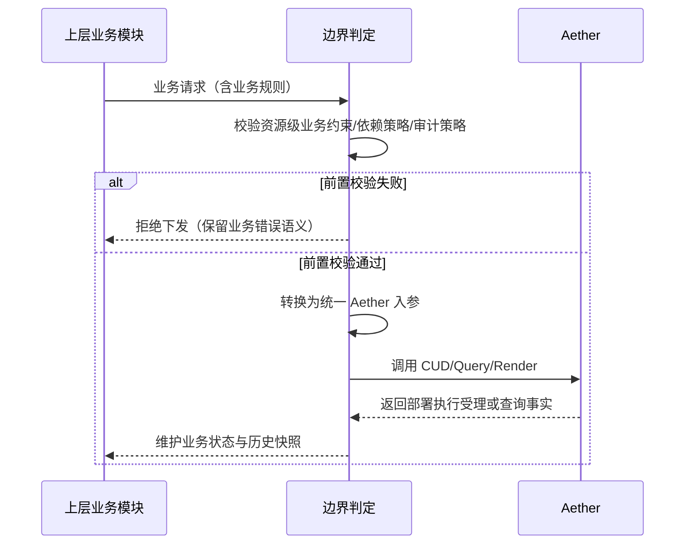

# Aether 设计文档

## §1 设计目标、范围、术语与决策基线（T01）

### 1.1 目标与需求追踪

本章节作为后续设计任务（§2~§10）的输入冻结层，仅定义“可设计/不可设计”边界与术语、决策基线，不提前下沉接口实现细节。

| 追踪ID | 来源 | 约束落点 |
| --- | --- | --- |
| RG-01 | requirements §1 文档目标 | 本文档仅覆盖 Aether 部署域能力，不扩展到上游制品构建流程。 |
| RG-02 | requirements §2 背景与范围 | 固化 In Scope / Out of Scope / 上层职责三段式边界。 |
| RG-03 | requirements §3 术语与对象 | 统一术语字典，禁止同义词混用。 |
| RG-04 | requirements §13.1 + 生效决策清单 | 仅使用 D-001/D-003/D-005/D-007/D-010/D-011/D-012/D-013/D-015/D-016/D-017/D-018/D-019 作为设计输入。 |
| RG-05 | requirements §13.2 | 后续章节必须满足 GC-01~GC-10 的交付约束。 |

### 1.2 设计输入边界（In Scope / Out of Scope / 上层职责）

| 边界分类 | 内容 |
| --- | --- |
| In Scope（Aether） | 统一 CUD/Query 执行能力；无状态部署执行；按工作空间/集群/命名空间落地；参数渲染 `values.yaml`；输出任务当前状态与结果。 |
| Out of Scope（Aether 不负责） | 低代码平台内部业务功能；登录认证流程；资源级业务约束前置校验；资源/任务状态与历史快照持久化；依赖展示语义模型。 |
| 上层职责（调用方必须完成） | 接收业务 OpenAPI；业务约束前置校验；Aether 入参转换；维护状态表与历史快照；决定依赖删除策略并显式传参。 |

不得下沉到 Aether 的职责（T01 DoD 强约束）：

1. 资源级业务约束校验（如单实例限制、来源组合限制）。
2. 依赖展示语义及其状态模型。
3. 资源/任务状态持久化维护。

### 1.3 术语与对象字典（与 requirements §3 对齐）

| 术语 | 规范定义 | 设计使用约束 |
| --- | --- | --- |
| Workspace | 资源管理与权限作用域的核心边界。 | 所有授权、幂等、隔离讨论默认以 `workspace_id` 为第一边界。 |
| Managed Cluster | 被平台接入的 Kubernetes 集群。 | 资源创建必须显式携带 `cluster_id`。 |
| Namespace | 工作空间在关联集群中的同名命名空间。 | 命名空间命名由工作空间映射决定，不在 Aether 内二次派生。 |
| Managed Registry | 被平台接入的 Harbor 仓库。 | 作为上层已纳管资产输入，Aether 不承担仓库纳管生命周期。 |
| Resource Type | Aether 管理的部署对象类型。 | 仅通过“类型注册 + 通用执行器”扩展，不复制流程。 |
| Resource Instance | 某资源类型的一次实例化部署。 | 作为执行目标实体，不承载业务域附加状态。 |
| Deployment Execution | CUD 触发的一次 Helm/K8S 执行过程。 | 仅表达当前执行事实，不承诺历史时间线。 |

### 1.4 决策基线映射（生效/废止隔离）

#### 1.4.1 生效决策与设计落点

| 决策ID | 状态 | 设计落点 | 约束摘要 |
| --- | --- | --- | --- |
| D-001 | 生效 | §1.1, §1.2 | Aether 聚焦部署消费，不承载制品构建流程。 |
| D-003 | 生效 | §1.3, §5（T05） | 资源扩展通过类型注册，执行链路复用通用执行器。 |
| D-005 | 生效 | §1.3, §2（T02） | 授权边界按工作空间统一，同空间不按创建者隔离。 |
| D-007 | 生效 | §1.3, §2（T02）, §3（T03） | 创建请求 `cluster_id` 必填。 |
| D-010 | 生效 | §1.2, §9（T09） | 资源级业务约束由上层前置校验。 |
| D-011 | 生效 | §1.2, §8（T08） | Aether 无状态执行，不维护资源/任务持久化。 |
| D-012 | 生效 | §1.1, §3（T03）, §4（T04） | Query 收敛为 `task_id` 单任务查询。 |
| D-013 | 生效 | §1.3, §4（T04） | 幂等键固定为 `request_id + workspace_id + action`。 |
| D-015 | 生效 | §1.2, §6（T06） | 依赖删除策略由上层显式传参，Aether 不内建隐式级联。 |
| D-016 | 生效 | §1.1, §4（T04）, §8（T08） | 幂等/重入采用“无存储 + 可观测事实判定”。 |
| D-017 | 生效 | §1.1, §3（T03）, §9（T09） | 接口定义与 OpenAPI 映射归属 `docs/design.md`。 |
| D-018 | 生效 | §1.1, §10（T10） | 图示仅 Mermaid；设计交付粒度需可直接指导编码。 |
| D-019 | 生效 | §1.1, §7（T07） | 必须支持 values 渲染并保证 Helm 执行语义等效。 |

#### 1.4.2 废止决策隔离规则

| 决策ID | 状态 | 替代关系 | 处理规则 |
| --- | --- | --- | --- |
| D-002 | 废止 | 被 D-011 取代 | 不得再用于定义任务持久化与列表查询能力。 |
| D-004 | 废止 | 被 D-015 取代 | 不得再引入依赖展示分类与强制级联删除语义。 |
| D-006 | 废止 | 被 D-011 取代 | 不得再将 PostgreSQL/Redis 作为 Aether 强依赖。 |
| D-008 | 废止 | 被 D-010 取代 | 不得再在 Aether 内固化“单实例”业务约束。 |
| D-009 | 废止 | 被 D-012 取代 | 不得再扩展分页/过滤/排序型 Query 能力。 |
| D-014 | 废止 | 被 D-017 取代 | 不得再将接口 DTO/OpenAPI 设计内容回填到 requirements。 |

基线判定规则：

1. 设计评审仅接受 requirements §13.1 生效清单中的决策条目。
2. 任何引用废止决策的设计内容都应判定为越界并回退。
3. 生效决策若存在历史表述冲突，以“最新替代链终点决策”解释为准。

### 1.5 边界判定关键时序（Mermaid）

### 1.6 数据结构与边界规则（设计输入层）

| 结构 | 字段 | 规则 |
| --- | --- | --- |
| `DesignBoundaryRow` | `category`, `responsibility`, `owner`, `forbidden_in_aether` | 用于标记职责归属；`owner` 只能是 `AETHER` 或 `UPSTREAM`。 |
| `GlossaryEntry` | `term`, `definition`, `source_section`, `aliases` | `aliases` 必须为空或仅含同义词映射，禁止改变术语边界。 |
| `DecisionBaselineEntry` | `decision_id`, `status`, `superseded_by`, `design_sections`, `enforced_rules` | `status=DEPRECATED` 的条目不得进入 `design_sections` 的实现约束集合。 |

边界条件与禁止操作：

1. 若需求变更引入新能力但未写入 requirements §13.1 生效决策，设计不得先行扩展。
2. 不允许将“上层已校验”替换为 “Aether 内部兜底业务校验”。
3. 不允许在无状态边界下声明“任务历史可追溯存储”能力。

## §2 授权模型与工作空间/多集群作用域（T02）

待 T02 补充。

## §3 统一接口契约、DTO、错误码（T03）

待 T03 补充。

## §4 执行状态机、幂等与重入（T04）

待 T04 补充。

## §5 资源类型注册与扩展机制（T05）

待 T05 补充。

## §6 依赖表达与删除策略（T06）

待 T06 补充。

## §7 values 渲染与 Helm 等效执行（T07）

待 T07 补充。

## §8 无状态执行与任务查询架构（T08）

待 T08 补充。

## §9 上层集成边界与审计日志（T09）

待 T09 补充。

## §10 验收追踪矩阵与设计完成性检查（T10）

待 T10 补充。
