# Aether 部署模块设计文档

## 1. 文档信息

### 1.1 版本记录

### 1.2 术语与缩写

### 1.3 参考文档

## 2. 需求对齐与设计原则

### 2.1 背景与目标对齐

Aether 部署模块的设计目标与 `docs/requirements.md` 保持一致：

- 在平台纳管的 K8S 集群上，统一管理 5 类一级资源（数据服务组件、低代码平台、DevBox、网关、高代码应用）的生命周期。
- 在“统一抽象 + 统一执行链路”前提下支持扩展，新增资源类型时不重写任务、鉴权、审计主流程。
- 明确共享资源与嵌入式资源边界，避免资源混管。
- 支持高代码应用发布产出标准 Helm Chart（版本化、可入库、可下载）。
- 以工作空间为租户边界，落实跨 workspace/cluster/namespace 的约束与审计。

T1 阶段输出定位为“设计基线”而非“功能详设”：

- 固化范围、边界、术语、约束。
- 建立需求 ID 到设计章节的可追踪骨架。
- 建立变更进入设计的统一流程与版本规则。

### 2.2 设计范围（In Scope）

本设计文档以 `docs/requirements.md` 为唯一规范来源。
需完整覆盖 `R-ENV`、`R-ABS`、`R-DSP`、`R-LCP`、`R-DBX`、`R-GTW`、
`R-HCA`、`R-PKG`、`R-DATA`、`R-OPS` 与 `NFR` 需求簇。

本阶段（T1）已完成：

- 需求簇到章节映射基线。
- 逐条需求 ID 覆盖核对机制（状态分级）。
- 需求变更管理流程与版本规则。

### 2.3 非目标（Out of Scope）

以下内容不属于本模块当前设计与实现范围：

- 镜像仓库与 Chart 仓库基础设施搭建。
- 低代码平台（Dify/FastGPT/Coze Studio/n8n）内部应用 DSL/工作流编排。
- Ingress/服务网格等高级网络治理能力。
- 外部 KMS 能力集成（当前采用 K8S Secret 默认机制）。

### 2.4 技术栈与实现约束

本设计遵循以下硬性约束：

- 后端语言：Go。
- Web/API 框架：Gin。
- 持久化：PostgreSQL。
- 模板与部署包标准：Helm Chart（内置与导入均按 Helm 管理）。
- API 规范：OpenAPI 3.0 + RESTful，统一响应结构与错误码。
- 变更类操作：统一异步任务模型（CUD 异步）。
- 查询类操作：同步返回（Query 同步）。
- 并发与幂等：`Idempotency-Key` + `resource_version`。
- 图示表达：统一使用 Mermaid。

### 2.5 角色与租户边界

角色模型固定为两级：超级管理员、普通用户。

- 超级管理员：可创建/管理工作空间，绑定集群与仓库，管理平台模板，执行解绑等高风险动作。
- 普通用户：仅能操作其已关联工作空间内资源，不可越权到其他工作空间。

租户与部署边界规则：

- 工作空间是权限与资源边界。
- 工作空间在每个关联集群映射同名 namespace。
- 资源创建必须先选择工作空间与目标集群；namespace 由映射规则确定。
- 同一应用禁止跨集群部署与关联。

### 2.6 资源分层与关键概念

本设计采用“一级资源 + 支撑资源 + 运行时对象”三层模型：

- 一级资源（固定 5 类）：`DataServiceInstance`、`LowCodePlatformInstance`、`DevBoxInstance`、`GatewayInstance`、`HighCodeApplication`。
- 支撑资源：`AgentInstance`、`HighCodeArtifact`、`DevBoxPublishRecord`、`HighCodeReleaseChart`、关系引用实体、任务实体、密钥版本实体。
- 运行时对象：Pod/ReplicaSet/Job 等，仅作为观测对象，不作为控制面业务主实体。

关键语义：

- 模板（Template）：可部署标准（Helm Chart + 参数 schema）。
- 实例（Instance）：模板/制品在 workspace+cluster+namespace 的运行实体。
- 可见性（Visibility）：`shared` 与 `embedded` 必须在 API、权限、展示上隔离。
- 宿主归属（Owner）：`embedded` 资源必须绑定 `owner_kind/owner_id` 并随宿主生命周期回收。

## 3. 总体架构设计

### 3.1 系统上下文图

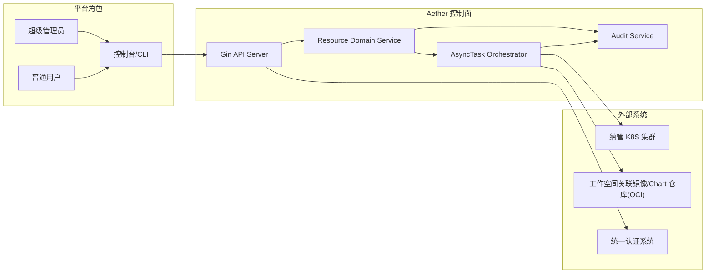

上下文边界说明：

- Aether 控制面负责权限校验、统一资源抽象、任务编排、状态回写、审计落库。
- K8S 集群仅承载运行态对象（Workload/Service/PVC/Secret），不承载控制面业务语义。
- OCI 仓库用于镜像与发布 Chart 的推拉，不承担业务关系存储。

### 3.2 逻辑架构图

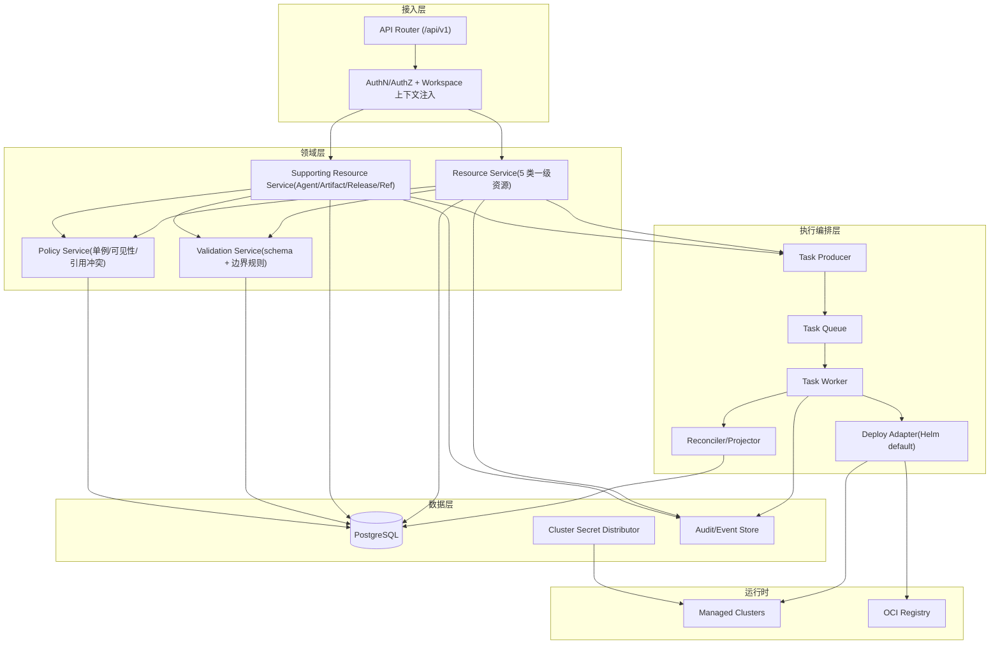

分层职责：

- 接入层：统一认证、租户上下文注入、幂等键透传、并发版本检查入口。
- 领域层：只处理领域规则，不直接操作 K8S。
- 执行层：统一 CUD 链路，按 `resource_kind` 分派适配器，确保新增资源不重写主流程。
- 数据层：PostgreSQL 为唯一控制面事实源，运行态经 Projector 回写快照。

### 3.3 统一资源抽象与扩展点

统一抽象元组：

- `TemplateOrArtifact`：部署来源（平台模板、导入 Helm、高代码镜像/Chart 制品）。
- `Instance`：运行实体（5 类一级资源 + 支撑资源实例）。
- `Relation`：实例关系（Application-Agent、Application-DataService、Owner-Embedded）。
- `ReleaseRecord`：发布与导出沉淀（DevBox 发布记录、HighCodeReleaseChart）。

统一 CUD 执行主链路（对应 `R-ABS-002`）：

1. 请求校验：鉴权、工作空间边界、参数 schema、`resource_version` 并发检查。
2. 任务入队：生成 `AsyncTask`，写入串行化键，返回 `task_id`。
3. 渲染与部署：适配器执行 `render -> apply/upgrade/delete`。
4. 状态回写：更新资源状态、最近任务、失败原因、运行快照。
5. 审计记录：落库请求与结果，关联 `request_id/task_id/resource_id`。

扩展点契约（新增资源类型时只新增 schema 与适配器）：

| 扩展点 | 输入 | 输出 | 约束 |
| --- | --- | --- | --- |
| `SchemaValidator` | `resource_kind + payload` | 标准化参数 | 参数非法返回 `400/422` |
| `TemplateResolver` | `template/artifact ref` | 可渲染包 | 必须返回确定版本与 digest |
| `DeployAdapter` | 统一部署上下文 | K8S 操作结果 | 默认 Helm，必须支持幂等重试 |
| `StatusProjector` | 任务结果 + 集群观测 | 领域状态快照 | 不直接暴露 Pod 作为主实体 |
| `AuditEmitter` | 请求/任务上下文 | 审计事件 | 关键动作必须留痕 |

统一标签规范（对应 `R-ABS-005`）：

- `workspace_id`
- `cluster_id`
- `resource_kind`
- `resource_id`
- `owner_kind`
- `owner_id`

### 3.4 部署视图（Aether 与外部环境边界）

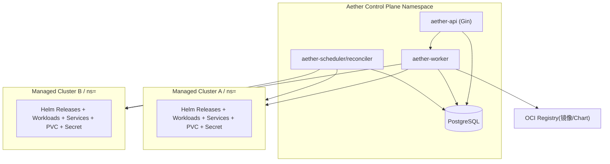

部署边界规则：

- 控制面统一部署在平台集群，业务资源部署在纳管集群目标 namespace。
- `workspace + cluster` 决定唯一部署边界，不允许跨集群关联。
- 镜像凭证由平台下发到目标 namespace，供部署与发布流程消费。

### 3.5 核心时序图（CUD/发布/回收）

#### 3.5.1 通用 CUD 时序（创建/更新/删除）

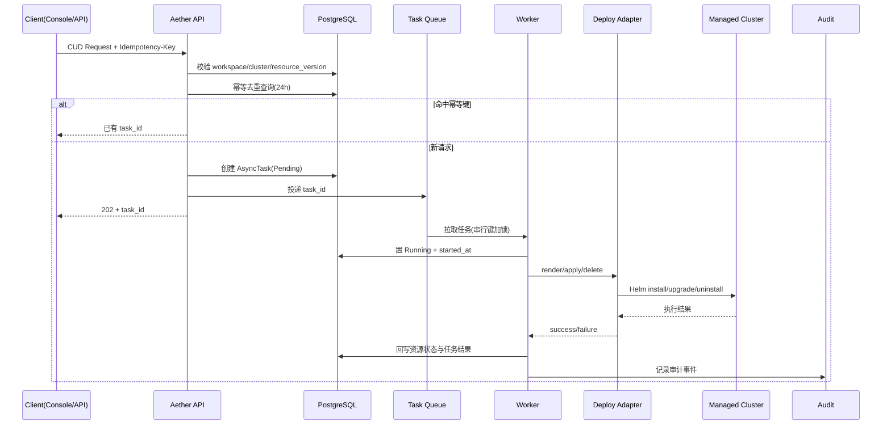

#### 3.5.2 高代码应用发布与 Chart 沉淀时序

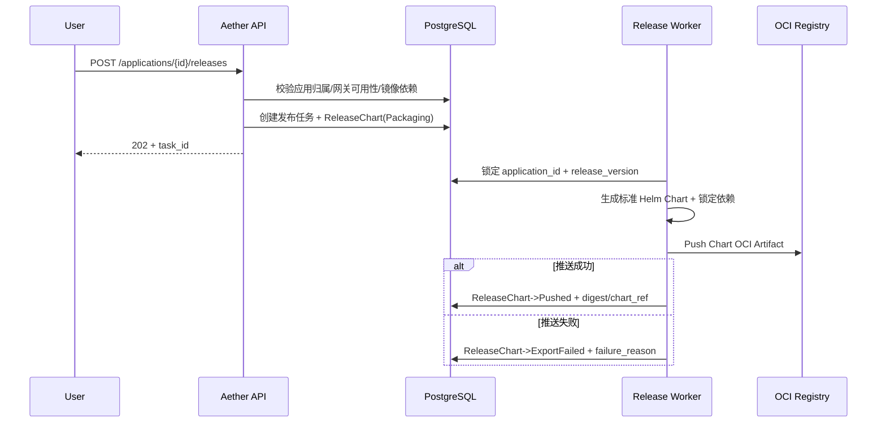

#### 3.5.3 级联删除与补偿时序（含 409 冲突）

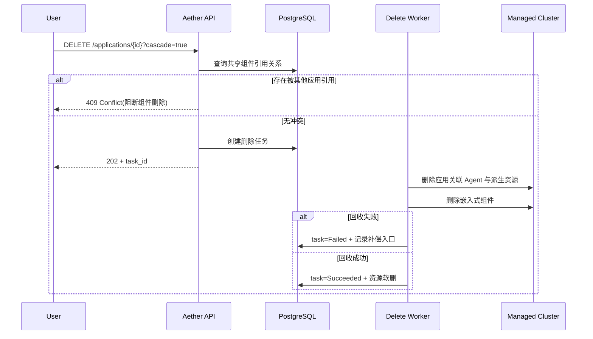

## 4. 功能域设计（对应需求拆解）

### 4.1 工作空间、集群与镜像仓库（R-ENV-001~010）

### 4.2 统一资源抽象与可扩展部署行为（R-ABS-001~008）

### 4.3 数据服务组件（R-DSP-001~012）

### 4.4 低代码平台（R-LCP-001~010）

### 4.5 DevBox（R-DBX-001~009）

### 4.6 网关（Higress）（R-GTW-001~006）

### 4.7 高代码应用（R-HCA-001~014）

### 4.8 高代码应用发布与 Helm Chart 沉淀（R-PKG-001~006）

### 4.9 应用关系持久化与资源可见性（R-DATA-001~008）

### 4.10 CRUD、权限与异步任务（R-OPS-001~010）

## 5. 领域模型与数据设计

### 5.1 领域模型总览（5 类一级资源 + 支撑资源）

模型分层：

- 一级资源（L1）：`DataServiceInstance`、`LowCodePlatformInstance`、`DevBoxInstance`、`GatewayInstance`、`HighCodeApplication`。
- 支撑资源：`AgentInstance`、`HighCodeArtifact`、`DevBoxPublishRecord`、`HighCodeReleaseChart`、关系引用、`AsyncTask`、`SecretVersion`。
- 运行态对象：K8S Workload/Service/PVC/Secret 仅作为投影对象，由 `resource_kind/resource_id` 回挂。

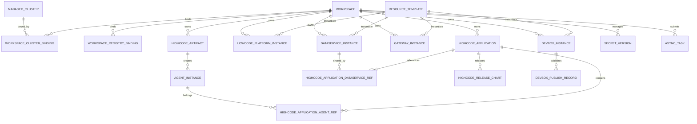

### 5.2 核心实体定义

#### 5.2.1 通用列（适用于可软删实体）

| 字段 | 类型 | 约束/说明 |
| --- | --- | --- |
| `id` | `uuid` | 主键 |
| `workspace_id` | `uuid` | 资源归属工作空间 |
| `cluster_id` | `uuid` | 部署目标集群 |
| `namespace` | `text` | 由 workspace 映射生成，不允许自定义 |
| `status` | `text` | 领域状态，受状态机约束 |
| `resource_version` | `bigint` | 乐观并发控制，单调递增 |
| `created_at/by` | `timestamptz,text` | 创建审计 |
| `updated_at/by` | `timestamptz,text` | 更新审计 |
| `deleted_at/by` | `timestamptz,text` | 软删审计（为空表示有效） |
| `delete_task_id` | `uuid` | 触发删除的任务追踪 |
| `last_task_id` | `uuid` | 最近一次任务 |

#### 5.2.2 一级资源实体

<!-- markdownlint-disable MD013 -->

| 实体 | 关键字段（除通用列） | 唯一性/约束 |
| --- | --- | --- |
| `data_service_instances` | `data_service_type text`、`instance_name text`、`visibility text`、`owner_kind text`、`owner_id uuid`、`template_id uuid`、`spec jsonb`、`connection_secret_ref text` | `visibility in ('shared','embedded')`；`embedded` 必须带 `owner_kind/owner_id` |
| `lowcode_platform_instances` | `platform_type text`、`instance_name text`、`entry_url text`、`template_id uuid`、`spec jsonb` | 同 workspace+cluster 下按 `platform_type+instance_name` 唯一 |
| `devbox_instances` | `instance_name text`、`template_id uuid`、`repo_url text`、`runtime_spec jsonb` | 支持 `Stopped/Publishing` 扩展状态 |
| `gateway_instances` | `instance_name text`、`template_id uuid`、`gateway_spec jsonb` | `workspace_id+cluster_id` 全局单例 |
| `highcode_applications` | `application_name text`、`source_type text`、`release_channel text`、`runtime_spec jsonb` | 创建时必须至少关联 1 个 Agent |

#### 5.2.3 支撑资源实体

| 实体 | 关键字段 | 唯一性/约束 |
| --- | --- | --- |
| `highcode_artifacts` | `artifact_name`、`artifact_version`、`artifact_type`、`image_ref`、`chart_ref`、`digest` | `artifact_type in ('devbox_published_image','uploaded_image','uploaded_helm_chart')` |
| `agent_instances` | `agent_instance_name`、`artifact_id`、`deploy_spec jsonb` | 同时刻仅允许归属一个 Application（由关系表约束） |
| `devbox_publish_records` | `devbox_instance_id`、`publish_version`、`image_ref`、`digest`、`published_at/by` | 只归档不物理删除 |
| `highcode_release_charts` | `application_id`、`release_version`、`chart_ref`、`digest`、`source_type`、`source_version`、`status` | `release_version` 在单应用内唯一 |
| `highcode_application_agent_refs` | `application_id`、`agent_instance_id`、`created_at/by` | `(application_id,agent_instance_id)` 唯一，且 `agent_instance_id` 唯一 |
| `highcode_application_dataservice_refs` | `application_id`、`data_service_instance_id`、`created_at/by` | 仅允许引用 `visibility='shared'` 组件 |
| `async_tasks` | `idempotency_key`、`task_type`、`serialized_key`、`status`、`retry_count`、`result jsonb` | `idempotency_key` 全局唯一（24h 去重） |
| `secret_versions` | `secret_name`、`version`、`namespace`、`encrypted_data_ref`、`is_current` | 每个 `secret_name` 仅一个当前版本 |

### 5.3 关系模型（Application-Agent-DataService）

关系约束：

- `HighCodeApplication` 与 `AgentInstance`：`1:N`，通过 `highcode_application_agent_refs` 建模。
- 同一 `AgentInstance` 在有效关系中仅可被一个 `Application` 绑定。
- `HighCodeApplication` 与共享 `DataServiceInstance`：`N:M`，通过 `highcode_application_dataservice_refs` 建模。
- `embedded` 数据服务不进入共享关联表，改由 `owner_kind/owner_id` 直接归属。

引用完整性规则：

- `application`、`agent`、`dataservice` 三者必须同 `workspace_id + cluster_id + namespace`。
- 级联删除 `cascade=true` 时，先校验共享组件引用；命中冲突直接 `409`。
- 删除低代码平台或 Chart 型高代码应用时，只回收其 `embedded` 组件。

聚合状态规则（对应 `R-DATA-004`）：

- Query 读路径不做跨资源实时聚合计算。
- 应用状态以应用自身最近成功/失败任务结果为准，成员状态以独立字段展示。
- 应用详情读模型固定输出：`agent_instances`、`dataservice_instances`、`entrypoints`、`release_charts`，满足关系可视化展示要求。

### 5.4 唯一性约束与索引策略

主约束（仅列核心）：

| 表 | 唯一约束 |
| --- | --- |
| `workspaces` | `uq_workspaces_name(workspace_name)` |
| `managed_clusters` | `uq_clusters_name(cluster_name)` |
| `workspace_cluster_bindings` | `uq_wcb_workspace_cluster(workspace_id,cluster_id)` |
| `workspace_registry_bindings` | `uq_wrb_workspace_registry(workspace_id,registry_id)` |
| `resource_templates` | `uq_tpl_kind_name_ver(template_kind,template_name,template_version)` |
| `highcode_artifacts` | `uq_art_workspace_name_ver_type(workspace_id,artifact_name,artifact_version,artifact_type)` |
| `data_service_instances` | `uq_ds_workspace_cluster_name(workspace_id,cluster_id,instance_name)` |
| `lowcode_platform_instances` | `uq_lc_workspace_cluster_type_name(workspace_id,cluster_id,platform_type,instance_name)` |
| `devbox_instances` | `uq_db_workspace_cluster_name(workspace_id,cluster_id,instance_name)` |
| `gateway_instances` | `uq_gw_workspace_cluster(workspace_id,cluster_id)` |
| `highcode_applications` | `uq_app_workspace_cluster_name(workspace_id,cluster_id,application_name)` |
| `agent_instances` | `uq_agent_workspace_cluster_name(workspace_id,cluster_id,agent_instance_name)` |
| `highcode_application_agent_refs` | `uq_ref_app_agent(application_id,agent_instance_id)` + `uq_ref_agent_single_owner(agent_instance_id)` |
| `highcode_application_dataservice_refs` | `uq_ref_app_ds(application_id,data_service_instance_id)` |
| `highcode_release_charts` | `uq_chart_app_release(application_id,release_version)` |
| `async_tasks` | `uq_task_idempotency(idempotency_key)` |
| `secret_versions` | `uq_secret_workspace_ns_name_ver(workspace_id,namespace,secret_name,version)` |

<!-- markdownlint-enable MD013 -->

索引策略：

- 列表查询索引：`idx_<table>_workspace_cluster_status_deleted(workspace_id,cluster_id,status,deleted_at)`。
- 任务查询索引：`idx_async_tasks_serialized_status(serialized_key,status,created_at desc)`。
- 关系查询索引：`idx_ref_agent_app(agent_instance_id,application_id)`、`idx_ref_ds_app(data_service_instance_id,application_id)`。
- 审计追踪索引：`idx_<table>_last_task(last_task_id)`、`idx_<table>_delete_task(delete_task_id)`。

实现说明：

- 所有业务唯一索引均采用“`deleted_at is null`”部分唯一索引，保证软删后可重建同名资源。
- 大表新增索引使用 `CREATE INDEX CONCURRENTLY`，避免阻塞写流量。

### 5.5 软删与审计字段策略

软删策略：

- 一级资源与大部分支撑资源使用软删；关系引用表可硬删（删除时必须写审计事件）。
- `deleted_at` 仅由删除任务写入，禁止业务接口直接更新。
- 软删后保留 `delete_task_id`，用于任务级追溯与补偿重放。

审计事件最小字段：

- `request_id`、`task_id`、`resource_kind`、`resource_id`
- `action`（create/update/delete/publish/export/bind/unbind）
- `actor`、`workspace_id`、`cluster_id`
- `before_snapshot`、`after_snapshot`、`result`、`failure_reason`
- `occurred_at`

### 5.6 发布制品模型（Artifact/ReleaseChart）

`HighCodeArtifact` 设计：

- 统一承载三类来源：DevBox 已发布镜像、用户上传镜像、用户上传 Helm Chart。
- 关键字段：`artifact_type`、`image_ref/chart_ref`、`digest`、`source_meta`。
- 与 `AgentInstance` 为 `1:N`（一个制品可创建多个 Agent）。

`HighCodeReleaseChart` 设计：

- 每次应用发布生成一个 `release_version`。
- 状态机：`Packaging -> Pushed | ExportFailed`。
- 元数据满足 `R-PKG-005` 最小集，并额外记录 `package_size`、`values_digest` 以支持复现。

### 5.7 工作空间-集群-仓库绑定模型与 namespace 映射

绑定模型：

- `workspace_cluster_bindings`：维护 `namespace_name`、`binding_status`、`freeze_at`、`recovery_deadline`。
- `workspace_registry_bindings`：维护仓库地址、凭证引用、最后下发版本。

namespace 映射规则：

- `namespace_name = workspace_name`，在绑定建立时创建或复用。
- 所有资源实例持久化写入 `namespace` 冗余列，便于查询与跨边界校验。
- 解绑进入冻结态后，禁止新建/更新任务，仅允许查询、撤销解绑、系统回收任务。

### 5.8 数据迁移与兼容策略

迁移原则：

- 向前兼容优先：新增列使用可空 + 默认值；写路径双写，读路径灰度切换。
- 约束分阶段：先建非唯一索引，再回填数据，再切换唯一/检查约束。
- 失败可回滚：每个 migration 对应 `up/down` 脚本，禁止跨版本隐式变更。

迁移阶段：

1. `Phase A`：建表与通用字段（不加严格外键）。
2. `Phase B`：回填历史数据（`workspace_id/cluster_id/resource_version`）。
3. `Phase C`：启用部分唯一索引与关键外键。
4. `Phase D`：清理废弃字段并冻结旧写路径。

## 6. 状态机与生命周期设计

### 6.1 一级资源状态机

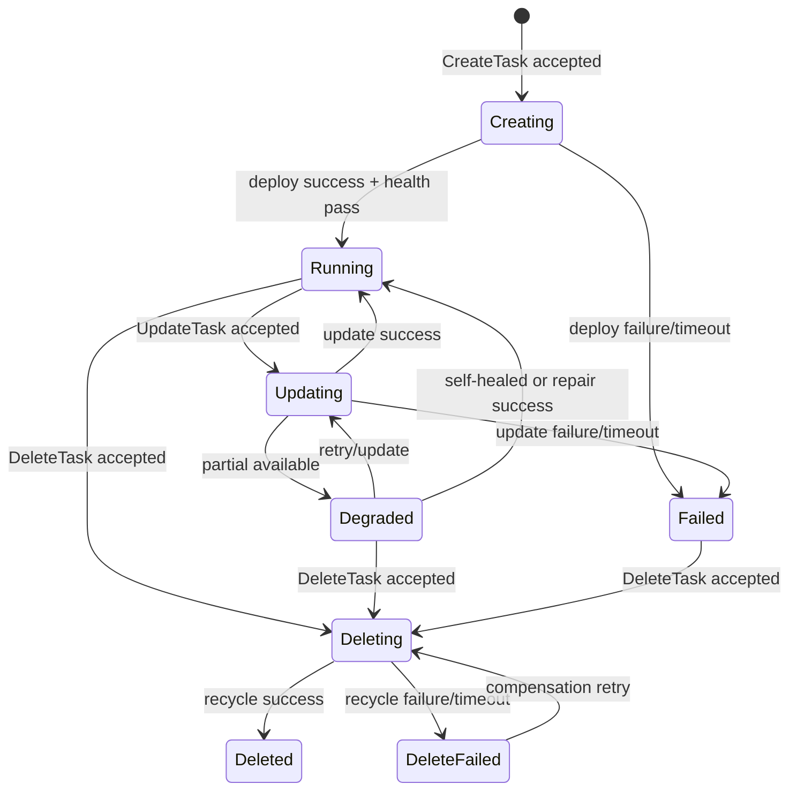

状态触发与补偿入口：

| 场景 | 触发条件 | 失败分支 | 补偿入口 |
| --- | --- | --- | --- |
| 创建 | `AsyncTask(create)` 被 worker 执行 | `Failed` | 重试创建任务或转删除清理 |
| 更新 | `AsyncTask(update)` 执行 | `Degraded/Failed` | 重试更新、回滚版本 |
| 删除 | `AsyncTask(delete)` 执行 | `DeleteFailed` | 幂等重试删除、人工介入 |

资源特化状态：

- `DevBoxInstance` 额外状态：`Stopped`、`Publishing`。
- `GatewayInstance` 不支持多实例并行升级，`Updating` 期间同 cluster 下拒绝新变更。

### 6.2 AgentInstance 状态机

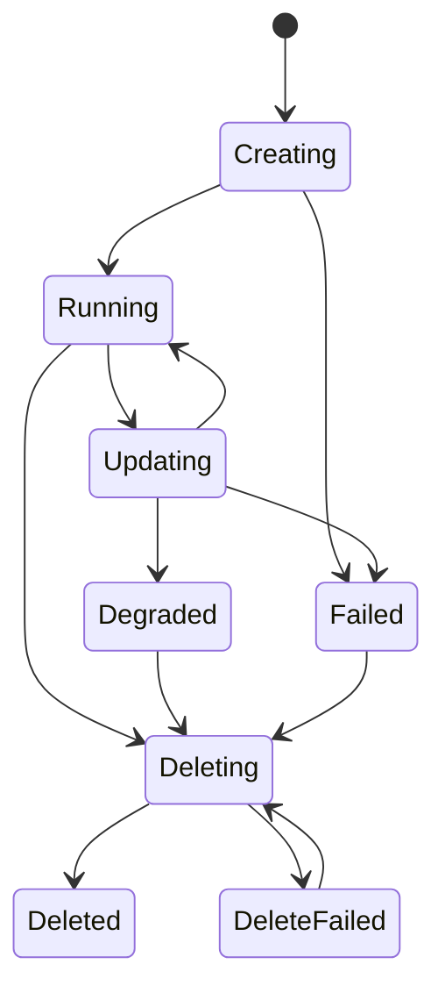

Agent 归属约束（非状态字段）：

- `agent_instance_id` 在有效关系中唯一归属一个 `application_id`。
- 应用解绑 Agent 后，Agent 可保持 `Running`（独立资源语义），或由应用删除任务级联回收。

### 6.3 ReleaseChart 状态机

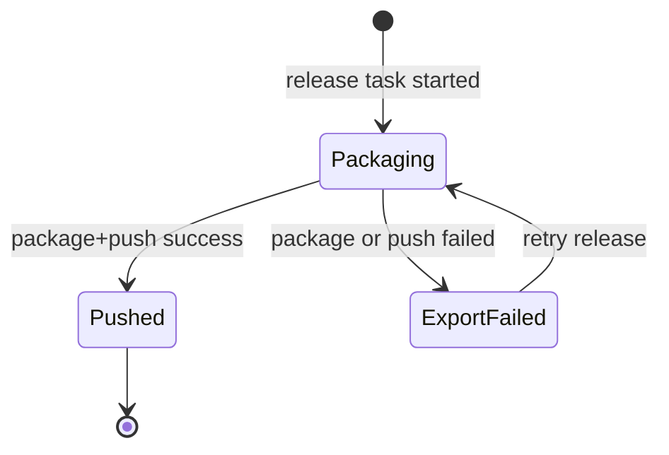

发布失败分支：

- 生成失败：Chart 渲染/依赖锁定失败，记录 `failure_reason=package_failed`。
- 推送失败：OCI 鉴权或网络失败，记录 `failure_reason=push_failed`。
- 重试策略遵循任务框架（最多 5 次指数退避）。

### 6.4 AsyncTask 状态机

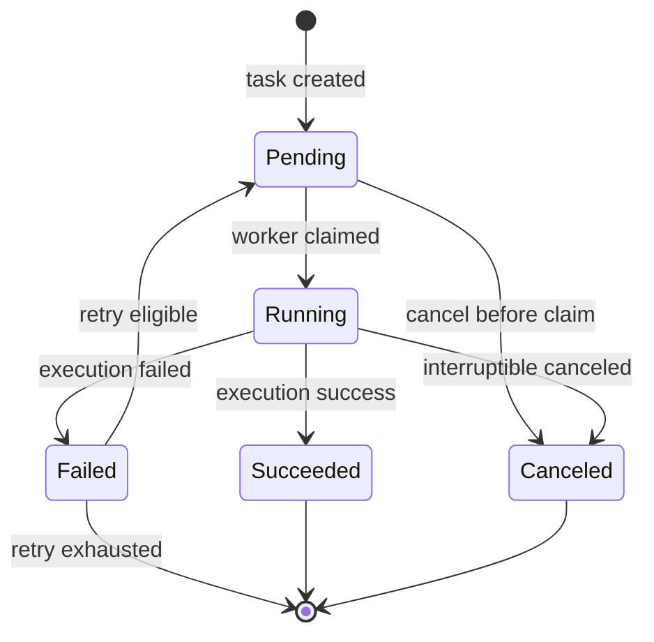

任务控制规则：

- 串行化键：`workspace_id:cluster_id:resource_kind:resource_id_or_name`。
- 重试上限：5 次；退避：`5s/15s/45s/135s/300s`。
- 默认超时：创建/更新 30 分钟，删除 15 分钟，发布导出 20 分钟。
- 结果字段：`resource_kind`、`resource_id`、`started_at`、`ended_at`、`failure_reason`、`retry_count`、`serialized_key`。

### 6.5 工作空间与集群解绑状态机（冻结->校验->24h 可恢复窗口->回收）

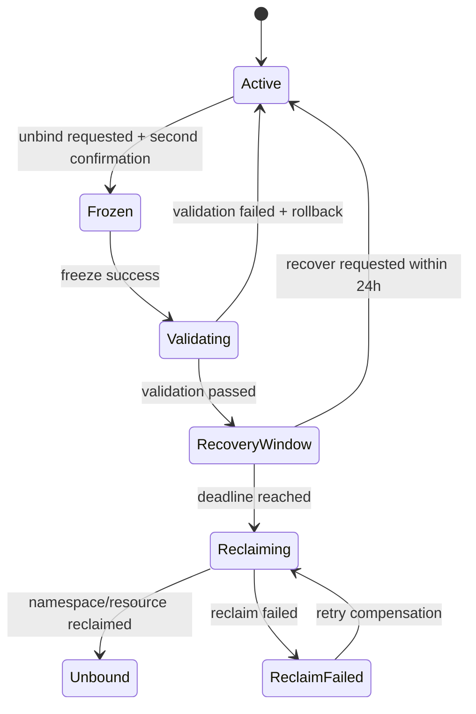

关键约束：

- `Frozen` 后拒绝新 CUD，仅允许 Query 与恢复操作。
- `RecoveryWindow` 默认 24 小时（`ADR-055`）。
- 回收阶段失败进入 `ReclaimFailed`，保留重试与人工补偿入口。

### 6.6 外部环境事件驱动状态同步（非 Aether 发起）

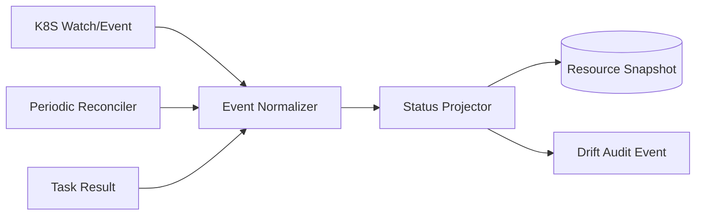

同步规则：

- 外部删除/变更导致与期望态不一致时，资源状态先置 `Degraded`，并记录漂移事件。
- 若下一轮 reconcile 自动修复成功，状态回到 `Running`；否则保持 `Failed/Degraded` 并触发告警。
- Projector 只更新状态快照与观测字段，不修改业务关系模型。

## 7. 接口契约与 API 设计

### 7.1 通用契约（前缀、幂等、并发控制、响应结构）

- 协议与前缀：
  - Base URL：`/api/v1`
  - 媒体类型：`application/json`
  - 认证：`Authorization: Bearer <token>`
- 租户上下文：
  - 外部资源接口统一采用工作空间/集群分层路径：
    `/api/v1/workspaces/{workspace_id}/clusters/{cluster_id}/...`
  - 服务端以路径参数为准注入租户上下文，禁止请求体覆盖 `workspace_id/cluster_id/namespace`。
- 同步与异步语义：
  - Query（GET）：同步返回领域读模型。
  - CUD（POST/PATCH/DELETE）：统一返回 `202 Accepted + task_id`，由任务系统异步执行。
- 幂等控制：
  - 所有 CUD 必须携带 `Idempotency-Key`（长度 8~128）。
  - 24h 内同作用域重复提交返回首次 `task_id`（见 8.4）。
- 并发控制：
  - 更新与删除必须提交 `resource_version`。
  - 版本不一致返回 `409 RESOURCE_VERSION_CONFLICT`。
- 请求追踪：
  - 可选 `X-Request-Id`；未传时服务端生成并回传。
  - 所有响应均回传 `request_id`。

统一响应结构：

```json
{
  "code": "OK",
  "message": "success",
  "request_id": "req_01J...",
  "data": {}
}
```

异步提交响应（`202`）：

```json
{
  "code": "ACCEPTED",
  "message": "task accepted",
  "request_id": "req_01J...",
  "data": {
    "task_id": "2de65c58-9e35-4f63-8cc4-3fb1beebf18c",
    "status": "Pending",
    "deduplicated": false
  }
}
```

错误响应结构：

```json
{
  "code": "RESOURCE_VERSION_CONFLICT",
  "message": "resource_version mismatch",
  "request_id": "req_01J...",
  "error": {
    "retryable": false,
    "details": [
      {
        "field": "resource_version",
        "reason": "expected 17, got 16"
      }
    ]
  }
}
```

分页与过滤约定（列表 Query 通用）：

- `page`（默认 1）、`page_size`（默认 20，最大 100）
- `sort`（如 `created_at.desc`）
- `status`、`keyword`、`visibility`（按资源域可选）

### 7.2 错误码与异常模型

错误码分层：

- HTTP 状态码：表达传输层语义（认证失败、未找到、冲突等）。
- 业务错误码：表达稳定可编程语义，供前端和自动化重试策略消费。

最小错误码集合（T3）：

| HTTP | 业务码 | 场景 | 是否可重试 |
| --- | --- | --- | --- |
| 400 | `INVALID_ARGUMENT` | 参数缺失、格式非法 | 否 |
| 401 | `UNAUTHORIZED` | Token 无效或过期 | 否 |
| 403 | `FORBIDDEN` | 非法工作空间、角色越权 | 否 |
| 404 | `RESOURCE_NOT_FOUND` | 资源不存在或已软删 | 否 |
| 409 | `RESOURCE_VERSION_CONFLICT` | `resource_version` 冲突 | 否 |
| 409 | `REFERENCE_CONFLICT` | `cascade=true` 时共享组件仍被引用（R-HCA-012） | 否 |
| 409 | `RESOURCE_BUSY` | 同资源已有 Running/Pending 任务 | 是 |
| 409 | `IDEMPOTENCY_PAYLOAD_MISMATCH` | 同幂等键但请求指纹不一致 | 否 |
| 422 | `SCHEMA_VALIDATION_FAILED` | 模板/制品参数校验失败 | 否 |
| 429 | `TOO_MANY_REQUESTS` | 请求超限/队列限流 | 是 |
| 500 | `INTERNAL_ERROR` | 未分类服务端错误 | 视情况 |
| 503 | `DEPENDENCY_UNAVAILABLE` | K8S/OCI/DB 短暂不可用 | 是 |

异常字段约定：

- `code`：稳定业务码（机器可读）。
- `message`：可读摘要（人读）。
- `error.retryable`：调用方是否可自动重试。
- `error.details[]`：字段级错误（`field/reason`）。

### 7.3 资源接口分组与路径规范

资源分组：

<!-- markdownlint-disable MD013 -->
| 分组 | Tag | 路径前缀 |
| --- | --- | --- |
| 数据服务组件 | `DataService` | `/workspaces/{workspace_id}/clusters/{cluster_id}/data-services` |
| 低代码平台 | `LowCodePlatform` | `/workspaces/{workspace_id}/clusters/{cluster_id}/lowcode-platforms` |
| DevBox | `DevBox` | `/workspaces/{workspace_id}/clusters/{cluster_id}/devboxes` |
| 网关 | `Gateway` | `/workspaces/{workspace_id}/clusters/{cluster_id}/gateways` |
| 高代码应用 | `HighCodeApplication` | `/workspaces/{workspace_id}/clusters/{cluster_id}/highcode-applications` |
| Agent 实例 | `AgentInstance` | `/workspaces/{workspace_id}/clusters/{cluster_id}/agent-instances` |
| 异步任务 | `AsyncTask` | `/workspaces/{workspace_id}/clusters/{cluster_id}/tasks` |
<!-- markdownlint-enable MD013 -->

标准 CRUD 模板（示例）：

- Create：`POST /.../{resources}`
- List：`GET /.../{resources}`
- Get：`GET /.../{resources}/{resource_id}`
- Update：`PATCH /.../{resources}/{resource_id}`
- Delete：`DELETE /.../{resources}/{resource_id}?resource_version=<n>&cascade=<bool>`

高代码发布与制品接口：

- 发布：`POST /workspaces/{workspace_id}/clusters/{cluster_id}/highcode-applications/{application_id}/releases`
- 发布记录：`GET /workspaces/{workspace_id}/clusters/{cluster_id}/highcode-applications/{application_id}/releases`
- 下载 Chart：`GET /workspaces/{workspace_id}/clusters/{cluster_id}/highcode-applications/{application_id}/releases/{release_version}/download`

任务接口：

- 查询任务：`GET /workspaces/{workspace_id}/clusters/{cluster_id}/tasks/{task_id}`
- 任务列表：`GET /workspaces/{workspace_id}/clusters/{cluster_id}/tasks?resource_kind=&resource_id=&status=`
- 取消任务：`POST /workspaces/{workspace_id}/clusters/{cluster_id}/tasks/{task_id}:cancel`

关键请求 Schema（OpenAPI 组件）：

```yaml
AsyncAccepted:
  type: object
  required: [task_id, status, deduplicated]
  properties:
    task_id: { type: string, format: uuid }
    status:
      type: string
      enum: [Pending, Running, Succeeded, Failed, Canceled]
    deduplicated: { type: boolean }

UpdateRequest:
  type: object
  required: [resource_version, spec]
  properties:
    resource_version: { type: integer, format: int64, minimum: 1 }
    spec: { type: object, additionalProperties: true }

ReleaseCreateRequest:
  type: object
  required: [resource_version]
  properties:
    resource_version: { type: integer, format: int64, minimum: 1 }
    release_version: { type: string, minLength: 1, maxLength: 64 }
    values_override: { type: object, additionalProperties: true }
```

### 7.4 Query 读路径与非聚合语义

读路径规则（落实 `R-DATA-004` 与 `ADR-056`）：

- Query 仅读取控制面读模型（PostgreSQL 快照 + 最近任务信息）。
- 不在 Query 阶段触发跨资源实时聚合计算。
- 详情接口展示成员列表及各自状态，不重算“应用聚合状态”。

应用详情固定返回结构（示例字段）：

- `application`：应用主信息与 `status/resource_version/last_task`
- `agent_instances[]`：成员 Agent 的独立状态
- `dataservice_instances[]`：区分 `shared/embedded` 与 `owner`
- `release_charts[]`：发布版本与 `chart_ref/digest/status`

读一致性策略：

- 默认 `read_committed`；
- 若请求带 `?consistent=true`，在单次事务中读取主资源与关系表，保证详情页同读一致。

### 7.5 OpenAPI 3.0 组织方式

规范组织：

- 根文件：`openapi/aether-deploy.yaml`
- 分文件：按 tag 拆分 `paths/*.yaml`，共用模型放 `components/schemas/*.yaml`
- 复用对象：`components/parameters`（分页、路径参数、`resource_version`）
- 安全定义：`components/securitySchemes/BearerAuth`

OpenAPI 统一约束：

- 每个 CUD 接口声明请求头参数 `Idempotency-Key`（`required: true`）。
- 每个 Update/Delete 请求显式声明 `resource_version`。
- 每个异步接口响应必须包含 `202` 与 `AsyncAccepted`。
- 每个接口统一定义错误响应：`400/401/403/404/409/422/429/500/503`（按适用裁剪）。

落地建议：

- 使用 `oapi-codegen` 生成 Gin handler 接口与模型；
- handler 层只做鉴权与参数绑定，业务语义下沉 service；
- service 统一调用任务生产器，禁止绕过任务框架直接写 K8S。

### 7.6 内部接口与事件契约（workspace/cluster/registry 绑定与解绑）

内部接口（平台内调用，不对租户开放）：

<!-- markdownlint-disable MD013 -->
| 接口 | 方法 | 语义 |
| --- | --- | --- |
| `/internal/v1/workspace-cluster-bindings/{binding_id}:freeze` | `POST` | 发起解绑冻结（含二次确认） |
| `/internal/v1/workspace-cluster-bindings/{binding_id}:validate` | `POST` | 校验冻结后任务与资源状态 |
| `/internal/v1/workspace-cluster-bindings/{binding_id}:recover` | `POST` | 24h 窗口内撤销解绑 |
| `/internal/v1/workspace-cluster-bindings/{binding_id}:reclaim` | `POST` | 执行 namespace 回收 |
| `/internal/v1/workspace-registry-bindings/{binding_id}:rotate-credential` | `POST` | 轮转仓库凭证并触发下发 |
<!-- markdownlint-enable MD013 -->

事件主题与载荷（Outbox -> EventBus）：

- `workspace.binding.state.changed.v1`
- `workspace.registry.credential.rotated.v1`
- `task.lifecycle.changed.v1`

`workspace.binding.state.changed.v1` 载荷示例：

```json
{
  "event_id": "evt_01J...",
  "binding_id": "a6f4dcae-88dc-4315-8f6f-d8f489fb0a00",
  "workspace_id": "ws_...",
  "cluster_id": "cl_...",
  "from_status": "Validating",
  "to_status": "RecoveryWindow",
  "occurred_at": "2026-02-23T10:00:00Z"
}
```

## 8. 异步任务与执行编排设计

### 8.1 任务模型与串行化键

- 任务实体：`async_tasks`（见 5.2.3），关键字段如下。

| 字段 | 类型 | 说明 |
| --- | --- | --- |
| `task_id` | `uuid` | 主键 |
| `task_type` | `text` | `create/update/delete/release/export/...` |
| `resource_kind` | `text` | 一级资源或支撑资源类型 |
| `resource_id` | `uuid/null` | 目标资源 ID（创建前可空） |
| `workspace_id/cluster_id` | `uuid` | 租户与部署边界 |
| `serialized_key` | `text` | 串行化执行键 |
| `idempotency_scope` | `text` | 幂等作用域哈希（见 8.4） |
| `status` | `text` | `Pending/Running/Succeeded/Failed/Canceled` |
| `retry_count/max_retry` | `int` | 重试计数与上限 |
| `timeout_seconds` | `int` | 任务超时阈值 |
| `cancel_requested` | `bool` | 协作式取消标记 |
| `payload/result` | `jsonb` | 输入上下文与输出结果 |

串行化键规则（对应 `R-OPS-005`）：

- 有 `resource_id`：`ws:{ws}:cl:{cl}:rk:{kind}:id:{id}`
- 创建前无 `resource_id`：`ws:{ws}:cl:{cl}:rk:{kind}:name:{normalized_name}`
- 发布任务：`ws:{ws}:cl:{cl}:rk:highcode_application:id:{app_id}:release`
- 解绑链路：`ws:{ws}:cl:{cl}:rk:workspace_cluster_binding:id:{binding_id}`

### 8.2 生产者流程

生产者位于 API Service（Handler -> Service -> TaskProducer）：

1. 校验认证、工作空间边界、参数 schema、`resource_version`。
2. 计算幂等作用域并查重（24h）。
3. 命中幂等记录：直接返回历史 `task_id`。
4. 未命中：在单事务内写入 `async_tasks`、审计草稿、Outbox 事件。
5. 提交事务后投递队列（至少一次）。
6. 返回 `202 + task_id`。

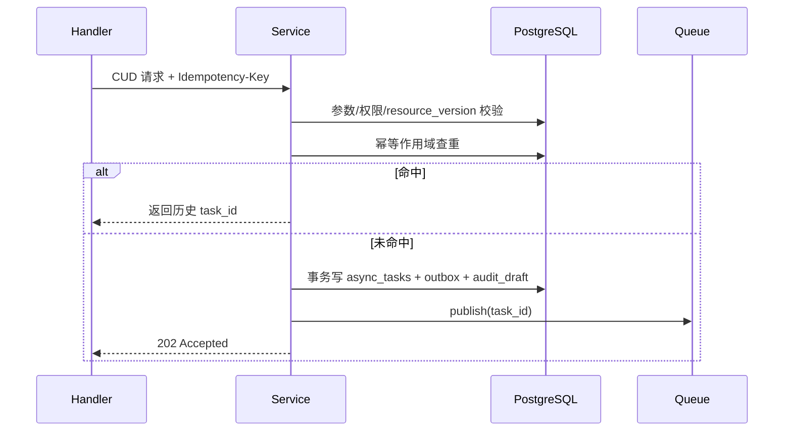

### 8.3 消费者流程

消费者位于 Worker（QueueConsumer -> Executor -> Adapter）：

1. 通过 `FOR UPDATE SKIP LOCKED` 抢占可执行任务。
2. 对 `serialized_key` 加分布式互斥锁。
3. 状态置 `Running` 并写 `started_at`。
4. 构造统一执行上下文（模板/制品、凭证、cluster client）。
5. 调用 `DeployAdapter` 执行 `apply/upgrade/delete/package/push`。
6. 成功：回写资源状态、任务结果、审计完成事件。
7. 失败：按 8.5 判定重试或终态失败，必要时进入 8.6 补偿。

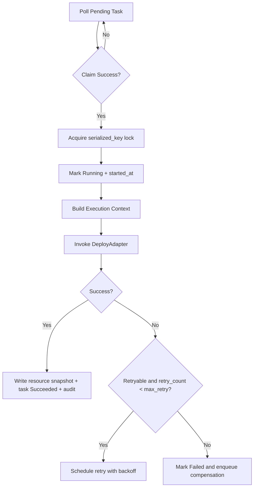

### 8.4 幂等与去重策略

幂等作用域（避免全局键冲突）：

- `idempotency_scope = hash(`
  `actor_id + workspace_id + cluster_id + method + route_template + idempotency_key)`
- 去重窗口：24 小时（从首次接收时间起算）。

判定规则：

- 作用域存在且请求指纹（规范化 body + query）一致：返回原 `task_id`。
- 作用域存在但请求指纹不一致：返回 `409 IDEMPOTENCY_PAYLOAD_MISMATCH`。
- 作用域不存在：创建新任务并写入作用域记录。

实现要点：

- 幂等记录与任务写入同事务提交，避免“查重命中但任务不存在”。
- 过期记录按 TTL 定时清理，不影响历史审计表。

### 8.5 重试、超时与取消策略

重试策略（对应 `R-OPS-007`）：

- 默认最大重试 `5` 次。
- 退避：`5s -> 15s -> 45s -> 135s -> 300s`。
- 可重试错误：`DEPENDENCY_UNAVAILABLE`、网络抖动、临时锁冲突。
- 不可重试错误：参数错误、权限错误、引用冲突、版本冲突。

超时策略：

| 任务类型 | 默认超时 |
| --- | --- |
| `create/update` | 30 分钟 |
| `delete` | 15 分钟 |
| `release/export` | 20 分钟 |
| `freeze/validate/recover/reclaim` | 10 分钟 |

取消策略：

- API：`POST /.../tasks/{task_id}:cancel`
- `Pending`：直接转 `Canceled`。
- `Running`：置 `cancel_requested=true`，适配器在阶段边界检查并协作中断。
- 取消成功后写入审计 `action=cancel_task` 与 `canceled_by/canceled_at`。

### 8.6 补偿与一致性策略

补偿触发场景（对应 `R-OPS-009`）：

- 删除宿主资源后嵌入式组件回收失败。
- 创建/升级过程中部分 K8S 对象成功、部分失败。
- 发布流程中“打包成功但推送失败”。

一致性策略：

- 任务状态与资源快照回写采用单事务，避免“任务成功但资源状态未更新”。
- 跨系统副作用（K8S/OCI）采用 Outbox 记录步骤，失败后按步骤反向补偿。
- 补偿任务独立 `task_type=compensation`，继承原 `serialized_key` 串行执行。

补偿时序（删除宿主 + 嵌入式回收失败）：

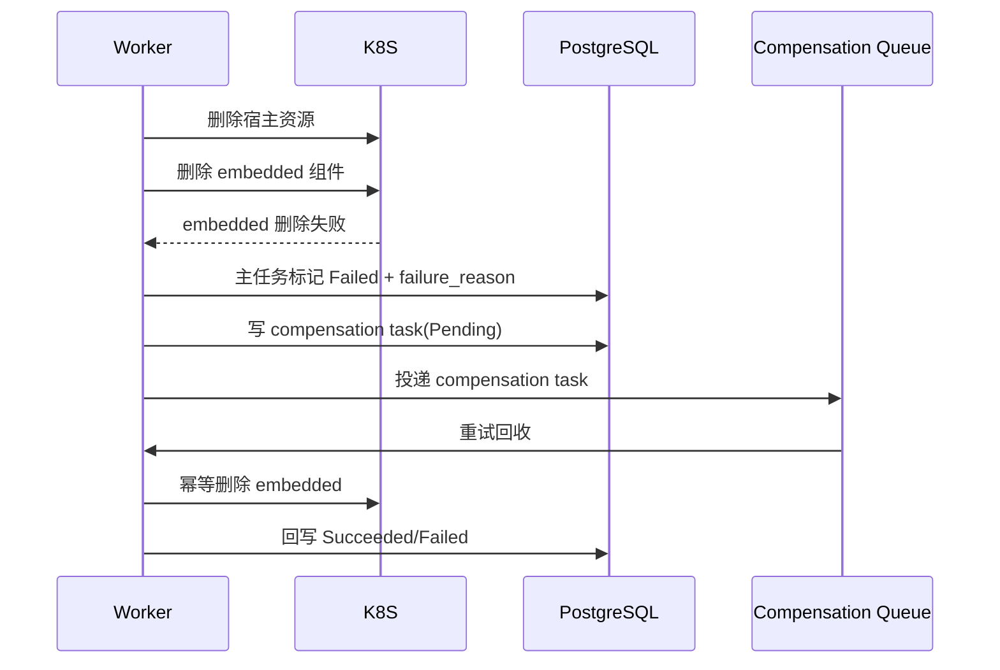

结果字段最小集合（对应 `R-OPS-008`）：

- `resource_kind`
- `resource_id`
- `started_at`
- `ended_at`
- `failure_reason`
- `retry_count`
- `serialized_key`

## 9. 资源编排与 K8s 交互设计

### 9.1 模板与制品技术路线（内置 Helm/导入 Helm/镜像转 Chart）

### 9.2 Chart Values 合并与参数校验

### 9.3 依赖镜像校验与凭证下发消费（平台负责 namespace 级分发）

### 9.4 资源命名与标签规范

### 9.5 部署、升级、回滚与漂移处理

## 10. 权限与安全设计

### 10.1 认证与授权模型

### 10.2 权限动作矩阵落地

### 10.3 Secret 生命周期与版本化

### 10.4 敏感数据保护与加密策略

### 10.5 审计日志设计

## 11. 多租户与隔离设计

### 11.1 租户上下文接入（Workspace/Cluster/Namespace 约束）

### 11.2 跨边界校验策略

### 11.3 共享与嵌入式资源隔离策略

### 11.4 级联删除与引用冲突处理

### 11.5 工作空间-集群解绑保护机制（冻结、恢复窗口、回收）

## 12. 可观测性与运维设计

### 12.1 日志设计

### 12.2 指标设计

### 12.3 追踪设计

### 12.4 告警与值班策略

### 12.5 运维操作手册

### 12.6 审计检索与追溯（关键操作与关系变更）

## 13. 非功能与容量设计

### 13.1 性能目标与预算（NFR-001~005）

### 13.2 可用性与稳定性目标（NFR-005）

### 13.3 容量规划（NFR-006~011）

### 13.4 安全与审计约束（NFR-012~015）

### 13.5 可扩展性与运维约束（NFR-016~019）

### 13.6 压测与容量验收方案

## 14. 验收与追踪矩阵

### 14.1 验收标准映射（需求 ID -> 用例）

### 14.2 测试分层与关键场景

### 14.3 发布与回滚计划

### 14.4 需求覆盖审计（逐条核对 requirements.md）

#### 14.4.1 审计口径与状态定义

- 审计基线：`docs/requirements.md` 当前版本（T1 编写时版本）。
- 覆盖定义：需求 ID 能映射到至少一个目标设计章节。
- 状态枚举：
  - `已覆盖`：当前 `docs/design.md` 已有可执行级描述（非仅章节占位）。
  - `待补充`：已建立章节落点，但详细设计尚未完成（后续任务补齐）。
  - `不适用`：需求已在基线中确认不属于当前版本交付范围。
- 当前批次（T1）不适用项：无。

#### 14.4.2 需求簇到章节映射（簇级）

| 需求簇 | 主要章节映射 |
| --- | --- |
| `R-ENV` | 4.1、5.7、6.5、7.6、11.1、11.2 |
| `R-ABS` | 3.3、4.2、5.1、8.1~8.6 |
| `R-DSP` | 4.3、5.2、5.3、9.1~9.5、11.3 |
| `R-LCP` | 4.4、5.2、9.1~9.5、11.3 |
| `R-DBX` | 4.5、5.2、5.6、9.1~9.5 |
| `R-GTW` | 4.6、5.2、9.1~9.5、11.2 |
| `R-HCA` | 4.7、5.2、5.3、9.1~9.5、11.4 |
| `R-PKG` | 4.8、5.6、8.2~8.6、9.1~9.5 |
| `R-DATA` | 4.9、5.3、5.5、11.3、12.6 |
| `R-OPS` | 4.10、7.1~7.6、8.1~8.6、12.6 |
| `NFR` | 10、11、12、13、14.1、14.2 |

#### 14.4.3 逐条需求 ID 覆盖核对表

| 需求 ID | 映射章节 | 当前状态 | 备注 |
| --- | --- | --- | --- |
| R-ENV-001 | 4.1、5.7、6.5、7.6、11.1、11.2 | 待补充 | T2~T6 完成后转为“已覆盖”。 |
| R-ENV-002 | 4.1、5.7、6.5、7.6、11.1、11.2 | 待补充 | T2~T6 完成后转为“已覆盖”。 |
| R-ENV-003 | 4.1、5.7、6.5、7.6、11.1、11.2 | 待补充 | T2~T6 完成后转为“已覆盖”。 |
| R-ENV-004 | 4.1、5.7、6.5、7.6、11.1、11.2 | 待补充 | T2~T6 完成后转为“已覆盖”。 |
| R-ENV-005 | 4.1、5.7、6.5、7.6、11.1、11.2 | 待补充 | T2~T6 完成后转为“已覆盖”。 |
| R-ENV-006 | 4.1、5.7、6.5、7.6、11.1、11.2 | 待补充 | T2~T6 完成后转为“已覆盖”。 |
| R-ENV-007 | 4.1、5.7、6.5、7.6、11.1、11.2 | 待补充 | T2~T6 完成后转为“已覆盖”。 |
| R-ENV-008 | 4.1、5.7、6.5、7.6、11.1、11.2 | 待补充 | T2~T6 完成后转为“已覆盖”。 |
| R-ENV-009 | 4.1、5.7、6.5、7.6、11.1、11.2 | 待补充 | T2~T6 完成后转为“已覆盖”。 |
| R-ENV-010 | 4.1、5.7、6.5、7.6、11.1、11.2 | 待补充 | T2~T6 完成后转为“已覆盖”。 |
| R-ABS-001 | 3.3、4.2、5.1、8.1~8.6 | 已覆盖 | 已在 3.3 与 5.1 固化统一抽象元组与分层模型。 |
| R-ABS-002 | 3.3、4.2、5.1、8.1~8.6 | 已覆盖 | 已在 3.3/3.5 定义统一 CUD 执行链路与时序。 |
| R-ABS-003 | 3.3、4.2、5.1、8.1~8.6 | 已覆盖 | 已在 3.3 固化 Helm 默认适配器与扩展点契约。 |
| R-ABS-004 | 3.3、4.2、5.1、8.1~8.6 | 已覆盖 | 已在 3.2/3.3 明确新增资源仅扩展 schema+adapter。 |
| R-ABS-005 | 3.3、4.2、5.1、8.1~8.6 | 已覆盖 | 已在 3.3 定义统一标签规范。 |
| R-ABS-006 | 3.3、4.2、5.1、8.1~8.6 | 已覆盖 | 已在 3.3/6.6 定义统一状态快照与观测回写机制。 |
| R-ABS-007 | 3.3、4.2、5.1、8.1~8.6 | 已覆盖 | 已在 2.6 固化分层与 Pod 观测边界。 |
| R-ABS-008 | 3.3、4.2、5.1、8.1~8.6 | 已覆盖 | 已在 2.6 固化分层与 Pod 观测边界。 |
| R-DSP-001 | 4.3、5.2、5.3、9.1~9.5、11.3 | 待补充 | T4 细化共享/嵌入式组件隔离与生命周期。 |
| R-DSP-002 | 4.3、5.2、5.3、9.1~9.5、11.3 | 待补充 | T4 细化共享/嵌入式组件隔离与生命周期。 |
| R-DSP-003 | 4.3、5.2、5.3、9.1~9.5、11.3 | 待补充 | T4 细化共享/嵌入式组件隔离与生命周期。 |
| R-DSP-004 | 4.3、5.2、5.3、9.1~9.5、11.3 | 待补充 | T4 细化共享/嵌入式组件隔离与生命周期。 |
| R-DSP-005 | 4.3、5.2、5.3、9.1~9.5、11.3 | 待补充 | T4 细化共享/嵌入式组件隔离与生命周期。 |
| R-DSP-006 | 4.3、5.2、5.3、9.1~9.5、11.3 | 待补充 | T4 细化共享/嵌入式组件隔离与生命周期。 |
| R-DSP-007 | 4.3、5.2、5.3、9.1~9.5、11.3 | 待补充 | T4 细化共享/嵌入式组件隔离与生命周期。 |
| R-DSP-008 | 4.3、5.2、5.3、9.1~9.5、11.3 | 待补充 | T4 细化共享/嵌入式组件隔离与生命周期。 |
| R-DSP-009 | 4.3、5.2、5.3、9.1~9.5、11.3 | 待补充 | T4 细化共享/嵌入式组件隔离与生命周期。 |
| R-DSP-010 | 4.3、5.2、5.3、9.1~9.5、11.3 | 待补充 | T4 细化共享/嵌入式组件隔离与生命周期。 |
| R-DSP-011 | 4.3、5.2、5.3、9.1~9.5、11.3 | 待补充 | T4 细化共享/嵌入式组件隔离与生命周期。 |
| R-DSP-012 | 4.3、5.2、5.3、9.1~9.5、11.3 | 待补充 | T4 细化共享/嵌入式组件隔离与生命周期。 |
| R-LCP-001 | 4.4、5.2、9.1~9.5、11.3 | 待补充 | T4 细化内置与导入 Helm 平台管理能力。 |
| R-LCP-002 | 4.4、5.2、9.1~9.5、11.3 | 待补充 | T4 细化内置与导入 Helm 平台管理能力。 |
| R-LCP-003 | 4.4、5.2、9.1~9.5、11.3 | 待补充 | T4 细化内置与导入 Helm 平台管理能力。 |
| R-LCP-004 | 4.4、5.2、9.1~9.5、11.3 | 待补充 | T4 细化内置与导入 Helm 平台管理能力。 |
| R-LCP-005 | 4.4、5.2、9.1~9.5、11.3 | 待补充 | T4 细化内置与导入 Helm 平台管理能力。 |
| R-LCP-006 | 4.4、5.2、9.1~9.5、11.3 | 待补充 | T4 细化内置与导入 Helm 平台管理能力。 |
| R-LCP-007 | 4.4、5.2、9.1~9.5、11.3 | 待补充 | T4 细化内置与导入 Helm 平台管理能力。 |
| R-LCP-008 | 4.4、5.2、9.1~9.5、11.3 | 待补充 | T4 细化内置与导入 Helm 平台管理能力。 |
| R-LCP-009 | 4.4、5.2、9.1~9.5、11.3 | 待补充 | T4 细化内置与导入 Helm 平台管理能力。 |
| R-LCP-010 | 4.4、5.2、9.1~9.5、11.3 | 待补充 | T4 细化内置与导入 Helm 平台管理能力。 |
| R-DBX-001 | 4.5、5.2、5.6、9.1~9.5 | 待补充 | T4 细化 DevBox 生命周期与发布门禁。 |
| R-DBX-002 | 4.5、5.2、5.6、9.1~9.5 | 待补充 | T4 细化 DevBox 生命周期与发布门禁。 |
| R-DBX-003 | 4.5、5.2、5.6、9.1~9.5 | 待补充 | T4 细化 DevBox 生命周期与发布门禁。 |
| R-DBX-004 | 4.5、5.2、5.6、9.1~9.5 | 待补充 | T4 细化 DevBox 生命周期与发布门禁。 |
| R-DBX-005 | 4.5、5.2、5.6、9.1~9.5 | 待补充 | T4 细化 DevBox 生命周期与发布门禁。 |
| R-DBX-006 | 4.5、5.2、5.6、9.1~9.5 | 待补充 | T4 细化 DevBox 生命周期与发布门禁。 |
| R-DBX-007 | 4.5、5.2、5.6、9.1~9.5 | 待补充 | T4 细化 DevBox 生命周期与发布门禁。 |
| R-DBX-008 | 4.5、5.2、5.6、9.1~9.5 | 待补充 | T4 细化 DevBox 生命周期与发布门禁。 |
| R-DBX-009 | 4.5、5.2、5.6、9.1~9.5 | 待补充 | T4 细化 DevBox 生命周期与发布门禁。 |
| R-GTW-001 | 4.6、5.2、9.1~9.5、11.2 | 待补充 | T4 细化单例约束、可用性校验与回滚。 |
| R-GTW-002 | 4.6、5.2、9.1~9.5、11.2 | 待补充 | T4 细化单例约束、可用性校验与回滚。 |
| R-GTW-003 | 4.6、5.2、9.1~9.5、11.2 | 待补充 | T4 细化单例约束、可用性校验与回滚。 |
| R-GTW-004 | 4.6、5.2、9.1~9.5、11.2 | 待补充 | T4 细化单例约束、可用性校验与回滚。 |
| R-GTW-005 | 4.6、5.2、9.1~9.5、11.2 | 待补充 | T4 细化单例约束、可用性校验与回滚。 |
| R-GTW-006 | 4.6、5.2、9.1~9.5、11.2 | 待补充 | T4 细化单例约束、可用性校验与回滚。 |
| R-HCA-001 | 4.7、5.2、5.3、9.1~9.5、11.4 | 待补充 | T4 细化三种来源、关系约束、级联删除。 |
| R-HCA-002 | 4.7、5.2、5.3、9.1~9.5、11.4 | 待补充 | T4 细化三种来源、关系约束、级联删除。 |
| R-HCA-003 | 4.7、5.2、5.3、9.1~9.5、11.4 | 待补充 | T4 细化三种来源、关系约束、级联删除。 |
| R-HCA-004 | 4.7、5.2、5.3、9.1~9.5、11.4 | 待补充 | T4 细化三种来源、关系约束、级联删除。 |
| R-HCA-005 | 4.7、5.2、5.3、9.1~9.5、11.4 | 待补充 | T4 细化三种来源、关系约束、级联删除。 |
| R-HCA-006 | 4.7、5.2、5.3、9.1~9.5、11.4 | 待补充 | T4 细化三种来源、关系约束、级联删除。 |
| R-HCA-007 | 4.7、5.2、5.3、9.1~9.5、11.4 | 待补充 | T4 细化三种来源、关系约束、级联删除。 |
| R-HCA-008 | 4.7、5.2、5.3、9.1~9.5、11.4 | 待补充 | T4 细化三种来源、关系约束、级联删除。 |
| R-HCA-009 | 4.7、5.2、5.3、9.1~9.5、11.4 | 待补充 | T4 细化三种来源、关系约束、级联删除。 |
| R-HCA-010 | 4.7、5.2、5.3、9.1~9.5、11.4 | 待补充 | T4 细化三种来源、关系约束、级联删除。 |
| R-HCA-011 | 4.7、5.2、5.3、9.1~9.5、11.4 | 待补充 | T4 细化三种来源、关系约束、级联删除。 |
| R-HCA-012 | 4.7、5.2、5.3、9.1~9.5、11.4 | 待补充 | T4 细化三种来源、关系约束、级联删除。 |
| R-HCA-013 | 4.7、5.2、5.3、9.1~9.5、11.4 | 待补充 | T4 细化三种来源、关系约束、级联删除。 |
| R-HCA-014 | 4.7、5.2、5.3、9.1~9.5、11.4 | 待补充 | T4 细化三种来源、关系约束、级联删除。 |
| R-PKG-001 | 4.8、5.6、8.2~8.6、9.1~9.5 | 待补充 | T4/T6 细化打包、入库、下载导出链路。 |
| R-PKG-002 | 4.8、5.6、8.2~8.6、9.1~9.5 | 待补充 | T4/T6 细化打包、入库、下载导出链路。 |
| R-PKG-003 | 4.8、5.6、8.2~8.6、9.1~9.5 | 待补充 | T4/T6 细化打包、入库、下载导出链路。 |
| R-PKG-004 | 4.8、5.6、8.2~8.6、9.1~9.5 | 待补充 | T4/T6 细化打包、入库、下载导出链路。 |
| R-PKG-005 | 4.8、5.6、8.2~8.6、9.1~9.5 | 待补充 | T4/T6 细化打包、入库、下载导出链路。 |
| R-PKG-006 | 4.8、5.6、8.2~8.6、9.1~9.5 | 待补充 | T4/T6 细化打包、入库、下载导出链路。 |
| R-DATA-001 | 4.9、5.3、5.5、11.3、12.6 | 已覆盖 | 已在 5.3 定义关系持久化。 |
| R-DATA-002 | 4.9、5.3、5.5、11.3、12.6 | 已覆盖 | 已在 5.3 定义宿主与 embedded 归属。 |
| R-DATA-003 | 4.9、5.3、5.5、11.3、12.6 | 已覆盖 | 已在 5.2/5.3 定义 visibility 与 owner。 |
| R-DATA-004 | 4.9、5.3、5.5、11.3、12.6 | 已覆盖 | 已在 5.3 固化 Query 非聚合规则。 |
| R-DATA-005 | 4.9、5.3、5.5、11.3、12.6 | 已覆盖 | 已在 5.5 固化软删与删除任务追踪。 |
| R-DATA-006 | 4.9、5.3、5.5、11.3、12.6 | 已覆盖 | 已在 5.3 定义 embedded 组件不进入共享关联模型。 |
| R-DATA-007 | 4.9、5.3、5.5、11.3、12.6 | 已覆盖 | 已在 5.3 定义应用详情读模型字段集合。 |
| R-DATA-008 | 4.9、5.3、5.5、11.3、12.6 | 已覆盖 | 已在 5.5 定义关系变更审计事件最小字段。 |
| R-OPS-001 | 4.10、7.1~7.6、8.1~8.6、12.6 | 已覆盖 | 已在 2.4/2.5 固化异步/同步与角色基线。 |
| R-OPS-002 | 4.10、7.1~7.6、8.1~8.6、12.6 | 已覆盖 | 已在 7.1、8.4 固化 24h 幂等去重。 |
| R-OPS-003 | 4.10、7.1~7.6、8.1~8.6、12.6 | 已覆盖 | 已在 2.4/2.5 固化异步/同步与角色基线。 |
| R-OPS-004 | 4.10、7.1~7.6、8.1~8.6、12.6 | 已覆盖 | 已在 7.1、7.3 固化工作空间/集群边界与错误模型。 |
| R-OPS-005 | 4.10、7.1~7.6、8.1~8.6、12.6 | 已覆盖 | 已在 8.1 固化串行化键模型与同资源串行执行。 |
| R-OPS-006 | 4.10、7.1~7.6、8.1~8.6、12.6 | 已覆盖 | 已在 7.1、7.3 固化版本并发控制契约。 |
| R-OPS-007 | 4.10、7.1~7.6、8.1~8.6、12.6 | 已覆盖 | 已在 8.5 固化重试、超时、取消语义。 |
| R-OPS-008 | 4.10、7.1~7.6、8.1~8.6、12.6 | 已覆盖 | 已在 8.6 明确任务结果最小字段集合。 |
| R-OPS-009 | 4.10、7.1~7.6、8.1~8.6、12.6 | 已覆盖 | 已在 8.6 固化补偿触发与一致性策略。 |
| R-OPS-010 | 4.10、7.1~7.6、8.1~8.6、12.6 | 已覆盖 | 已在 7.1、8.2、8.3 纳入关键动作审计点。 |
| NFR-001 | 10、11、12、13、14.1、14.2 | 待补充 | T5/T6 细化量化指标、监控口径与验收方案。 |
| NFR-002 | 10、11、12、13、14.1、14.2 | 待补充 | T5/T6 细化量化指标、监控口径与验收方案。 |
| NFR-003 | 10、11、12、13、14.1、14.2 | 待补充 | T5/T6 细化量化指标、监控口径与验收方案。 |
| NFR-004 | 10、11、12、13、14.1、14.2 | 待补充 | T5/T6 细化量化指标、监控口径与验收方案。 |
| NFR-005 | 10、11、12、13、14.1、14.2 | 待补充 | T5/T6 细化量化指标、监控口径与验收方案。 |
| NFR-006 | 10、11、12、13、14.1、14.2 | 待补充 | T5/T6 细化量化指标、监控口径与验收方案。 |
| NFR-007 | 10、11、12、13、14.1、14.2 | 待补充 | T5/T6 细化量化指标、监控口径与验收方案。 |
| NFR-008 | 10、11、12、13、14.1、14.2 | 待补充 | T5/T6 细化量化指标、监控口径与验收方案。 |
| NFR-009 | 10、11、12、13、14.1、14.2 | 待补充 | T5/T6 细化量化指标、监控口径与验收方案。 |
| NFR-010 | 10、11、12、13、14.1、14.2 | 待补充 | T5/T6 细化量化指标、监控口径与验收方案。 |
| NFR-011 | 10、11、12、13、14.1、14.2 | 待补充 | T5/T6 细化量化指标、监控口径与验收方案。 |
| NFR-012 | 10、11、12、13、14.1、14.2 | 待补充 | T5/T6 细化量化指标、监控口径与验收方案。 |
| NFR-013 | 10、11、12、13、14.1、14.2 | 待补充 | T5/T6 细化量化指标、监控口径与验收方案。 |
| NFR-014 | 10、11、12、13、14.1、14.2 | 待补充 | T5/T6 细化量化指标、监控口径与验收方案。 |
| NFR-015 | 10、11、12、13、14.1、14.2 | 待补充 | T5/T6 细化量化指标、监控口径与验收方案。 |
| NFR-016 | 10、11、12、13、14.1、14.2 | 待补充 | T5/T6 细化量化指标、监控口径与验收方案。 |
| NFR-017 | 10、11、12、13、14.1、14.2 | 待补充 | T5/T6 细化量化指标、监控口径与验收方案。 |
| NFR-018 | 10、11、12、13、14.1、14.2 | 待补充 | T5/T6 细化量化指标、监控口径与验收方案。 |
| NFR-019 | 10、11、12、13、14.1、14.2 | 待补充 | T5/T6 细化量化指标、监控口径与验收方案。 |

## 15. 交付物与需求管理

### 15.1 设计交付物清单

### 15.2 需求变更管理流程

#### 15.2.1 触发条件

以下任一情况触发“需求变更 -> 设计同步”流程：

- 新增/删除需求 ID（`R-*`、`S-SEC-*`、`NFR-*`）。
- 既有需求语义变化（边界、口径、优先级、验收标准变化）。
- 设计输入变化（状态机、唯一性约束、接口契约、任务语义变化）。

#### 15.2.2 变更流程（强制）

1. 变更提案：在需求评审中提交变更项，至少包含 `change_id`、影响需求 ID、变更原因、风险、期望生效版本。
2. 决策固化：在 `docs/decision.md` 新增 ADR，记录决策、原因、影响、替代关系。
3. 需求更新：更新 `docs/requirements.md` 对应条目，确保需求文本可验收、可测试。
4. 设计追踪更新：更新本文件 `14.4` 覆盖表，调整受影响需求 ID 的章节映射与状态。
5. 设计正文更新：更新受影响章节（如 4/5/6/7/8/9/10/11/12/13/14）。
6. 任务同步：更新 `docs/task/task_design.md` 的任务状态、DoD 与依赖关系。
7. 评审与发布：完成评审后再进入实现任务拆分，禁止“需求已改、设计未改”直接开发。

#### 15.2.3 版本规则

| 文档 | 版本类型 | 触发条件 |
| --- | --- | --- |
| `requirements.md` | MAJOR | 破坏既有契约或边界（如 API 语义、关系模型、状态机不兼容变更） |
| `requirements.md` | MINOR | 向后兼容新增（新增需求、可选字段、可选能力） |
| `requirements.md` | PATCH | 无语义变化的澄清、错别字修正、表述重排 |
| `design.md` | MAJOR | 设计主链路或核心模型不兼容调整 |
| `design.md` | MINOR | 新增章节能力或补齐现有章节细节（兼容） |
| `design.md` | PATCH | 仅文档排版/措辞修订，不改变实现语义 |

版本联动规则：

- `requirements.md` 升级 `MAJOR/MINOR` 时，`design.md` 至少同步升级 `MINOR`。
- 任一需求变更未完成 `14.4` 状态更新，不得标记对应任务为完成。
- 若需求变更导致章节失效，相关 ID 状态必须先回退为 `待补充`，待正文补齐后再恢复 `已覆盖`。

#### 15.2.4 退出准则

一次需求变更闭环完成必须满足：

- `requirements.md`、`decision.md`、`design.md` 三者一致。
- `14.4` 受影响需求 ID 已更新映射与状态。
- `task_design.md` 已同步任务状态。
- 评审记录可追溯到 ADR 与需求 ID。

### 15.3 开放问题清单
